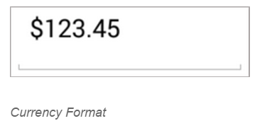
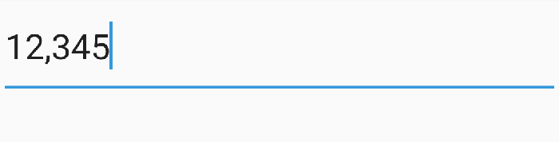

# Number formatting and group separator

The Values of the SfNumericTextBox can be configured to display different formats like currency format, percent format etc.

## Format String

The `FormatString` property determines the format specifier by which the display text has to be formatted. 

N> The control displays the formatted text on lost focus. Default Value of `FormatString` is "n".

### Display Currency Notation

`c` - Displays the value with currency notation.


	

	
	numericTextBox.FormatString="c";
	 



	
### Display Number Notation

`n` – Displays the value in number format.


	

	
	numericTextBox.FormatString="n";
	 



	
### Display Percentage Notation

`p` – Displays the value in percentage.


	


	numericTextBox.FormatString="p";
	 



	
N> Instead of using above `FormatString` types, we can provide any symbol or value as string in `FormatString` property which will be appended with the value in SfNumericTextBox. 

## Parser Input Value

The value of the SfNumericTextBox can be parsed based on the `ParsingMode` property. 

N> The `ParsingMode` is of type Parsers containing enum values of Double and Decimal. The default Value for `ParsingMode` is Double.





	numericTextBox.ParserMode=ParserMode.Decimal;
	  




## Compute to Percentage

The `PercentDisplayMode` property can be used to display numeric data in Percent mode. 

N> The control displays the percent value on lost focus. 

* `Value`: Displays the value with percentage symbol.





	numericTextBox.PercentDisplayMode=PercentDisplayMode.Value;





* `Compute`: Displays the computed value with percentage symbol.





	numericTextBox.PercentDisplayMode=PercentDisplayMode.Compute;





## Group separator modes

[`GroupSeparatorMode`](https://help.syncfusion.com/cr/xamarin-android/Com.Syncfusion.Numerictextbox.GroupSeparatorMode.html) provides 2 states to display the group separator. 
When the mode is set as `Always`, it will display separator while typing itself on the other hand when the mode is set as `LostFocus` it will enable the separator when the control lost its focus.

N> [`EnableGroupSeparator`](https://help.syncfusion.com/cr/xamarin-android/Com.Syncfusion.Numerictextbox.SfNumericTextBox.html#Com_Syncfusion_Numerictextbox_SfNumericTextBox_EnableGroupSeparator) property must be enabled to use the `GroupSeparatorMode`.





            SfNumericTextBox numericTextBox = new SfNumericTextBox(this);
            numericTextBox.Value = 12345;
            numericTextBox.FormatString = "n";
            numericTextBox.GroupSeparatorMode = GroupSeparatorMode.Always;
            numericTextBox.EnableGroupSeparator = true;
            SetContentView(numericTextBox);





