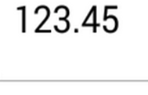

# Set Maximum Number of Decimal Digits

The maximum number of digits to be displayed after the decimal point can be specified by using `MaximumNumberDecimalDigits` property. 

N> The `MaximumNumberDecimalDigits` property can be provided with positive value only.





	numericTextBox.MaximumNumberDecimalDigits=2;
  




