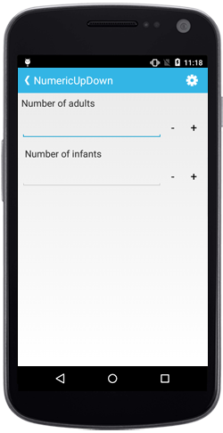
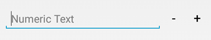

# Assign Nullable Value

The null values can be set in SfNumericUpDown `Value` property, by setting `AllowNull` property value to true.

N> By default, the property value is false.





	numericupdown.AllowNull=true;





## Set Hint Text

The `WaterMark` property can be used to provide a hint that helps the user to get started with their input. The watermark text is visible when value is empty or null.





	numericupdown.Watermark = "Numeric Text";
	




