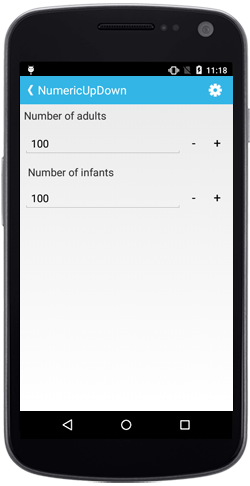
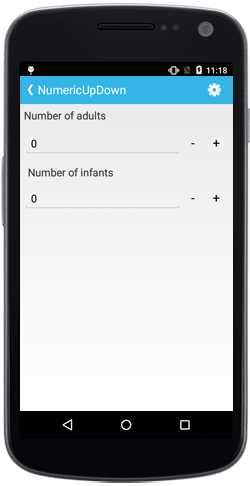

# Auto Reverse

While incrementing, the control will start from Minimum value once it reaches the Maximum value and vice-versa.

N> By default the property value is false.





numericupdown.AutoReverse = true;





## Continuous Spinning Between Ranges

User can restrict the Values between a specific range by setting `Maximum` and `Minimum` property value.

N> By default the minimum property value is 0 and maximum property value is 100.





sfNumericUpDown.Minimum = 10;
sfNumericUpDown.Maximum = 50





## Set Increment

Frequency in which values gets incremented can be decided using `StepValue` property.

N> By default the property value is 1.





	sfNumericUpDown.StepValue = 6;




