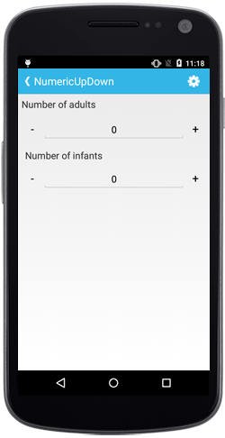

# Spin Button Alignment

Spin Button position in the SfNumericUpDown control can be changed relative to the TextBox based on `SpinButtonAlignment` property. 

There are three built-in modes.

* Right
* Left
* Both

### Right

Spin Buttons will get aligned to the right side of the control.





numeric.SpinButtonAlignment = SpinButtonAlignment.Right;





### Left

Spin Buttons will get aligned to the left side of the control.





numeric.SpinButtonAlignment = SpinButtonAlignment.Left;





### Both

Spin Buttons will get aligned to the both side of the control.





numeric.SpinButtonAlignment = SpinButtonAlignment.Both;





N> By default the property value is Right.

## UpDownButtonSetting Customization

We can set the Up Down button of SfNumericUpDown control by using any of the below given ways.

1. View
2. Image
3. FontIconText

N> For image and FontIcon we need to add the the respective image and TTF file.
		For android: Add image at Resource/Drawable/{Image} and .ttf file at Asserts/{.ttf}
		

### By using View





			LinearLayout MainLayout = new LinearLayout(this);
            MainLayout.Orientation = Orientation.Vertical;

            SfNumericUpDown numeric;

            numeric = new SfNumericUpDown(this);
            LinearLayout UpButton_View = new LinearLayout(this);
            LinearLayout DownButton_View = new LinearLayout(this);

            ImageView UpImage = new ImageView(this);
            ImageView DownImage = new ImageView(this);

            UpImage.SetImageResource(Resource.Drawable.UpButton);
            DownImage.SetImageResource(Resource.Drawable.DownButton);

            UpButton_View.AddView(UpImage);
            DownButton_View.AddView(DownImage);

            UpDownButtonSettings UpButton = new UpDownButtonSettings();
            UpButton.ButtonView = UpButton_View;

            UpDownButtonSettings DownButton = new UpDownButtonSettings();
            DownButton.ButtonView = DownButton_View;
            UpButton.ButtonHeight = 50;
            DownButton.ButtonHeight = 50;

            UpButton.ButtonWidth = 50;
            DownButton.ButtonWidth = 50;

            UpButton_View.SetBackgroundColor(Color.Green);
            DownButton_View.SetBackgroundColor(Color.Violet);

            numeric.DecrementButtonSettings = DownButton;
            numeric.IncrementButtonSettings = UpButton;

            MainLayout.AddView(numeric);

            SetContentView(MainLayout);





### By using Image





			LinearLayout MainLayout = new LinearLayout(this);
            MainLayout.Orientation = Orientation.Vertical;

            SfNumericUpDown numeric;

            numeric = new SfNumericUpDown(this);

            UpDownButtonSettings UpButton = new UpDownButtonSettings();
           
            UpDownButtonSettings DownButton = new UpDownButtonSettings();

            UpButton.ButtonHeight = 50;
            DownButton.ButtonHeight = 50;

            UpButton.ButtonWidth = 50;
            DownButton.ButtonWidth = 50;

            UpButton.ButtonImage = "UpButton";
            DownButton.ButtonImage = "DownButton";

            numeric.DecrementButtonSettings = DownButton;
            numeric.IncrementButtonSettings = UpButton;

            MainLayout.AddView(numeric);

            SetContentView(MainLayout);





### By using FontIconText





			LinearLayout MainLayout = new LinearLayout(this);
            MainLayout.Orientation = Orientation.Vertical;

            SfNumericUpDown numeric;

            numeric = new SfNumericUpDown(this);

            UpDownButtonSettings UpButton = new UpDownButtonSettings();
           
            UpDownButtonSettings DownButton = new UpDownButtonSettings();

            UpButton.ButtonHeight = 50;
            DownButton.ButtonHeight = 50;

            UpButton.ButtonWidth = 50;
            DownButton.ButtonWidth = 50;

            var typeface = Typeface.CreateFromAsset(this.Assets, "Segoe MDL2 Assets.ttf");
            UpButton.ButtonFontFamily = typeface;

            DownButton.ButtonFontFamily = typeface;

            UpButton.ButtonFontIcon="\xE74A";
            DownButton.ButtonFontIcon="\xE74B";

            numeric.DecrementButtonSettings = DownButton;
            numeric.IncrementButtonSettings = UpButton;

            MainLayout.AddView(numeric);

            SetContentView(MainLayout);





