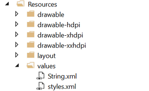
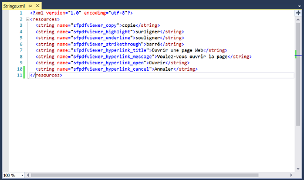
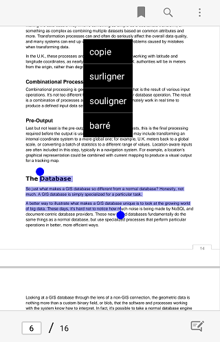

# Localization 

Localization is the process of configuring the application to a specific language. PdfViewerControl supports to localize its static text.

Create String.xml in resource file in Android

Location- ProjectName.Android/Resources/values/Strings.Xml

In below screenshot we have localized the text in PDF Viewer in Xamarin.Android from English to French language.

