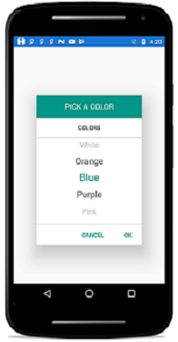

# Overview of Xamarin.Android SfPicker

The picker control allows users to pick an item among a list of items that can be customized with custom view. This control can be opened as dialog. Its rich feature set includes functionalities like multi column, header/footer, custom view on header/footer and default validation buttons.

## Feature in Andriod

<table>
<tr>
<th>Features</th>
<th>Xamarin.Android</th>
</tr>
<tr>
<td>Show Picker in Dialog</td>
<td><i class="fa fa-check"></i></td>
<td><i class="fa fa-check"></i></td>
<td><i class="fa fa-check"></i></td>
</tr>
<tr>
<td>Selection</td>
<td><i class="fa fa-check"></i></td>
<td><i class="fa fa-check"></i></td>
<td><i class="fa fa-check"></i></td>
</tr>
<tr>
<td>Header Customization</td>
<td><i class="fa fa-check"></i></td>
<td><i class="fa fa-check"></i></td>
<td><i class="fa fa-check"></i></td>
</tr>
<tr>
<td>Footer Customization</td>
<td><i class="fa fa-check"></i></td>
<td><i class="fa fa-check"></i></td>
<td><i class="fa fa-check"></i></td>
</tr>
<tr>
<td>Item Customization</td>
<td><i class="fa fa-check"></i></td>
<td><i class="fa fa-check"></i></td>
<td><i class="fa fa-check"></i></td>
</tr>
<tr>
<td>Multi Column Support</td>
<td><i class="fa fa-check"></i></td>
<td><i class="fa fa-check"></i></td>
<td><i class="fa fa-check"></i></td>
</tr>
<tr>
<td>Customize each column width</td>
<td><i class="fa fa-check"></i></td>
<td><i class="fa fa-check"></i></td>
<td><i class="fa fa-check"></i></td>
</tr>
<tr>
<td>Column Header support</td>
<td><i class="fa fa-check"></i></td>
<td><i class="fa fa-check"></i></td>
<td><i class="fa fa-check"></i></td>
</tr>
<tr>
<td>Column Header Customization</td>
<td><i class="fa fa-check"></i></td>
<td><i class="fa fa-check"></i></td>
<td><i class="fa fa-check"></i></td>
</tr>
</table>

Please find the screen shot of SfPicker color selection

Please find the screen shot of SfPicker multicolumn

