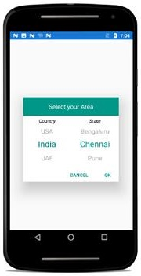

# Cascading of Xamarin.Android SfPicker

We have demonstrated how to create custom Cascading sample using Picker control in the following steps.

We have created the cascading sample for updating state collection based on selected item of SfPicker.

Please refer the below steps to create the cascading sample 

**Step** **1** **:** We have created three ObservableCollection with object type in PickerCascading class. 

**Collection** **details** **:** 

Area Collection, Country Collection and State Collection.

Country Collection -> We have added country names.

State Collection -> We have added state names.

Area Collection -> We have added above  2 collections.

Area Collection is main collection we have assigned this collection to ItemsSource of Picker Control.

The below code demonstrates Area collection creation.



    public class PickerCascading:INotifyPropertyChanged

    {

        #region Public Properties

        /// 

        /// Area is the actual DataSource for SfPicker control which will holds the collection of Country and State

        /// 

        /// <value>The area.</value>

        public ObservableCollection<object> Area { get; set; }

        //Country is the collection of country names

        private ObservableCollection<object> Country { get; set; }

        //State is the collection of state names

        private ObservableCollection<object> State { get; set; }

        /// 

        /// Headers API is holds the column name for every column in cascading picker

        /// 

        /// <value>The Headers.</value>

        public ObservableCollection<string> Header { get; set; }

        private object _selected;

        public event PropertyChangedEventHandler PropertyChanged;

        #endregion

        //Identify the selected area using property changed method

        public object SelectedArea

        {

            get { return _selected; }

            set { _selected = value; RaisePropertyChanged("SelectedArea"); }

        }

        public PickerCascading()

        {

            Area = new ObservableCollection<object>();

            Header = new ObservableCollection<string>();

            Country = new ObservableCollection<object>();

            State = new ObservableCollection<object>();

            //populate Countries

            Country.Add("UK");

            Country.Add("USA");

            Country.Add("India");

            Country.Add("UAE");

            Country.Add("Germany");

            //populate states

            State.Add("London");

            State.Add("Manchester");

            State.Add("Cambridge");

            State.Add("Edinburgh");

            State.Add("Glasgow");

            State.Add("Birmingham");

            Area.Add(Country);

            Area.Add(State);

            SelectedArea = new ObservableCollection<object>() { "UK", "London" };

        }

        //Hooked when changes occurred 

        public void RaisePropertyChanged(string name)

        {

            if (PropertyChanged != null)

            PropertyChanged(this, new PropertyChangedEventArgs(name));

        }

    }



**Step** **2** **:** We have updated the state collection  based on selected item of country name using Selection changed event of SfPicker control.



    private void Picker_OnSelectionChanged(object sender, SelectionChangedEventArgs e)
        
        {
            if (picker.ItemsSource != null && e.NewValue is System.Collections.IList && (e.NewValue as System.Collections.IList).Count > 0 && CurrentItem != (e.NewValue as System.Collections.IList)[0].ToString())
            {
                ObservableCollection<object> source = picker.ItemsSource as ObservableCollection<object>;
                //Updated the second column collection based on first column selected value.
                (source).RemoveAt(1);
                (source).Add(GetCountry((e.NewValue as System.Collections.IList)[0].ToString()));
                picker.ItemsSource = source;
            }
        }



**Step** **3** **:** We have defined column headers as  “Country” and  “State” using ColumnHeaderText property of SfPicker control. The below code demonstrates how to define header for each column of SfPicker control.



    public class PickerCascading:INotifyPropertyChanged

    {           

    /// 

    /// Headers API is holds the column name for every column in cascading picker

    /// 

    /// <value>The Headers.</value>

    public ObservableCollection<string> Header { get; set; }

        public PickerCascading()

        {

        Header = new ObservableCollection<string>();

        Header.Add("Country");

        Header.Add("State");

        }

    }



**Step** **4** **:** We have added the cascading picker control in MainActivity  page. Please refer the below code snippets.





    public class MainActivity : Activity
	
    {
        String CurrentItem;

        SfPicker picker;

        protected override void OnCreate (Bundle savedInstanceState)
        {
            picker = new SfPicker(this);
            
            base.OnCreate(savedInstanceState);
       
            PickerCascading cascading = new PickerCascading();
            
            picker.ShowHeader = true;
            
            picker.ShowColumnHeader = true;
            
            picker.ShowFooter = true;
            
            picker.BackgroundColor = Color.White;
            
            picker.OnSelectionChanged += Picker_OnSelectionChanged;
        
            picker.ItemsSource =cascading.Area;
            
            picker.SelectedItem =cascading.SelectedArea;
            
            picker.ColumnHeaderText=cascading.Header;

            picker.PickerMode = PickerMode.Default;
            
            picker.UnSelectedItemTextColor = Color.Black;
            
            picker.HeaderText = "Select your Area";
            
            float height = this.Resources.DisplayMetrics.HeightPixels; 
            picker.LayoutParameters = new ViewGroup.LayoutParams(Android.Views.ViewGroup.LayoutParams.MatchParent, (int)(height * 0.60));
            
            SetContentView (picker);
        }
    }





Screen shot for the above codes.

We have attached Cascading sample for reference. Please download the sample from the following link.

Sample link: [CascadingSample](http://www.syncfusion.com/downloads/support/directtrac/general/CASCAD~1-543545380.ZIP)

