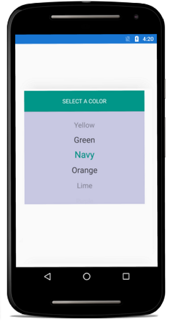

# Dealing with Columns

This section explains about the customization of SfPicker Columns

## Adjust Column Width

SfPicker allows user to adjust the column width by hooking `SfPicker.OnColumnLoaded` event and then check the column using `ColumnLoadedEventArgs.Column` property and then adjust width of column by setting `ColumnLoadedEventArgs.ColumnWidth` property.

We have prepared below code snippets to demonstrate DateTimePicker sample using `OnColumnLoaded` event.

*MainPage*

Column width of the each and every column can be adjusted by the use of OnColumnLoaded event in SfPicker which is implemented in the below code.





    [Activity (Label = "CascadingColorAndroid.Android", MainLauncher = true, Icon = "@drawable/icon")]

	public class MainActivity : Activity
	{
         SfPicker picker;

        protected override void OnCreate (Bundle savedInstanceState)
        {
            picker = new SfPicker(this);
            
            base.OnCreate(savedInstanceState);
            
            ColorInfo colorInfo = new ColorInfo();

            picker.HeaderText = "Select a Color";
            
            picker.BackgroundColor = Color.White;
            
            picker.ColumnHeaderText = "Color";
            
            picker.ColumnHeaderHeight = 70;
            
            picker.ColumnHeaderTextSize = 20;
            
            picker.HeaderTypeface = Typeface.Create("sans-serif", 
            TypefaceStyle.Bold);
            
            picker.ColumnHeaderTypeface = Typeface.Create("sans-serif", TypefaceStyle.Italic);
            
            picker.ShowColumnHeader = true;
          
            picker.PickerMode = PickerMode.Default;
            
            picker.ItemsSource =colorInfo.Colors;

            picker.OnColumnLoaded += Picker_OnColumnLoaded;
            
            picker.OnSelectionChanged += Picker_OnSelectionChanged;
            
            picker.ShowHeader = true;
            
            picker.ShowColumnHeader = false;

            float height = this.Resources.DisplayMetrics.HeightPixels;
            
            picker.LayoutParameters = new ViewGroup.LayoutParams(Android.Views.ViewGroup.LayoutParams.MatchParent, (int)(height * 0.60));
            
            SetContentView(picker);
        }

        private void Picker_OnColumnLoaded(object sender, ColumnLoadedEventArgs e)
        {
            if (e.Column == 0)
                 e.ColumnWidth = 1050;
            
        }
    }





We have attached sample for reference. Please download the below sample.

Sample link: [DealingWithColumns](http://www.syncfusion.com/downloads/support/directtrac/general/DEALIN~219918526.ZIP)

## Add Caption

SfPicker allows user to add header for each column by setting `SfPicker.ColumnHeaderText` property and enabling `SfPicker.ShowColumnHeader` property to True.

`ColumnHeaderText` property is of object type and user can assign string or collection. 
If a string type is assigned in `SfPicker.ColumnHeaderText`, that string will be updated in all the column of SfPicker.

To assign the collection in `SfPicker.ColumnHeaderText`, SfPicker column header update based on index with value on collection.

The below code illustrate assign the ColumnHeaderText for SfPicker





    public class MainActivity : Activity

    {
        protected override void OnCreate(Bundle savedInstanceState)
        {
            DatePicker datePicker = new DatePicker(this);
            
            base.OnCreate(savedInstanceState);
            
            datePicker.ColumnHeaderHeight = 70;
            
            datePicker.PickerHeight = 400;
            
            datePicker.PickerWidth = 300;
            
            datePicker.PickerMode = PickerMode.Default;
            
            datePicker.BackgroundColor = Color.White;
            
            datePicker.SelectedItem = datePicker.StartDate;
            
            float height = this.Resources.DisplayMetrics.HeightPixels;
            
            datePicker.LayoutParameters = new ViewGroup.LayoutParams(Android.Views.ViewGroup.LayoutParams.MatchParent, (int)(height * 0.60));

            SetContentView(datePicker);
        }

        public class DatePicker : SfPicker
        {
            #region Public Properties

            // Months API is used to modify the Day collection as per change in Month

            internal Dictionary<string, string> Months { get; set; }

            /// 

            /// Date is the actual DataSource for SfPicker control which will holds the collection of Day ,Month and Year
            /// 

            /// <value>The date.</value>
            
            public ObservableCollection<object> Date { get; set; }

            //Day is the collection of day numbers
            
            internal ObservableCollection<object> Day { get; set; }

            //Month is the collection of Month Names
            
            internal ObservableCollection<object> Month { get; set; }

            //Year is the collection of Years from 1990 to 2042
            
            internal ObservableCollection<object> Year { get; set; }

            /// 

            /// Headers API is holds the column name for every column in date picker
            /// 

            /// <value>The Headers.</value>
            
            public ObservableCollection<string> Headers { get; set; }

            public ObservableCollection<object> StartDate;
            #endregion

            public DatePicker(Context context) : base(context)
            {

                ObservableCollection<object> collection = new ObservableCollection<object>();

                //Select today dates
                collection.Add(CultureInfo.CurrentCulture.DateTimeFormat.GetMonthName(DateTime.Now.Date.Month).Substring(0, 3));
                
                if (DateTime.Now.Date.Day < 10)
                    collection.Add("0" + DateTime.Now.Date.Day);
                else
                    collection.Add(DateTime.Now.Date.Day.ToString());
                
                collection.Add(DateTime.Now.Date.Year.ToString());

                this.StartDate = collection;

                Months = new Dictionary<string, string>();
                
                Date = new ObservableCollection<object>();
                
                Day = new ObservableCollection<object>();
                
                Month = new ObservableCollection<object>();
                
                Year = new ObservableCollection<object>();
                
                Headers = new ObservableCollection<string>();
                
                Headers.Add("MONTH");
                
                Headers.Add("DAY");
                
                Headers.Add("YEAR");
                
                HeaderText = "DATE PICKER";
                
                PopulateDateCollection();
                
                this.ItemsSource = Date;
                
                this.ColumnHeaderText = Headers;
                
                ShowFooter = true;
                
                ShowHeader = true;
                
                ShowColumnHeader = true;
            }

            private void PopulateDateCollection()
            {

                //populate months
                
                for (int i = 1; i < 13; i++)
                {
                    if (!Months.ContainsKey(CultureInfo.CurrentCulture.DateTimeFormat.GetMonthName(i).Substring(0, 3)))
                        Months.Add(CultureInfo.CurrentCulture.DateTimeFormat.GetMonthName(i).Substring(0, 3), CultureInfo.CurrentCulture.DateTimeFormat.GetMonthName(i));
                    Month.Add(CultureInfo.CurrentCulture.DateTimeFormat.GetMonthName(i).Substring(0, 3));
                }

                //populate year
                for (int i = 1990; i < 2050; i++)
                {
                    Year.Add(i.ToString());
                }

                //populate Days
                for (int i = 1; i <= DateTime.DaysInMonth(DateTime.Now.Year, DateTime.Now.Month); i++)
                {
                    if (i < 10)
                    {
                        Day.Add("0" + i);
                    }
                    else
                        Day.Add(i.ToString());
                }

                Date.Add(Month);
                Date.Add(Day);
                Date.Add(Year);
            }
        }
    }




## Caption Customization

This section explains about the column header Background, TextColor and Fonts customization of SfPicker.

### Background

Column header background color can be customized by setting `SfPicker. ColumnHeaderBackgroundColor` property of SfPicker.





    protected override void OnCreate (Bundle savedInstanceState)

        {
            SfPicker picker = new SfPicker(this);
            base.OnCreate(savedInstanceState);
            picker.ColumnHeaderBackgroundColor = Color.White;
            SetContentView(picker);
        }




### Text Color 

Column header text color can be customized by setting `SfPicker.ColumnHeaderTextColor` property of SfPicker.





    protected override void OnCreate (Bundle savedInstanceState)

        {
            SfPicker picker = new SfPicker(this);
            base.OnCreate(savedInstanceState);
            picker.ColumnHeaderTextColor = Color.Black;
            SetContentView(picker);
        }




### Font 

This section explains about the customization of Column Header text of Font.

#### 	FontFamily

Column Header text FontFamily can be customized by setting `SfPicker.ColumnHeaderTypeFace` property of SfPicker.





    protected override void OnCreate (Bundle savedInstanceState)

        {
            SfPicker picker = new SfPicker(this);
            base.OnCreate(savedInstanceState);
            picker.ColumnHeaderTypeface = Typeface.Create("sans-serif", TypefaceStyle.Italic);
            SetContentView(picker);
        }





#### 	FontSize

Column header text FontSize can be customized  by setting `SfPicker.ColumnHeaderTextSize` property of SfPicker.





    protected override void OnCreate (Bundle savedInstanceState)

        {
            SfPicker picker = new SfPicker(this);
            base.OnCreate(savedInstanceState);
            picker.ColumnHeaderTextSize = 20;
            SetContentView(picker);
        }



#### 	FontAttribute

 Column header text FontAttribute can be customized by setting `SfPicker.ColumnHeaderTypeFace` property of SfPicker.





    protected override void OnCreate (Bundle savedInstanceState)

        {
            SfPicker picker = new SfPicker(this);
            base.OnCreate(savedInstanceState);
            picker.ColumnHeaderTypeface = Typeface.Create("sans-serif", TypefaceStyle.Italic);
            SetContentView(picker);
        }




## Cascading

SfPicker allow user to get selection change intimation by setting `SfPicker.SelectionChanged` event 

We have prepared cascading sample for change the SfPicker background color when change the Selection of SfPicker





*MainPage*

    public class MainActivity : Activity
    {
         SfPicker picker;

        protected override void OnCreate (Bundle savedInstanceState)
        {
            picker = new SfPicker(this);
            
            base.OnCreate(savedInstanceState);
            
            ColorInfo colorInfo = new ColorInfo();

            picker.HeaderText = "Select a Color";
            
            picker.BackgroundColor = Color.White;
            
            picker.ColumnHeaderText = "Color";
            
            picker.ColumnHeaderHeight = 70;
            
            picker.ColumnHeaderTextSize = 20;
            
            picker.HeaderTypeface = Typeface.Create("sans-serif", TypefaceStyle.Bold);
            
            picker.ColumnHeaderTypeface = Typeface.Create("sans-serif", TypefaceStyle.Italic);
            
            picker.ShowColumnHeader = true;
          
            picker.PickerMode = PickerMode.Default;
            
            picker.ItemsSource =colorInfo.Colors;

            picker.OnColumnLoaded += Picker_OnColumnLoaded;
            
            picker.OnSelectionChanged += Picker_OnSelectionChanged;
            
            picker.ShowHeader = true;
            
            picker.ShowColumnHeader = false;

            float height = this.Resources.DisplayMetrics.HeightPixels;
            
            picker.LayoutParameters = new ViewGroup.LayoutParams(Android.Views.ViewGroup.LayoutParams.MatchParent, (int)(height * 0.60));
            
            SetContentView(picker);
        }

          private void Picker_OnSelectionChanged(object sender, SelectionChangedEventArgs e)
        {
          if (e.NewValue != null)
            {
                var color = PickerHelper.GetColor(e.NewValue.ToString());
                picker.BackgroundColor = color;
               
            }
        }

    }

    ColorInfo:

    public class ColorInfo

    {

        private ObservableCollection<string> _color;

        public ObservableCollection<string> Colors

        {

            get { return _color; }

            set { _color = value; }

        }

        public ColorInfo()

        {

            Colors = new ObservableCollection<string>();

            Colors.Add("Red");
            
            Colors.Add("Yellow");
            
            Colors.Add("Green");
            
            Colors.Add("Navy");
            
            Colors.Add("Orange");
            
            Colors.Add("Lime");
            
            Colors.Add("Gray");
            
            Colors.Add("Pink");

            SelectedColor = "Yellow";

        }

    }

    PickerHelper:

    public static class PickerHelper

    {

    static Dictionary<string, Color> colors = new Dictionary<string, Color>();

        public static Color GetColor(string color)

        {

            colors.Clear();
            
            colors.Add("Yellow", Color.Yellow);
            
            colors.Add("Green", Color.Green);
            
            colors.Add("Orange", Color.Orange);
            
            colors.Add("Lime", Color.Lime);
            
            colors.Add("Navy", Color.Navy);
            
            colors.Add("Pink", Color.Pink);
            
            colors.Add("Red", Color.Red);
            
            colors.Add("Gray", Color.Gray);
            
            return colors[color.ToString()];

        }

    }





Screen shot for the above code

We have attached sample for reference. please download the sample from the below link.

Sample link:[DealingWithColumns](http://www.syncfusion.com/downloads/support/directtrac/general/DEALIN~219918526.ZIP)