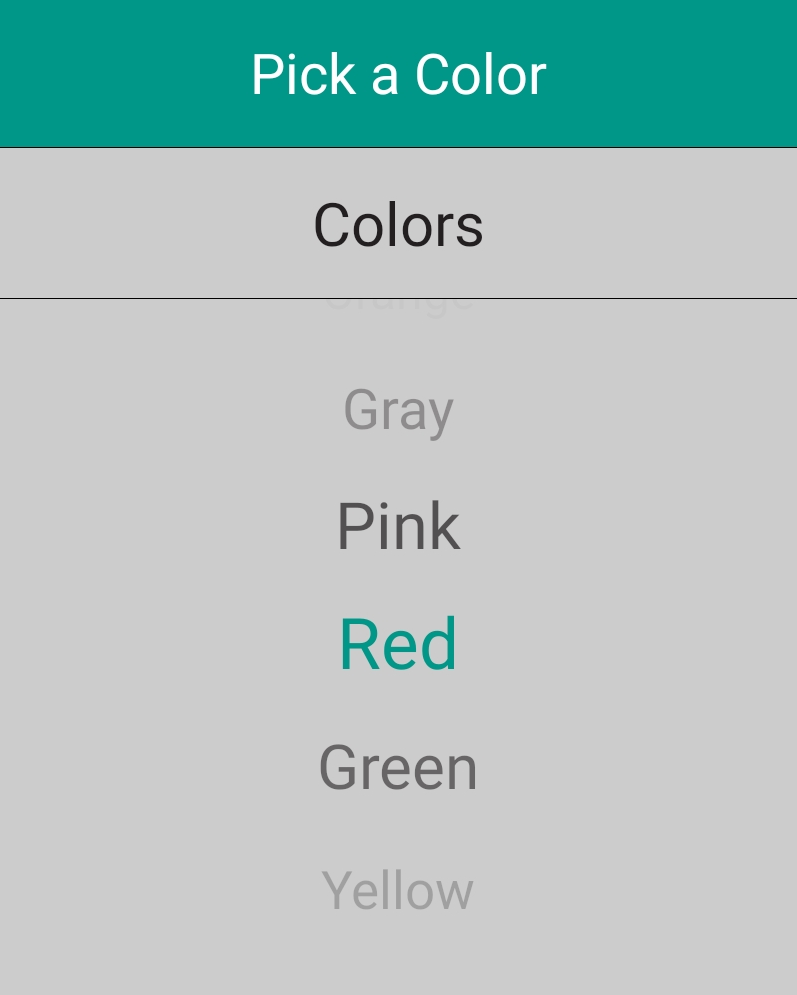
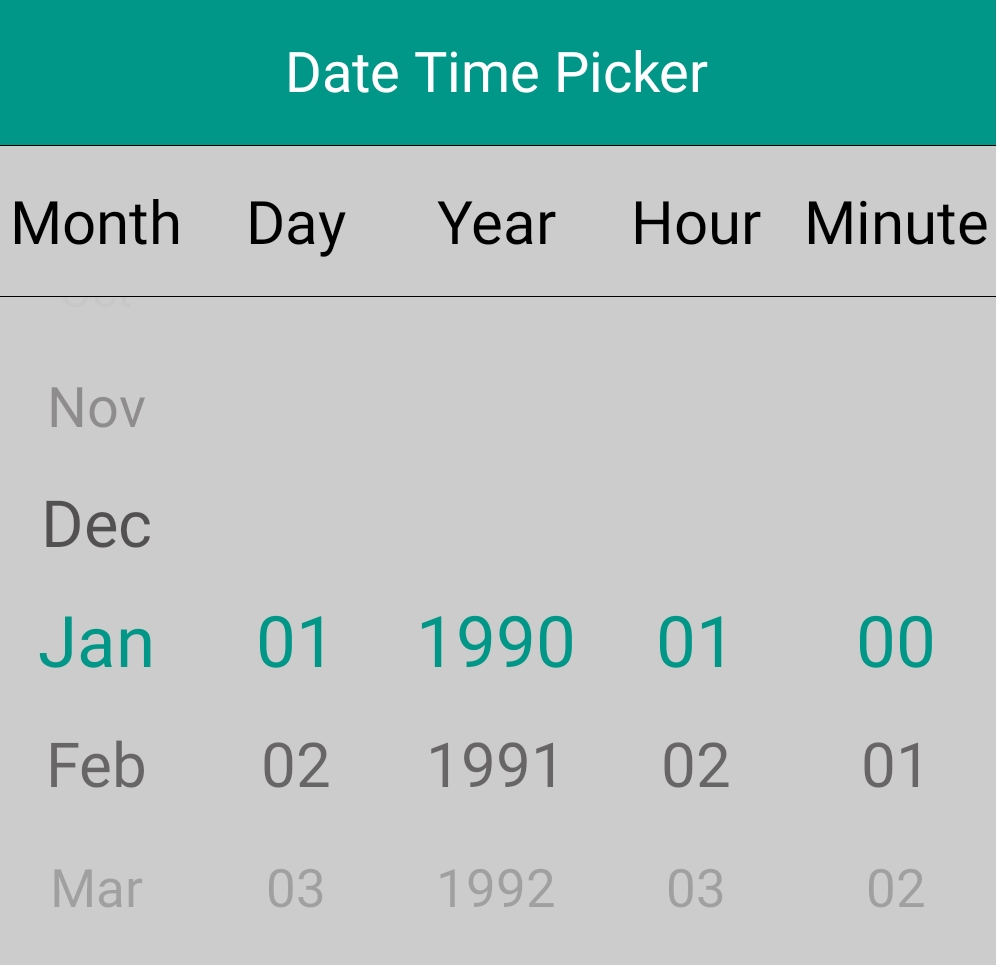

# Looping in Xamarin.Android

The Looping support is used to automatically navigate the first item to repeat the list of items after reached the last item. Each forward iteration is followed by a backward iteration in the picker control. This can be achieved by `EnableLooping` property.

## EnableLooping

The looping support is achieved by setting the `EnableLooping` property to true.



SfPicker picker = new SfPicker();

ColorInfo info = new ColorInfo();

picker.ItemsSource = info.Colors;

// Enable Looping in picker control

picker.EnableLooping = true;



Screen shot for the above codes.

You can find the complete Looping sample from this [link](http://www.syncfusion.com/downloads/support/directtrac/208168/ze/Looping_1756767840).

## How to restrict Looping in a particular column of the picker

The looping support can be restricted in a particular column of the picker by setting the `EnableLooping` of ColumnLoaded event argument to false.



picker.OnColumnLoaded+=(object sender, ColumnLoadedEventArgs e) => 
{

if (e.Column == 0)
{
    e.EnableLooping = true;
}
else
    e.EnableLooping = false;
};



Screen shot for the above codes.

You can find the sample from this [link](http://www.syncfusion.com/downloads/support/directtrac/208168/ze/AutoReverse_Sample1257178886.zip).

