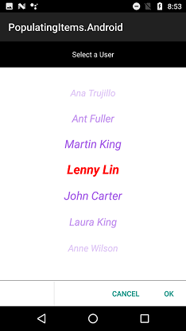

# Populating Items for SfPicker

This section explains about the ways of populating items for SfPicker control

## Binding Data Source

SfPicker is bound the external data source to display the data’s. It supports any collections that’s implements the `IEnumerable` interface.

To bind the data source in SfPicker, set the `SfPicker.ItemsSource` property as show in below code.





    protected override void OnCreate(Bundle savedInstanceState) 
        
        {
            SfPicker picker = new SfPicker(this);
            base.OnCreate(savedInstanceState);
            ColorInfo info = new ColorInfo();
            picker.ItemsSource = info.Colors;
            SetContentView(picker);
        }




## Multi-Column Items

The SfPicker automatically populate the items as Multi-Column based on the Data Source.

Collection of items can be created and assigned to a Collection and each item Collection is a column of SfPicker. 

The following code example illustrates about to populate Month, Day and Year values in each column of SfPicker.




    
    public class MainActivity : Activity
    {
        protected override void OnCreate(Bundle savedInstanceState)
        {
            DatePicker datePicker = new DatePicker(this);
            base.OnCreate(savedInstanceState);
            datePicker.ColumnHeaderHeight = 70;
            datePicker.PickerHeight = 400;
            datePicker.PickerWidth = 300;
            datePicker.PickerMode = PickerMode.Default;
            datePicker.BackgroundColor = Color.Aqua;
            datePicker.SelectedItem = datePicker.StartDate;
            float height = this.Resources.DisplayMetrics.HeightPixels;
            datePicker.LayoutParameters = new ViewGroup.LayoutParams(Android.Views.ViewGroup.LayoutParams.MatchParent, (int)(height * 0.60));

            SetContentView(datePicker);
        }
        
        public class DatePicker : SfPicker
     
        {
            #region Public Properties

            // Months API is used to modify the Day collection as per change in Month

            internal Dictionary<string, string> Months { get; set; }

            /// 

            /// Date is the actual DataSource for SfPicker control which will holds the collection of Day ,Month and Year
            /// 

            /// <value>The date.</value>
            public ObservableCollection<object> Date { get; set; }

            //Day is the collection of day numbers
            internal ObservableCollection<object> Day { get; set; }

            //Month is the collection of Month Names
            internal ObservableCollection<object> Month { get; set; }

            //Year is the collection of Years from 1990 to 2042
            internal ObservableCollection<object> Year { get; set; }

            /// 

            /// Headers API is holds the column name for every column in date picker
            /// 

            /// <value>The Headers.</value>
            public ObservableCollection<string> Headers { get; set; }

            public ObservableCollection<object> StartDate;
            #endregion

            public DatePicker(Context context) : base(context)
            {

                ObservableCollection<object> collection = new ObservableCollection<object>();

                //Select today dates
                collection.Add(CultureInfo.CurrentCulture.DateTimeFormat.GetMonthName(DateTime.Now.Date.Month).Substring(0, 3));
                if (DateTime.Now.Date.Day < 10)
                    collection.Add("0" + DateTime.Now.Date.Day);
                else
                    collection.Add(DateTime.Now.Date.Day.ToString());
                collection.Add(DateTime.Now.Date.Year.ToString());

                this.StartDate = collection;

                Months = new Dictionary<string, string>();
                Date = new ObservableCollection<object>();
                Day = new ObservableCollection<object>();
                Month = new ObservableCollection<object>();
                Year = new ObservableCollection<object>();
                Headers = new ObservableCollection<string>();
                Headers.Add("Month");
                Headers.Add("Day");
                Headers.Add("Year");
                HeaderText = "Date Picker";
                PopulateDateCollection();
                this.ItemsSource = Date;
                this.ColumnHeaderText = Headers;
                ShowFooter = true;
                ShowHeader = true;
                ShowColumnHeader = true;
            }
            private void PopulateDateCollection()
            {

                //populate months
                for (int i = 1; i < 13; i++)
                {
                    if (!Months.ContainsKey(CultureInfo.CurrentCulture.DateTimeFormat.GetMonthName(i).Substring(0, 3)))
                        Months.Add(CultureInfo.CurrentCulture.DateTimeFormat.GetMonthName(i).Substring(0, 3), CultureInfo.CurrentCulture.DateTimeFormat.GetMonthName(i));
                    Month.Add(CultureInfo.CurrentCulture.DateTimeFormat.GetMonthName(i).Substring(0, 3));
                }

                //populate year
                for (int i = 1990; i < 2050; i++)
                {
                    Year.Add(i.ToString());
                }

                //populate Days
                for (int i = 1; i <= DateTime.DaysInMonth(DateTime.Now.Year, DateTime.Now.Month); i++)
                {
                    if (i < 10)
                    {
                        Day.Add("0" + i);
                    }
                    else
                        Day.Add(i.ToString());
                }

                Date.Add(Month);
                Date.Add(Day);
                Date.Add(Year);
            }
        }
    }




MultiColumn sample from the following link

Sample link: [MultiColumn](http://www.syncfusion.com/downloads/support/directtrac/general/MULTIC~11133258025.ZIP)

Screen shot for the above code.

## Set Items Colors and Font Attributes customization

In SfPicker, items text color and font both selected and unselected item of SfPicker control can be customized as shown below.  

### Selected Item Customization

##### Text Color 

Selected item text color can be customized by setting `SfPicker.SelectedItemTextColor` property of SfPicker.




  
    protected override void OnCreate(Bundle savedInstanceState) 
        
        {
            SfPicker picker = new SfPicker(this);
            base.OnCreate(savedInstanceState);
            picker.SelectedItemTextColor = Color.Red;
            SetContentView(picker);
        }




##### Font 

This section explains about the customization of Selected Item Font.

###### 	FontFamily

Selected item text FontFamily can be customized by setting `SfPicker.SelectedItemTypeFace` property of SfPicker.





    protected override void OnCreate(Bundle savedInstanceState) 

        {
            SfPicker picker = new SfPicker(this);
            base.OnCreate(savedInstanceState);
            picker.SelectedItemTypeface = Typeface.Create("sans-serif", TypefaceStyle.BoldItalic);
            SetContentView(picker);
        }




###### 	FontSize

Selected item text FontSize can be customized by setting `SfPicker.SelectedItemTextSize` property of SfPicker.





    protected override void OnCreate(Bundle savedInstanceState) 

        {
            SfPicker picker = new SfPicker(this);
            base.OnCreate(savedInstanceState);
            picker.SelectedItemTextSize = 11;
            SetContentView(picker);
        }




###### 	FontAttribute

Selected item text FontAttribute can be customized by setting `SfPicker.SelectedItemTypeFace` property of SfPicker.





    protected override void OnCreate(Bundle savedInstanceState) 

        {
            SfPicker picker = new SfPicker(this);
            base.OnCreate(savedInstanceState);
            picker.SelectedItemTypeface = Typeface.Create("sans-serif", TypefaceStyle.BoldItalic);
            SetContentView(picker);
        }





### UnSelected Item Customization

##### Text Color

Unselected item text color can be customized by setting `SfPicker.UnSelectedItemTextColor` property of SfPicker.





    protected override void OnCreate(Bundle savedInstanceState) 

        {
            SfPicker picker = new SfPicker(this);
            base.OnCreate(savedInstanceState);
            picker.UnSelectedItemTextColor = Color.BlueViolet;
            SetContentView(picker);
        }




##### Font

This section explains about the customization of unselected items Font.

###### 	FontFamily

Unselected item text FontFamily can be customized by setting `SfPicker.UnSelectedItemTypeFace` property of SfPicker.


    
  

    protected override void OnCreate(Bundle savedInstanceState) 

        {
            SfPicker picker = new SfPicker(this);
            base.OnCreate(savedInstanceState);
            picker.UnSelectedItemTypeface = Typeface.Create("sans-serif", TypefaceStyle.Italic);";
            SetContentView(picker);
        }




###### 	FontSize

Unselected item text FontSize can be customized by setting `SfPicker.UnSelectedItemTextSize` property of SfPicker.




 
    protected override void OnCreate(Bundle savedInstanceState) 

        {
            SfPicker picker = new SfPicker(this);
            base.OnCreate(savedInstanceState); 
            picker.UnSelectedItemTextSize = 11;
            SetContentView(picker);
        }




###### 	FontAttribute

Unselected item text FontAttribute can be customized by setting `SfPicker.UnSelectedItemTypeFace` property of SfPicker.





    protected override void OnCreate(Bundle savedInstanceState) 

        {
            SfPicker picker = new SfPicker(this);
            base.OnCreate(savedInstanceState);
            picker.UnSelectedItemTypeface = Typeface.Create("sans-serif", TypefaceStyle.Italic);";
            SetContentView(picker);
        }



## Adding Custom View Items

In SfPicker, the items can be customized with custom view of each item by adding all the item with custom view.





    public class MainActivity : Activity
    
    {
        SfPicker picker;
        protected override void OnCreate(Bundle savedInstanceState) 
        {
            picker = new SfPicker(this);
            
            base.OnCreate(savedInstanceState);
            
            UsersInfo userInfo = new UsersInfo();
            
            picker.ItemsSource = userInfo.Users;
            
            picker.BackgroundColor = Color.Orange;
            
            picker.HeaderText = "Select a User";
            
            picker.HeaderBackgroundColor = Color.Black;
            
            picker.HeaderTextColor = Color.White;
            
            picker.ShowHeader = true;
            
            picker.ColumnHeaderText = "Users";
            
            picker.ShowColumnHeader = true;
            
            picker.ShowFooter = true;
            
            picker.PickerMode = PickerMode.Default;
            
            float height = this.Resources.DisplayMetrics.HeightPixels;
            picker.LayoutParameters = new ViewGroup.LayoutParams(Android.Views.ViewGroup.LayoutParams.MatchParent, (int)(height * 0.60)); 
       
            SetContentView(picker);
        }

        *UserInfo :*

        public class UserInfo

        {

        private ObservableCollection<string> _user;
            
        public ObservableCollection<string> Users
            
            {

                get { return _user; }

                set { _user = value; }

            }
            public UserInfo()

            {

            Users = new ObservableCollection<string>();

            Users.Add("Maria Anders");

            Users.Add("Ana Trujillo");

            Users.Add("Ant Fuller");

            Users.Add("Martin King");

            Users.Add("Lenny Lin");

            Users.Add("John Carter");

            Users.Add("Laura King");

            Users.Add("Anne Wilson");

            Users.Add("Martin King");

            Users.Add("Gina Irene");

            }

        }
    }    





Screen shot for the above code.

