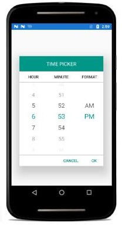

# Time Picker using SfPicker

We have demonstrated how to create TimePicker using Picker control in the following steps.

**Step** **1** **:** We have created custom class named as “TimePicker”. This class should inherit from SfPicker control.


 
    public class TimePicker : SfPicker

    {

    }



**Step** **2** **:** After that create four ObservableCollection with object type in TimePicker class.

**Collection** **details** **:**

Time Collection, Minute Collection, Hour Collection and Format Collection.

Time Collection->We have added all the three collections.

Minute Collection -> We have added minutes from 0 to 59.

Hour Collection -> We have added hours from 1 to 12.

Format Collection -> We have added two format AM and PM.

The below code demonstrates Time collection creation.



    public class TimePicker : SfPicker
        
    {
        /// 

        /// Header API is holds the column name for every column in time picker
        /// 

        
        public ObservableCollection<string> Headers { get; set; }
        public TimePicker(Context context) : base(context)
        {
	       Headers = new ObservableCollection<string>();
            
            Headers.Add("HOUR");
                
            Headers.Add("MINUTE");
                
            Headers.Add("FORMAT");
           
            //SfPicker header text
            
            HeaderText = "TIME PICKER";	
		
            // Column header text collection
            
            this.ColumnHeaderText = Headers;	
        }
    }


**Step** **3** **:** We have defined each column headers “HOUR”, “MINUTE” and “FORMAT” using ColumnHeaderText property of SfPicker control. The below code demonstrates how to define header for each column of SfPicker control.


 
    public class TimePicker : SfPicker

    {

        /// 

        /// Header API is holds the column name for every column in time picker

        /// 

        public ObservableCollection<string> Headers { get; set; }

        public TimePicker(Context context) : base(context)
        
        {

            Headers = new ObservableCollection<string>();

            Headers.Add("HOUR");
               
            Headers.Add("MINUTE");
               
            Headers.Add("FORMAT");

            //SfPicker header text

            HeaderText = "TIME PICKER";

            // Column header text collection

            this.ColumnHeaderText = Headers;

        }

    }



**Step** **4** **:** Finally we have enabled SfPicker footer, header and Column header using ShowFooter, ShowHeader and ShowColumnHeader properties.


 
    public TimePicker(Context context) : base(context)
        
    {

        //Enable Footer of SfPicker

        ShowFooter = true;

        //Enable Header of SfPicker

        ShowHeader = true;

        //Enable Column Header of SfPicker

        ShowColumnHeader = true;

    }



**Step** **5** **:** We have added the TimePicker control in MainActivity page. Please refer the below code snippets.





    public class MainActivity : Activity
	
    {
        
        protected override void OnCreate(Bundle savedInstanceState)
        {
            base.OnCreate(savedInstanceState);
            
            TimePicker timePicker = new TimePicker(this);
            
            timePicker.BackgroundColor = Color.White;
            
            timePicker.ColumnHeaderHeight = 70;
            
            timePicker.PickerHeight = 400;
            
            timePicker.PickerWidth = 300;
            
            timePicker.PickerMode = PickerMode.Default;
            
            timePicker.SelectedItem =timePicker.SelectedTime;
            
            SetContentView(timePicker);
        }
    }





Screen shot for the above codes.

We have attached TimePicker sample for reference. Please download the sample from the following link.

Sample link: [TimePicker](http://www.syncfusion.com/downloads/support/directtrac/general/TIMEPI~1-1638045819.ZIP)
