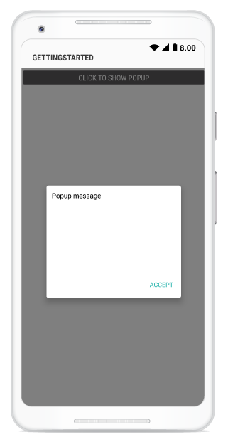
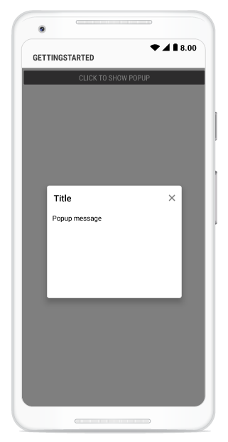
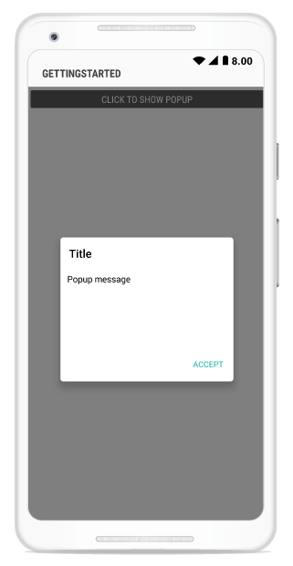

---
layout: post
title: How to | SfPopupLayout |Xamarin.Android | Syncfusion
description: Explains how to achieve various requirements with SfPopupLayout
platform: Xamarin.Android
control: SfPopupLayout
documentation: ug
--- 

# How to 

## hide the header in the SfPopupLayout 

The SfPopupLayout allows hiding the header by using the [SfPopupLayout.PopupView.ShowHeader](https://help.syncfusion.com/cr/xamarin-android/Syncfusion.Android.PopupLayout.PopupView.html#Syncfusion_Android_PopupLayout_PopupView_ShowHeader) property. The default value of this property is `true`.




//MainActivity.cs

protected override void OnCreate(Bundle bundle)
{
	....
    popupLayout.PopupView.ShowHeader = false;
    SetContentView(popupLayout);
    ....
}




## hide the footer in the SfPopupLayout 

The SfPopupLayout allows hiding the footer by using the [SfPopupLayout.PopupView.ShowFooter](https://help.syncfusion.com/cr/xamarin-android/Syncfusion.Android.PopupLayout.PopupView.html#Syncfusion_Android_PopupLayout_PopupView_ShowFooter) property. The default value of this property is `true`.




//MainActivity.cs

protected override void OnCreate(Bundle bundle)
{
	....
    popupLayout.PopupView.ShowFooter = false;
    SetContentView(popupLayout);
    ....
}




## hide the Close button in the SfPopupLayout 

The SfPopupLayout allows hiding the Close button by using the [SfPopupLayout.PopupView.ShowCloseButton](https://help.syncfusion.com/cr/xamarin-android/Syncfusion.Android.PopupLayout.PopupView.html#Syncfusion_Android_PopupLayout_PopupView_ShowCloseButton) property. The default value of this property is `true`.




//MainActivity.cs

protected override void OnCreate(Bundle bundle)
{
	....
    popupLayout.PopupView.ShowCloseButton = false;
    SetContentView(popupLayout);
    ....
}




## load SfPopupLayout in GridTappedEvent of SfDataGrid

The SfPopupLayout allows opening pop-up in the grid tapped event of the SfDataGrid.



using Syncfusion.Android.PopupLayout;
using Syncfusion.SfDataGrid;

namespace GettingStarted
{
    public class MainActivity : Activity 
    {
       SfPopupLayout popupLayout;
       SfDataGrid dataGrid;
       ViewModel viewModel;

        protected override void OnCreate (Bundle bundle) 
        {
            base.OnCreate (bundle); 
            
            dataGrid = new SfDataGrid(this);
            viewModel = new ViewModel();
            dataGrid.ItemsSource = viewModel.OrdersInfo;
            dataGrid.GridTapped += DataGrid_GridTapped;

            popupLayout = new SfPopupLayout(this);
            popupLayout.Content = dataGrid;
            SetContentView(popupLayout);
        } 

        private void DataGrid_GridTapped(object sender, GridTappedEventArgs e)
        {
            popupLayout.Show();
        }
    } 
}




## load SfPopupLayout in ItemClick event of ListView

The SfPopupLayout allows opening it in the ItemClick event of the ListView.



//MainActivity.cs

public class MainActivity : Activity
{
    ListView listView;
    SfPopupLayout popupLayout;
    ContactsViewModel viewModel;
    float density;
    protected override void OnCreate(Bundle savedInstanceState)
    {
        base.OnCreate(savedInstanceState);
        density = this.Resources.DisplayMetrics.Density;
        viewModel = new ContactsViewModel();
        popupLayout = new SfPopupLayout(this);
       
        listView = new ListView(this);
        listView.ItemClick += ListView_ItemClick;
        listView.Adapter = new CustomPopupAdapter(viewModel, this, popupLayout);
        popupLayout.Content = listView;
        SetContentView(popupLayout);
    }
    private void ListView_ItemClick(object sender, AdapterView.ItemClickEventArgs e)
    {
        popupLayout.PopupView.WidthRequest = 220;
        popupLayout.PopupView.HeightRequest = 150;
        popupLayout.PopupView.PopupStyle.BorderColor = Color.White;
        popupLayout.PopupView.PopupStyle.BorderThickness = 5;
        popupLayout.PopupView.ShowFooter = false;
        popupLayout.PopupView.PopupStyle.CornerRadius = 5;
        popupLayout.Show();
    }
    
}






// CustomPopupAdapter.cs

public class CustomPopupAdapter : BaseAdapter
{
    ContactsViewModel viewModel;
    SfPopupLayout popupLayout;
    Context context;
    public CustomPopupAdapter(ContactsViewModel viewModel, Context context, SfPopupLayout popup) : base()
    {
        this.viewModel = viewModel;
        this.context = context;
        this.popupLayout = popup;
    }
    public override int Count
    {
        get
        {
            return viewModel.ContactsList.Count;
        }
    }
    public override Java.Lang.Object GetItem(int position)
    {
        return position;
    }
    public override long GetItemId(int position)
    {
        return position;
    }
    public override View GetView(int position, View convertView, ViewGroup parent)
    {
        if (convertView != null)
            return convertView;
        else
        {
            var view = new CustomView(this.context);
            view.SetValue(viewModel.ContactsList[position]);
            if (position == 2)
            {
                popupLayout.PopupView.ContentView = GetCustomPopupView(this.context);
            }
            return view;
        }
    }
    private View GetCustomPopupView(Context context)
    {
        TextView messageView = new TextView(context);
        messageView.Text = "List view items are tapped";
        messageView.SetBackgroundColor(Color.White);
        messageView.SetTextColor(Color.Black);
        messageView.TextSize = 16;
        messageView.SetPadding(20, 10, 10, 10);
        return messageView;
    }
}



## show ListView as a pop-up

The SfPopupLayout allows loading the ListView as a content of the pop-up.




// MainActivity.cs

public class MainActivity : Activity
{
    ListView listView;
    SfPopupLayout popupLayout;
    ContactsViewModel viewModel;
    Button showPopupButton;
    LinearLayout mainLayout;
    float density;
    protected override void OnCreate(Bundle savedInstanceState)
    {
        base.OnCreate(savedInstanceState);
        density = this.Resources.DisplayMetrics.Density;
        viewModel = new ContactsViewModel();
        popupLayout = new SfPopupLayout(this);

        showPopupButton = new Button(this);
        showPopupButton.Click += ShowPopupButton_Click;
        showPopupButton.SetTextColor(Color.White);
        showPopupButton.Text = "CLICK TO SHOW POPUP";
        showPopupButton.Gravity = GravityFlags.Center;
        showPopupButton.SetBackgroundColor(Color.Gray);

        mainLayout = new LinearLayout(this);
        mainLayout.Orientation = Orientation.Vertical;
        mainLayout.SetBackgroundColor(Color.White);
        mainLayout.AddView(showPopupButton, ViewGroup.LayoutParams.MatchParent, ViewGroup.LayoutParams.WrapContent);

        listView = new ListView(this);
        istView.Adapter = new CustomPopupAdapter(viewModel, this, popupLayout);
        popupLayout.Content = mainLayout;
        SetContentView(popupLayout);
    }
    private void ShowPopupButton_Click(object sender, EventArgs e)
    {
        popupLayout.PopupView.PopupStyle.BorderColor = Color.White;
        popupLayout.PopupView.PopupStyle.BorderThickness = 5;
        popupLayout.PopupView.ShowFooter = false;
        popupLayout.PopupView.PopupStyle.CornerRadius = 5;
        popupLayout.PopupView.ContentView = listView;
        popupLayout.PopupView.HeaderTitle = "ListView";
        popupLayout.Show();
    }
    
}



