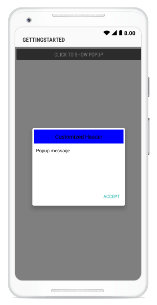
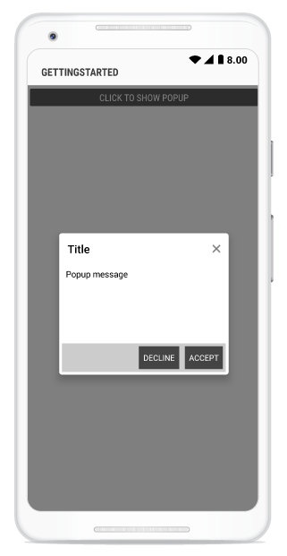

---
layout: post
title: Popup Layouts | SfPopupLayout |Xamarin.Android | Syncfusion
description: Layouts in SfPopupLayout
platform: Xamarin.Android
control: SfPopupLayout
documentation: ug
--- 

# Layout Customizations

The SfPopupLayout supports two types of [SfPopupLayout.PopupView.AppearanceMode](https://help.syncfusion.com/cr/xamarin-android/Syncfusion.Android.PopupLayout.AppearanceMode.html). By default,`AppearanceMode.OneButton` is set. You can change the appearance of the SfPopupLayout by using the `SfPopupLayout.PopupView.AppearanceMode` property.

The two different appearance modes in the SfPopupLayout are as follows:

<table>
<tr>
<th> Modes </th>
<th> Description </th>
</tr>
<tr>
<td> {{'[OneButton](https://help.syncfusion.com/cr/xamarin-android/Syncfusion.Android.PopupLayout.AppearanceMode.html)'| markdownify }} </td>
<td> Shows the SfPopupLayout with one button in the footer view. This is the default value.</td>
</tr>
<tr>
<td> {{'[TwoButton](https://help.syncfusion.com/cr/xamarin-android/Syncfusion.Android.PopupLayout.AppearanceMode.html)'| markdownify }} </td>
<td> Shows the SfPopupLayout with two buttons in the footer view.</td>
</tr>
</table>

## Pop-up with one button in the footer

In the following code example, the `SfPopupLayout.PopupView.AppearanceMode` property is set as `OneButton` which displays only the Accept button in the footer view.



using Syncfusion.Android.PopupLayout;

namespace GettingStarted
{
    public class MainActivity : Activity 
    {
       SfPopupLayout popupLayout;
       Button showPopupButton;
       LinearLayout layout;

        protected override void OnCreate (Bundle bundle) 
        {
            base.OnCreate (bundle); 
            layout = new LinearLayout(this);
            layout.Orientation = Orientation.Vertical;
            layout.SetBackgroundColor(Color.White);

            showPopupButton = new Button(this);
            showPopupButton.Click += ShowPopupButton_Click;
            showPopupButton.SetTextColor(Color.White);
            showPopupButton.Text = "Click to show Popup";

            layout.AddView(showPopupButton, ViewGroup.LayoutParams.MatchParent, ViewGroup.LayoutParams.WrapContent);

            // Setting the AppearanceMode as OneButton.
            popupLayout.PopupView.AppearanceMode = AppearanceMode.OneButton;
            popupLayout = new SfPopupLayout(this);
            popupLayout.Content = layout;

            SetContentView(popupLayout);
        } 

        private void ShowPopupButton_Click(object sender, System.EventArgs e)
        {
            popupLayout.Show();
        }
    }
} 



Executing the above codes renders the following output in an android device.

## Pop-up with two buttons in the footer

In the following code example, the `SfPopupLayout.PopupView.AppearanceMode` property is set as `TwoButton` which displays both Decline button and Accept button in the footer view.



using Syncfusion.Android.PopupLayout;

namespace GettingStarted
{
    public class MainActivity : Activity 
    {
       SfPopupLayout popupLayout;
       Button showPopupButton;
       LinearLayout layout;

        protected override void OnCreate (Bundle bundle) 
        {
            base.OnCreate (bundle); 
            layout = new LinearLayout(this);
            layout.Orientation = Orientation.Vertical;
            layout.SetBackgroundColor(Color.White);

            showPopupButton = new Button(this);
            showPopupButton.Click += ShowPopupButton_Click;
            showPopupButton.SetTextColor(Color.White);
            showPopupButton.Text = "Click to show Popup";

            layout.AddView(showPopupButton, ViewGroup.LayoutParams.MatchParent, ViewGroup.LayoutParams.WrapContent);

            // Setting the AppearanceMode as TwoButton.
            popupLayout.PopupView.AppearanceMode = AppearanceMode.TwoButton;
            popupLayout = new SfPopupLayout(this);
            popupLayout.Content = layout;

            SetContentView(popupLayout);
        } 

        private void ShowPopupButton_Click(object sender, System.EventArgs e)
        {
            popupLayout.Show();
        }
    }
} 



Executing the above codes renders the following output in an android device.

## Customizing pop-up layouts
 
You can customize the entire view of the pop-up by loading the templates or custom views for the header, body, and footer.

### Header customization

Any view can be added as the header content using the [SfPopupLayout.PopupView.HeaderView](https://help.syncfusion.com/cr/xamarin-android/Syncfusion.Android.PopupLayout.PopupView.html#Syncfusion_Android_PopupLayout_PopupView_HeaderView) property to refresh it.

Refer to the following code example in which a TextView is added as a header content.



using Syncfusion.Android.PopupLayout;

namespace GettingStarted
{
    public class MainActivity : Activity 
    {
       SfPopupLayout popupLayout;
       Button showPopupButton;
       LinearLayout layout;
       TextView headerView;

        protected override void OnCreate (Bundle bundle) 
        {
            base.OnCreate (bundle); 
            layout = new LinearLayout(this);
            layout.Orientation = Orientation.Vertical;
            layout.SetBackgroundColor(Color.White);

            showPopupButton = new Button(this);
            showPopupButton.Click += ShowPopupButton_Click;
            showPopupButton.SetTextColor(Color.White);
            showPopupButton.Text = "Click to show Popup";

            layout.AddView(showPopupButton, ViewGroup.LayoutParams.MatchParent, ViewGroup.LayoutParams.WrapContent);

            headerView = new TextView(this) { Text = "Customized Header"};
            headerView.Gravity = GravityFlags.Center;
            headerView.TextSize = 16;
            headerView.SetBackgroundColor(Color.Rgb(0, 0, 255));
            headerView.SetTextColor(Color.Black);

            popupLayout = new SfPopupLayout(this);
            popupLayout.PopupView.ShowCloseButton = false;
            popupLayout.Content = layout;

            // Adding Header view of the SfPopupLayout.
            popupLayout.PopupView.HeaderView = headerView;

            SetContentView(popupLayout);
        } 

        private void ShowPopupButton_Click(object sender, System.EventArgs e)
        {
            popupLayout.Show();
        }
    }
} 



Executing the above codes renders the following output in an android device.

### Footer customization

Any view can be added as the footer content using the [SfPopupLayout.PopupView.FooterView](https://help.syncfusion.com/cr/xamarin-android/Syncfusion.Android.PopupLayout.PopupView.html#Syncfusion_Android_PopupLayout_PopupView_FooterView) property to refresh it.

Refer to the following code example in which a TextView is added as a footer content.



using Syncfusion.Android.PopupLayout;

namespace GettingStarted
{
    public class MainActivity : Activity 
    {
       SfPopupLayout popupLayout;
       Button showPopupButton;
       LinearLayout layout;
       TextView footerView;

        protected override void OnCreate (Bundle bundle) 
        {
            base.OnCreate (bundle); 
            layout = new LinearLayout(this);
            layout.Orientation = Orientation.Vertical;
            layout.SetBackgroundColor(Color.White);

            showPopupButton = new Button(this);
            showPopupButton.Click += ShowPopupButton_Click;
            showPopupButton.SetTextColor(Color.White);
            showPopupButton.Text = "Click to show Popup";

            layout.AddView(showPopupButton, ViewGroup.LayoutParams.MatchParent, ViewGroup.LayoutParams.WrapContent);

            footerView = new TextView(this) { Text = "Customized Footer"};
            footerView.Gravity = GravityFlags.Center;
            footerView.TextSize = 16;
            footerView.SetBackgroundColor(Color.Rgb(0,0,255));
            footerView.SetTextColor(Color.Black);

            popupLayout = new SfPopupLayout(this);
            popupLayout.Content = layout;

            // Adding Footer view of the SfPopupLayout
            popupLayout.PopupView.FooterView = footerView;

            SetContentView(popupLayout);
        } 

        private void ShowPopupButton_Click(object sender, System.EventArgs e)
        {
            popupLayout.Show();
        }
    }
} 



Executing the above codes renders the following output in an android device.

## Styles

The SfPopupLayout applies style for all of elements by using the [SfPopupLayout.PopupView.PopupStyle](https://help.syncfusion.com/cr/xamarin-android/Syncfusion.Android.PopupLayout.PopupView.html#Syncfusion_Android_PopupLayout_PopupView_PopupStyle) property.

### Customizing header elements

The SfPopupLayout allows customizing the header elements with various available header customizations as follows:

<table>
<tr>
<th> Property </th>
<th> Description </th>
</tr>
<tr>
<td> {{'[SfPopupLayout.PopupView.PopupStyle.HeaderBackgroundColor](https://help.syncfusion.com/cr/xamarin-android/Syncfusion.Android.PopupLayout.PopupStyle.html#Syncfusion_Android_PopupLayout_PopupStyle_HeaderBackgroundColor)'| markdownify }} </td>
<td>  Gets or sets the background color of the header.</td>
</tr>
<tr>
<td> {{'[SfPopupLayout.PopupView.PopupStyle.HeaderTypeface](https://help.syncfusion.com/cr/xamarin-android/Syncfusion.Android.PopupLayout.PopupStyle.html#Syncfusion_Android_PopupLayout_PopupStyle_HeaderTypeface)'| markdownify }} </td>
<td>  Gets or sets the font style of the header title.</td>
</tr>
<tr>
<td> {{'[SfPopupLayout.PopupView.PopupStyle.HeaderTypefaceStyle](https://help.syncfusion.com/cr/xamarin-android/Syncfusion.Android.PopupLayout.PopupStyle.html#Syncfusion_Android_PopupLayout_PopupStyle_HeaderTypefaceStyle)'| markdownify }} </td>
<td>  Gets or sets the font attribute of the header title. </td>
</tr>
<tr>
<td> {{'[SfPopupLayout.PopupView.PopupStyle.HeaderTextSize](https://help.syncfusion.com/cr/xamarin-android/Syncfusion.Android.PopupLayout.PopupStyle.html#Syncfusion_Android_PopupLayout_PopupStyle_HeaderTextSize)'| markdownify }} </td>
<td> Gets or sets the text size of the header title.</td>
</tr>
<tr>
<td> {{'[SfPopupLayout.PopupView.PopupStyle.HeaderTextGravity](https://help.syncfusion.com/cr/xamarin-android/Syncfusion.Android.PopupLayout.PopupStyle.html#Syncfusion_Android_PopupLayout_PopupStyle_HeaderTextGravity)'| markdownify }} </td>
<td>  Gets or sets the text alignment of the header.</td>
</tr>
<tr>
<td> {{'[SfPopupLayout.PopupView.PopupStyle.HeaderTextColor](https://help.syncfusion.com/cr/xamarin-android/Syncfusion.Android.PopupLayout.PopupStyle.html#Syncfusion_Android_PopupLayout_PopupStyle_HeaderTextColor)'| markdownify }} </td>
<td>  Gets or sets the text color for the header title.</td>
</tr>
</table>

Refer to the following code example for customizing the header elements.


//MainActivity.cs

protected override void OnCreate(Bundle bundle)
{
	....
    popupLayout.PopupView.PopupStyle.HeaderBackgroundColor = Color.DarkGray;
    popupLayout.PopupView.PopupStyle.HeaderTypeface = Typeface.DefaultBold;
    popupLayout.PopupView.PopupStyle.HeaderTypefaceStyle = TypefaceStyle.Bold;
    popupLayout.PopupView.PopupStyle.HeaderTextSize = 25;
    popupLayout.PopupView.PopupStyle.HeaderTextGravity = GravityFlags.Center;
    popupLayout.PopupView.PopupStyle.HeaderTextColor = Color.White;
    SetContentView(popupLayout);
    ....
}



Executing the above codes renders the following output in an android device.

### Customizing footer elements

The SfPopupLayout allows customizing the footer elements with various available footer customizations as follows:

<table>
<tr>
<th> Property </th>
<th> Description </th>
</tr>
<tr>
<td> {{'[SfPopupLayout.PopupView.PopupStyle.FooterBackgroundColor](https://help.syncfusion.com/cr/xamarin-android/Syncfusion.Android.PopupLayout.PopupStyle.html#Syncfusion_Android_PopupLayout_PopupStyle_FooterBackgroundColor)'| markdownify }} </td>
<td>  Gets or sets the background color of the footer.</td>
</tr>
<tr>
<td> {{'[SfPopupLayout.PopupView.PopupStyle.AcceptButtonBackgroundColor](https://help.syncfusion.com/cr/xamarin-android/Syncfusion.Android.PopupLayout.PopupStyle.html#Syncfusion_Android_PopupLayout_PopupStyle_AcceptButtonBackgroundColor)'| markdownify }} </td>
<td>  Gets or sets the background color of the Accept button in the footer.</td>
</tr>
<tr>
<td> {{'[SfPopupLayout.PopupView.PopupStyle.AcceptButtonTextColor](https://help.syncfusion.com/cr/xamarin-android/Syncfusion.Android.PopupLayout.PopupStyle.html#Syncfusion_Android_PopupLayout_PopupStyle_AcceptButtonTextColor)'| markdownify }} </td>
<td>  Gets or sets the foreground color of the Accept button in the footer.</td>
</tr>
<tr>
<td> {{'[SfPopupLayout.PopupView.PopupStyle.DeclineButtonBackgroundColor](https://help.syncfusion.com/cr/xamarin-android/Syncfusion.Android.PopupLayout.PopupStyle.html#Syncfusion_Android_PopupLayout_PopupStyle_DeclineButtonBackgroundColor)'| markdownify }} </td>
<td> Gets or sets the background color of the Decline button in the footer.</td>
</tr>
<tr>
<td> {{'[SfPopupLayout.PopupView.PopupStyle.DeclineButtonTextColor](https://help.syncfusion.com/cr/xamarin-android/Syncfusion.Android.PopupLayout.PopupStyle.html#Syncfusion_Android_PopupLayout_PopupStyle_DeclineButtonTextColor)'| markdownify }} </td>
<td>  Gets or sets the foreground color of the Decline button in the footer.</td>
</tr>
</table>

Refer to the following code example for customizing the footer elements.



//MainActivity.cs

protected override void OnCreate(Bundle bundle)
{
	....
    // Setting the AppearanceMode as TwoButton.
    popupLayout.PopupView.AppearanceMode = AppearanceMode.TwoButton;

    // Footer customization
    popupLayout.PopupView.PopupStyle.FooterBackgroundColor = Color.LightGray;
    popupLayout.PopupView.PopupStyle.AcceptButtonBackgroundColor = Color.DarkGray;
    popupLayout.PopupView.PopupStyle.AcceptButtonTextColor = Color.White;
    popupLayout.PopupView.PopupStyle.DeclineButtonBackgroundColor = Color.DarkGray;
    popupLayout.PopupView.PopupStyle.DeclineButtonTextColor = Color.White;
    SetContentView(popupLayout);
    ....
}



Executing the above codes renders the following output in an android device.

### Border customization

The SfPopupLayout allows customizing the border appearance with various available border customizations as follows:

<table>
<tr>
<th> Property </th>
<th> Description </th>
</tr>
<tr>
<td> {{'[SfPopupLayout.PopupView.PopupStyle.BorderColor](https://help.syncfusion.com/cr/xamarin-android/Syncfusion.Android.PopupLayout.PopupStyle.html#Syncfusion_Android_PopupLayout_PopupStyle_BorderColor)'| markdownify }} </td>
<td>  Gets or sets the border color for the PopupView.</td>
</tr>
<tr>
<td> {{'[SfPopupLayout.PopupView.PopupStyle.BorderThickness](https://help.syncfusion.com/cr/xamarin-android/Syncfusion.Android.PopupLayout.PopupStyle.html#Syncfusion_Android_PopupLayout_PopupStyle_BorderThickness)'| markdownify }} </td>
<td>  Gets or sets the border thickness for the PopupView.</td>
</tr>
<tr>
<td> {{'[SfPopupLayout.PopupView.PopupStyle.CornerRadius](https://help.syncfusion.com/cr/xamarin-android/Syncfusion.Android.PopupLayout.PopupStyle.html#Syncfusion_Android_PopupLayout_PopupStyle_CornerRadius)'| markdownify }} </td>
<td>  Gets or sets the corner radius for the PopupView.</td>
</tr>
</table>

Refer to the following code example for customizing the border elements.



//MainActivity.cs

protected override void OnCreate(Bundle bundle)
{
	....
    popupLayout.PopupView.PopupStyle.BorderColor = Color.LightBlue;
    popupLayout.PopupView.PopupStyle.BorderThickness = 3;
    popupLayout.PopupView.PopupStyle.CornerRadius = 5;
    SetContentView(popupLayout);
    ....
}



Executing the above codes renders the following output in an android device.

