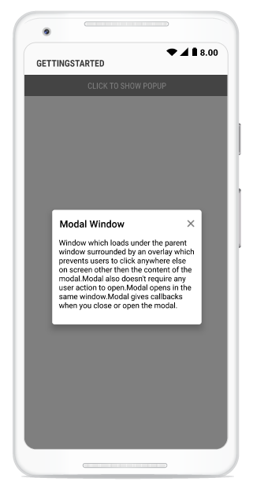

---
layout: post
title: Model Window Popup | SfPopupLayout |Xamarin.Android | Syncfusion
description: Model Window Popup with SfPopupLayout
platform: Xamarin.Android
control: SfPopupLayout
documentation: ug
--- 

# Modal Window Pop-up

You can use the pop-up layout as modal window by using the built-in Close icon and [SfPopupLayout.StaysOpen](https://help.syncfusion.com/cr/xamarin-android/Syncfusion.Android.PopupLayout.SfPopupLayout.html#Syncfusion_Android_PopupLayout_SfPopupLayout_StaysOpen) property prevents interaction with your application until you close the window.

`Modal`:Window loads under the parent window surrounded by an overlay which prevents clicking anywhere else on the screen apart from the control of the modal.

Modal does not require any action to open. It opens in the same window and gives callback when closing or opening the window.

Refer to the following code example in which pop-up will close only if you click on Close icon with a toast message displayed from the pop-up closed event.



using Syncfusion.Android.PopupLayout;

namespace GettingStarted
{
    public class MainActivity : Activity 
    {
       SfPopupLayout popupLayout;
       Button showPopupButton;
       LinearLayout mainLayout;
       TextView popupContent;

        protected override void OnCreate (Bundle bundle) 
        {
            base.OnCreate (bundle); 
            mainLayout = new LinearLayout(this);
            mainLayout.Orientation = Orientation.Vertical;
            mainLayout.SetBackgroundColor(Color.White);

            showPopupButton = new Button(this);
            showPopupButton.Click += ShowPopupButton_Click;
            showPopupButton.SetTextColor(Color.White);
            showPopupButton.Text = "Click to show Popup";

            popupContent = new TextView(this) { Text = "Window loads under the parent window surrounded by an overlay which prevents clicking anywhere else on the screen apart from the control of the modal. Modal opens in the same window. It also does not require any user action to open, and give callbacks when closing or opening the modal." };
            popupContent.TextAlignment = TextAlignment.ViewStart;
            popupContent.SetTextColor(Color.Black);
            popupContent.SetPadding(30, 0, 0, 0);

            mainLayout.AddView(showPopupButton, ViewGroup.LayoutParams.MatchParent, ViewGroup.LayoutParams.WrapContent);

            popupLayout = new SfPopupLayout(this);
            popupLayout.PopupView.HeaderTitle = "Modal Window";
            popupLayout.PopupView.ContentView = popupContent;
            popupLayout.PopupView.HeightRequest = 230;
            popupLayout.PopupView.ShowFooter = false;

            popupLayout.Closed += PopupLayout_Closed;
            popupLayout.Content = mainLayout;

            SetContentView(popupLayout);
        } 

        private void PopupLayout_Closed(object sender, System.EventArgs e)
        {
            Toast.MakeText(this.BaseContext, "Popup is Closed", ToastLength.Short).Show();
        }

        private void ShowPopupButton_Click(object sender, System.EventArgs e)
        {
            // Below code ensures that the popup doesn't collapse when user interacts outside the popup.
            popupLayout.PopupView.ShowCloseButton = true;
            popupLayout.StaysOpen = true;
            popupLayout.IsOpen = true;
        }
    } 
}



Executing the above codes renders the following output in an android device.

