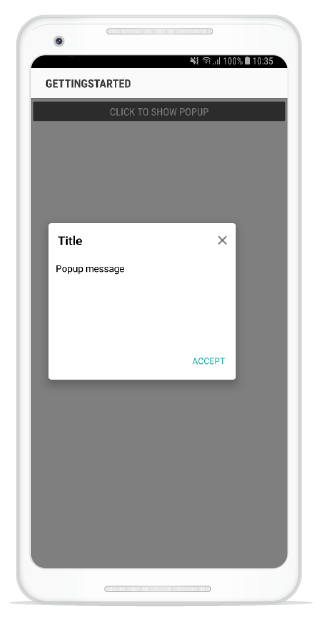

---
layout: post
title: Popup positioning | SfPopupLayout |Xamarin.Android | Syncfusion
description: Positioning capabilities of SfPopupLayout
platform: Xamarin.Android
control: SfPopupLayout
documentation: ug
--- 

# Pop-up Positioning

SfPopupLayout allows you to show the Popup content at various position based on the requirement.

Following are the list of options available to show SfPopupLayout at various position.

<table>
<tr>
<th> Methods / Property </th>
<th> Description </th>
</tr>
<tr>
<td> {{'[SfPopupLayout.IsOpen](https://help.syncfusion.com/cr/xamarin-android/Syncfusion.Android.PopupLayout.SfPopupLayout.html#Syncfusion_Android_PopupLayout_SfPopupLayout_IsOpen)'| markdownify }} </td>
<td> Shows SfPopupLayout at the center.</td>
</tr>
<tr>
<td> {{'[SfPopupLayout.Show()](https://help.syncfusion.com/cr/xamarin-android/Syncfusion.Android.PopupLayout.SfPopupLayout.html#Syncfusion_Android_PopupLayout_SfPopupLayout_Show)'| markdownify }} </td>
<td> It is similar to <code>SfPopupLayout.IsOpen</code> property.</td>
</tr>
<tr>
<td> {{'[SfPopupLayout.Show(x-position, y-position)](https://help.syncfusion.com/cr/xamarin-android/Syncfusion.Android.PopupLayout.SfPopupLayout.html#Syncfusion_Android_PopupLayout_SfPopupLayout_Show)'| markdownify }} </td>
<td> Shows SfPopupLayout at the specified X and y position.</td>
</tr>
<tr>
<td> {{'[SfPopupLayout.ShowAtTouchPoint()](https://help.syncfusion.com/cr/xamarin-android/Syncfusion.Android.PopupLayout.SfPopupLayout.html#Syncfusion_Android_PopupLayout_SfPopupLayout_ShowAtTouchPoint)'| markdownify }} </td>
<td> Shows SfPopupLayout at the touch point.</td>
</tr>
<tr>
<td> {{'[SfPopupLayout.ShowRelativeToView(View, RelativePosition)](https://help.syncfusion.com/cr/xamarin-android/Syncfusion.Android.PopupLayout.SfPopupLayout.html#Syncfusion_Android_PopupLayout_SfPopupLayout_ShowRelativeToView_Android_Views_View_Syncfusion_Android_PopupLayout_RelativePosition_Android_Views_View_)'| markdownify }} </td>
<td> Shows SfPopupLayout at the position relative to the specified view.</td>
</tr>
<tr>
<td> {{'[SfPopupLayout.ShowRelativeToView(View, RelativePosition,x-position,y-position)](https://help.syncfusion.com/cr/xamarin-android/Syncfusion.Android.PopupLayout.SfPopupLayout.html#Syncfusion_Android_PopupLayout_SfPopupLayout_ShowRelativeToView_Android_Views_View_Syncfusion_Android_PopupLayout_RelativePosition_System_Double_System_Double_)'| markdownify }} </td>
<td> Shows the SfPopupLayout at an absolute x, y coordinate from the relative position of the specified view.</td>
</tr>
</table>

## Center Positioning

SfPopupLayout can be shown at the center by using the following options.

  * [IsOpen property](https://help.syncfusion.com/cr/xamarin-android/Syncfusion.Android.PopupLayout.SfPopupLayout.html#Syncfusion_Android_PopupLayout_SfPopupLayout_IsOpen)
  * [SfPopupLayout.Show()](https://help.syncfusion.com/cr/xamarin-android/Syncfusion.Android.PopupLayout.SfPopupLayout.html#Syncfusion_Android_PopupLayout_SfPopupLayout_Show)

To open the SfPopupLayout, use the `SfPopupLayout.IsOpen` property as in the following code sample.



using Syncfusion.Android.PopupLayout;

namespace GettingStarted
{
    public class MainActivity : Activity 
    {
       SfPopupLayout popupLayout;
       Button showPopupButton;
       LinearLayout layout;

        protected override void OnCreate (Bundle bundle) 
        {
            base.OnCreate (bundle); 
            layout = new LinearLayout(this);
            layout.Orientation = Orientation.Vertical;
            layout.SetBackgroundColor(Color.White);

            showPopupButton = new Button(this);
            showPopupButton.Click += ShowPopupButton_Click;
            showPopupButton.SetTextColor(Color.White);
            showPopupButton.Text = "Click to show Popup";

            layout.AddView(showPopupButton, ViewGroup.LayoutParams.MatchParent, ViewGroup.LayoutParams.WrapContent);          
            popupLayout = new SfPopupLayout(this);
            popupLayout.Content = layout;

            SetContentView(popupLayout);
        } 

        private void ShowPopupButton_Click(object sender, System.EventArgs e)
        {
            // Shows SfPopupLayout at the center of the view.
            popupLayout.IsOpen = true;
        }
    }
} 



Executing the above codes renders the following output in an android device.

To open the SfPopupLayout, use the `SfPopupLayout.Show()` as in the following code sample.



using Syncfusion.Android.PopupLayout;

namespace GettingStarted
{
    public class MainActivity : Activity 
    {
       SfPopupLayout popupLayout;
       Button showPopupButton;
       LinearLayout layout;

        protected override void OnCreate (Bundle bundle) 
        {
            base.OnCreate (bundle); 
            layout = new LinearLayout(this);
            layout.Orientation = Orientation.Vertical;
            layout.SetBackgroundColor(Color.White);

            showPopupButton = new Button(this);
            showPopupButton.Click += ShowPopupButton_Click;
            showPopupButton.SetTextColor(Color.White);
            showPopupButton.Text = "Click to show Popup";

            layout.AddView(showPopupButton, ViewGroup.LayoutParams.MatchParent, ViewGroup.LayoutParams.WrapContent);           
            popupLayout = new SfPopupLayout(this);
            popupLayout.Content = layout;

            SetContentView(popupLayout);
        } 

        private void ShowPopupButton_Click(object sender, System.EventArgs e)
        {
               // Shows SfPopupLayout at the center of the view.
               popupLayout.Show();
        }
    }
} 



Executing the above codes renders the following output in an android device.

## Absolute Positioning

SfPopupLayout can be shown at the specified position by using the following method.

### Show At x,y position

To open the SfPopupLayout in specific X,Y coordinates, use the `SfPopupLayout.Show(x-position, y-position)` property as in the following code sample.



using Syncfusion.Android.PopupLayout;

namespace GettingStarted
{
    public class MainActivity : Activity 
    {
       SfPopupLayout popupLayout;
       Button showPopupButton;
       LinearLayout layout;

        protected override void OnCreate (Bundle bundle) 
        {
            base.OnCreate (bundle); 
            layout = new LinearLayout(this);
            layout.Orientation = Orientation.Vertical;
            layout.SetBackgroundColor(Color.White);

            showPopupButton = new Button(this);
            showPopupButton.Click += ShowPopupButton_Click;
            showPopupButton.SetTextColor(Color.White);
            showPopupButton.Text = "Click to show Popup";

            layout.AddView(showPopupButton, ViewGroup.LayoutParams.MatchParent, ViewGroup.LayoutParams.WrapContent);       
            popupLayout = new SfPopupLayout(this);
            popupLayout.Content = layout;

            SetContentView(popupLayout);
        } 

        private void ShowPopupButton_Click(object sender, System.EventArgs e)
        {
               // Shows SfPopupLayout at x-position 100 and y position 100.
               popupLayout.Show(100, 700);
        }
    }
} 



Executing the above codes renders the following output in an android device.

### Show At Touch Point

To open the SfPopupLayout from the touch point in the screen, use the `SfPopupLayout.ShowAtTouchPoint()` property as in the following code sample.



using Syncfusion.Android.PopupLayout;

namespace GettingStarted
{
    public class MainActivity : Activity 
    {
       SfPopupLayout popupLayout;
       Button showPopupButton;
       LinearLayout layout;

        protected override void OnCreate (Bundle bundle) 
        {
            base.OnCreate (bundle); 
            layout = new LinearLayout(this);
            layout.Orientation = Orientation.Vertical;
            layout.SetBackgroundColor(Color.White);

            showPopupButton = new Button(this);
            showPopupButton.Click += ShowPopupButton_Click;
            showPopupButton.SetTextColor(Color.White);
            showPopupButton.Text = "Click to show Popup";

            layout.AddView(showPopupButton, ViewGroup.LayoutParams.MatchParent, ViewGroup.LayoutParams.WrapContent);         
            popupLayout = new SfPopupLayout(this);
            popupLayout.Content = layout;

            SetContentView(popupLayout);
        } 

        private void ShowPopupButton_Click(object sender, System.EventArgs e)
        {
               // Shows SfPopupLayout at the touch point.
               popupLayout.ShowAtTouchPoint();
        }
    }
} 



Executing the above codes renders the following output in an android device.

N> SfPopupLayout.ShowAtTouchPoint() is not applicable for displaying pop-up when the SfPopupLayout is not set as root view .

## Relative Positioning

SfPopupLayout can be shown at the relative position by using the following method.

### Show Relative To View

To open the SfPopupLayout relative to a view, use the `SfPopupLayout.ShowRelativeToView(View, RelativePosition)` property as in the following code sample.



using Syncfusion.Android.PopupLayout;

namespace GettingStarted
{
    public class MainActivity : Activity 
    {
       SfPopupLayout popupLayout;
       Button showPopupButton;
       LinearLayout layout;

        protected override void OnCreate (Bundle bundle) 
        {
            base.OnCreate (bundle); 
            layout = new LinearLayout(this);
            layout.Orientation = Orientation.Vertical;
            layout.SetBackgroundColor(Color.White);

            showPopupButton = new Button(this);
            showPopupButton.Click += ShowPopupButton_Click;
            showPopupButton.SetTextColor(Color.White);
            showPopupButton.Text = "Click to show Popup";
            showPopupButton.Gravity = GravityFlags.Center;
            showPopupButton.SetBackgroundColor(Color.Blue);
            showPopupButton.SetX(320);
            showPopupButton.SetY(1000);

            layout.AddView(showPopupButton, 700, 250);
          
            popupLayout = new SfPopupLayout(this);
            popupLayout.Content = layout;

            SetContentView(popupLayout);
        } 

        private void ShowPopupButton_Click(object sender, System.EventArgs e)
        {
            // Shows SfPopupLayout at the bottom of the text view.
            popupLayout.ShowRelativeToView(showPopupButton, RelativePosition.AlignBottom);
        }
    }
} 



Executing the above codes renders the following output in an android device.

### Absolute relative positioning

The SfPopupLayout can be displayed at an absolute x, y coordinate from the relative position of the specified view by using the following method.

To open the SfPopupLayout in the specific x, y coordinate relative to a view, use the `SfPopupLayout.ShowRelativeToView(View, RelativePosition,x-position,y-position)` method.




using Syncfusion.Android.PopupLayout;

namespace GettingStarted
{
    public class MainActivity : Activity 
    {
       SfPopupLayout popupLayout;
       Button showPopupButton;
       LinearLayout layout;

        protected override void OnCreate (Bundle bundle) 
        {
            base.OnCreate (bundle); 
            layout = new LinearLayout(this);
            layout.Orientation = Orientation.Vertical;
            layout.SetBackgroundColor(Color.White);

            showPopupButton = new Button(this);
            showPopupButton.Click += ShowPopupButton_Click;
            showPopupButton.SetTextColor(Color.White);
            showPopupButton.Text = "Click to show Popup";
            showPopupButton.Gravity = GravityFlags.Center;
            showPopupButton.SetBackgroundColor(Color.Blue);
            showPopupButton.SetX(150);
            showPopupButton.SetY(800);

            layout.AddView(showPopupButton, 700, 250);
          
            popupLayout = new SfPopupLayout(this);
            popupLayout.Content = layout;

            SetContentView(popupLayout);
        } 

        private void ShowPopupButton_Click(object sender, System.EventArgs e)
        {
            // Shows SfPopupLayout at the bottom of the text view with absolute relative position.
            popupLayout.ShowRelativeToView(showPopupButton, RelativePosition.AlignBottom,30,30);
        }
    }
} 




Executing the above codes renders the following output in an android device.

You can pass both negative and positive values as parameters to the `SfPopupLayout.ShowRelativeToView(View, RelativePosition, x-position, y-position)`. The pop-up will be positioned by considering the relative position as (0, 0) the center point. For example, if you have set the `RelativePosition` as `RelativePosition.BottomRight` and `RelativeView` as a button, bottom right corner of the button will be considered as the 0, 0 point and a negative x-position value will place the pop-up to the left of that point and a positive x-position value will place the pop-up to the right of that point. The same applies for y-position also.

N> To open the SfPopupLayout relative to a view without absolute position, you have to pass the x-position and y-position parameters as 0 in the `SfPopupLayout.ShowRelativeToView(View, RelativePosition,x-position,y-position)`.
