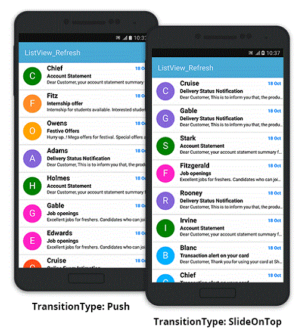
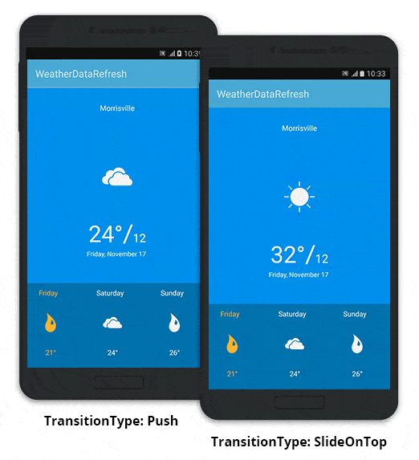

---
layout: post
title: Customizing PullableContent | SfPullToRefresh | Xamarin.Android | Syncfusion
description: Customizing the PullableContent of SfPullToRefresh
platform: Xamarin.Android
control: SfPullToRefresh
documentation: ug
--- 

# Customizing PullableContent

SfPullToRefresh supports various layouts as its pullable content. 

This section explains how to refresh the following views by hosting as a pullable content of SfPullToRefresh:

* [ListView](#listview) 
* [SfDataGrid](#sfdatagrid) 
* [Custom layout](#custom-layout) 

## ListView

SfPullToRefresh can host the ListView as its pullable content and refresh the view. 

### ListView customizations

Refer to the following code example for creating and customizing a ListView: 



//MainActivity.cs

ListView listView;
CustomBaseAdapter adapter;
InboxRepository repository;

protected override void OnCreate(Bundle bundle)
{
    ....
    listView = new ListView(this);
    listView.SetBackgroundColor(Color.LightGray);
    repository = new InboxRepository();
    adapter = new CustomBaseAdapter(this, repository.InboxItems);
    listView.Adapter = adapter;
    ....
}



The example code of the adapter and the template of the ListView are not displayed here. However, the source code of this sample can be downloaded here.

### Adapting ListView in SfPullToRefresh

To add ListView as a pullable content and to refresh the pullable content, refer to the following code example:



//MainActivity.cs

SfPullToRefresh pullToRefresh;

protected override void OnCreate (Bundle bundle)
{
    ....
    pullToRefresh = new SfPullToRefresh(this);
    pullToRefresh.PullableContent = listView;
    pullToRefresh.TransitionType = TransitionType.Push;
    pullToRefresh.Refreshing += PullToRefresh_Refreshing;
    SetContentView(pullToRefresh);
    ....
}

private async void PullToRefresh_Refreshing(object sender, RefreshingEventArgs e)
{
    await Task.Delay(3000);
    repository.RefreshItemSource();
    adapter.NotifyDataSetChanged();
    e.Refreshed = true;
}

//InboxRepository.cs 

private Random random;

public ObservableCollection<Mail> InboxItems { get; set; }

public void RefreshItemSource()
{
    int count = random.Next(1, 6);

    for (int i = 0; i < count; i++)
    {
        int randomNumber = random.Next(0, 9);
        Mail mail = new Mail();
        mail.Sender = sender[random.Next(0, 24)];
        mail.Subject = subject[randomNumber];
        mail.Details = details[randomNumber];
        mail.BackgroundColor = colors[randomNumber];
        InboxItems.Insert(i, mail);
    }
}



The final output of the sample of SfPullToRefresh adapting ListView as its pullable content is as follows:

## SfDataGrid

SfPullToRefresh can host the `SfDataGrid` as its pullable content and refresh it.

### SfDataGrid customizations

Click [here](https://help.syncfusion.com/xamarin-android/sfdatagrid/getting-started) to explore SfDataGrid. Refer to the following code example to create and customize a SfDataGrid:



//MainActivity.cs

SfDataGrid sfGrid;
ViewModel viewModel;

protected override void OnCreate(Bundle bundle)
{
    ....
    sfGrid = new SfDataGrid(this);
    sfGrid.HeaderRowHeight = 52;
    sfGrid.RowHeight = 48;
    viewModel = new ViewModel();
    viewModel.SetRowsToGenerate(100);
    sfGrid.AutoGenerateColumns = false;
    GridGenerateColumns();
    sfGrid.ColumnSizer = ColumnSizer.Star;
    sfGrid.ItemsSource = viewModel.OrdersInfo;
    ....
}

void GridGenerateColumns()
{
    sfGrid.Columns.Add(new GridTextColumn() { MappingName = "OrderID", HeaderText = "Order ID" });
    sfGrid.Columns.Add(new GridTextColumn() { MappingName = "CustomerID", HeaderText = "Customer ID", TextAlignment = GravityFlags.CenterVertical });
    sfGrid.Columns.Add(new GridTextColumn() { MappingName = "Freight", Format = "C", CultureInfo = new CultureInfo("en-US"), TextAlignment = GravityFlags.Center });
    sfGrid.Columns.Add(new GridTextColumn() { MappingName = "ShipCity", HeaderText = "Ship City", TextAlignment = GravityFlags.CenterVertical });
}



The example code of the ViewModel is not displayed here. However, the source code of this sample can be downloaded here.

### Adapting SfDataGrid in SfPullToRefresh

To add SfDataGrid as a pullable content and to refresh the pullable content, refer to the following code example: 



//MainActivity.cs

SfPullToRefresh pullToRefresh;

protected override void OnCreate(Bundle bundle)
{
    ....
    pullToRefresh = new SfPullToRefresh(this);
    pullToRefresh.Refreshing += PullToRefresh_Refreshing;
    pullToRefresh.RefreshContentThreshold = 52;
    pullToRefresh.PullableContent = sfGrid;
    SetContentView(pullToRefresh);
    ....
}

private async void PullToRefresh_Refreshing(object sender, RefreshingEventArgs e)
{
    await Task.Delay(3000);
    if (viewModel != null)
        viewModel.ItemsSourceRefresh();
    e.Refreshed = true;
}



The final output of the sample of SfPullToRefresh adapting SfDataGrid as its pullable content is as follows:

## Custom layout

A layout can be customized and added as the pullable content of SfPullToRefresh. 

The code example of the customized layout is as follows:



//pullToRefresh.xml

<LinearLayout xmlns:android="http://schemas.android.com/apk/res/android"
    android:orientation="vertical"
    android:layout_width="match_parent"
    android:layout_height="match_parent"
    android:layout_weight="1"
    android:background="#039be5"
    android:id="@+id/layout">
    <TextView
        android:layout_marginTop="30dp"
        android:layout_width="wrap_content"
        android:layout_height="wrap_content"
        android:text="Morrisville"
        android:textSize="15sp"
        android:textColor="#ffffff"
        android:layout_weight="1"
        android:layout_gravity="center_horizontal" />
    <ImageView
        android:layout_width="120dp"
        android:layout_height="120dp"
        android:id="@+id/weatherImage"
        android:adjustViewBounds="true"
        android:layout_weight="1"
        android:src="@drawable/cloudy"
        android:layout_gravity="center_horizontal" />
    <TextView
        android:layout_width="wrap_content"
        android:layout_height="wrap_content"
        android:textColor="#ffffff"
        android:text="20°/12"
        android:textAppearance="?android:attr/textAppearanceLarge"
        android:textSize="23sp"
        android:textAlignment="center"
        android:id="@+id/temperatureTextView"
        android:layout_gravity="center" />
    <TextView
        android:layout_marginTop="2dp"
        android:layout_marginBottom="5dp"
        android:layout_width="wrap_content"
        android:layout_height="wrap_content"
        android:text="Friday, March 16 "
        android:textSize="13sp"
        android:textColor="#ffffff"
        android:id="@+id/dayTextView"
        android:layout_weight="1"
        android:layout_gravity="center_horizontal" />
    <HorizontalScrollView
        android:layout_width="wrap_content"
        android:layout_gravity="bottom"
        android:background="#007aaa"
        android:id="@+id/scrollView"
        android:layout_height="170dp">
        <LinearLayout
            android:orientation="horizontal"
            android:background="#007aaa"
            android:layout_width="wrap_content"
            android:id="@+id/pullScroller"
            android:layout_height="fill_parent" />
    </HorizontalScrollView>
</LinearLayout>



### Adapting custom layout in SfPullToRefresh

To add the above custom layout as a pullable content and to refresh the pullable content, refer to the following code example:



//MainActivity.cs

LinearLayout linearLayout;
ImageView weatherImageView;
Handler handler;
TextView degreeText;

protected override void OnCreate (Bundle bundle)
{
    ....
    LayoutInflater layoutInflater = LayoutInflater.From(this);
    view = layoutInflater.Inflate(Resource.Layout.pullToRefresh, null);
    linearLayout = (LinearLayout)view;
    //The custom layout is set as the pullable content of SfPullToRefresh.
    pullToRefresh.PullableContent = linearLayout;
    ....
    //Refreshing of the pullable content is handled here. 
    pullToRefresh.Refreshing += (sender, e) =>
            {
                if (selectedLayout != null)
                {
                    run = new Java.Lang.Runnable(() =>
                    {
                        Java.Util.Random random = new Java.Util.Random();
                        int i = random.NextInt(6 - 0 + 1) + 0;
                        weatherImageView = (ImageView)linearLayout.FindViewById(Resource.Id.weatherImage);
                        weatherImageView.SetImageResource(dataSource[i].Type);
                        degreeText = (TextView)linearLayout.FindViewById(Resource.Id.temperatureTextView);
                        String s1 = "" + dataSource[i].Temperature + (char)0x00B0 + "/12";
                        SpannableString ss3 = new SpannableString(s1);
                        ss3.SetSpan(new RelativeSizeSpan(2f), 0, 4, SpanTypes.ExclusiveExclusive);
                        degreeText.SetText(ss3, TextView.BufferType.Normal);
                        e.Refreshed = true;
                    });
                    handler.PostDelayed(run, 3000);
                }
            };
    ....
}



The final output of the above sample is as follows:

## Samples

Download the source code of the sample from the below link:

* [ListView](http://www.syncfusion.com/downloads/support/directtrac/general/ze/ListView_Refresh_UG-904322401)

* [SfDataGrid](http://www.syncfusion.com/downloads/support/directtrac/general/ze/SfDataGrid_Refresh_UG-1130051554)

* [Custom layout](http://www.syncfusion.com/downloads/support/directtrac/general/ze/WeatherDataRefresh_UG-1906644392)
