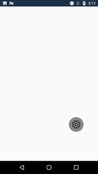

# Placing and dragging RadialMenu

You can place the radial menu anywhere on its parent layout and drag it within the parent layout. 

## Dragging RadialMenu

You can enable or disable dragging using the [IsDragEnabled](https://help.syncfusion.com/cr/xamarin-android/Syncfusion.SfRadialMenu.Android.SfRadialMenu.html#Syncfusion_SfRadialMenu_Android_SfRadialMenu_IsDragEnabled) property.




using Android.App;
using Android.Widget;
using Android.OS;
using Syncfusion.SfRadialMenu.Android;
using Android.Graphics;
using Android.Views;
using System.Collections.Generic;

namespace GettingStarted
{
    [Activity(Label = "GettingStarted", MainLauncher = true)]
    public class MainActivity : Activity
    {
        protected override void OnCreate(Bundle savedInstanceState)
        {
            base.OnCreate(savedInstanceState);
            SfRadialMenu radialMenu = new SfRadialMenu(this);
            radialMenu.CenterButtonText = "\uE713";
            radialMenu.CenterButtonTypeface = Typeface.CreateFromAsset(this.Assets, "Segoe_MDL2_Assets.ttf");
            radialMenu.CenterButtonRadius = 32;
            radialMenu.CenterButtonBorderColor = Color.White;
            radialMenu.IsDragEnabled = true;
            SetContentView(radialMenu);
        }
    }
}




## DragEvents

SfRadialMenu provides the DragBegin and DragEnd events that occur when the RadialMenu is dragged.

### DragBegin

This event occurs when you start dragging RadialMenu with `DragBeginEventArgs`.

* `Position`: Gets the start position of the RadialMenu.

* `Handled`: Gets or sets the Boolean value for enabling and disabling the dragging of RadialMenu.

To hook the [DragBegin](https://help.syncfusion.com/cr/xamarin-android/Syncfusion.SfRadialMenu.Android.SfRadialMenu.html) event and to get the start position and restrict dragging, refer to the following code example.




using Android.App;
using Android.Widget;
using Android.OS;
using Syncfusion.SfRadialMenu.Android;
using Android.Graphics;
using Android.Views;
using System.Collections.Generic;

namespace GettingStarted
{
    [Activity(Label = "GettingStarted", MainLauncher = true)]
    public class MainActivity : Activity
    {
        protected override void OnCreate(Bundle savedInstanceState)
        {
            base.OnCreate(savedInstanceState);
            SfRadialMenu radialMenu = new SfRadialMenu(this);
            radialMenu.DragBegin += RadialMenu_DragBegin;
            radialMenu.CenterButtonText = "\uE713";
            radialMenu.CenterButtonTypeface = Typeface.CreateFromAsset(this.Assets, "Segoe_MDL2_Assets.ttf");
            radialMenu.CenterButtonRadius = 32;
            radialMenu.CenterButtonBorderColor = Color.White;
            radialMenu.IsDragEnabled = true;
            SetContentView(radialMenu);
        }

        private void RadialMenu_DragBegin(object sender, DragBeginEventArgs e)
        {
            e.Handled = true;
        }
    }
}




### DragEnd

This event occurs when dragging ends in RadialMenu with `DragEndEventArgs`.

* `OldValue`: Gets the start position of the RadialMenu.

* `NewValue`: Gets the end position of the RadialMenu.

* `Handled`: Gets or sets the Boolean value for restricting the RadialMenu from moving to another position.

To hook the [DragEnd](https://help.syncfusion.com/cr/xamarin-android/Syncfusion.SfRadialMenu.Android.SfRadialMenu.html) event, to get the start and end positions, and to restrict the movement of RadialMenu, refer to the following code example.




using Android.App;
using Android.Widget;
using Android.OS;
using Syncfusion.SfRadialMenu.Android;
using Android.Graphics;
using Android.Views;
using System.Collections.Generic;

namespace GettingStarted
{
    [Activity(Label = "GettingStarted", MainLauncher = true)]
    public class MainActivity : Activity
    {
        protected override void OnCreate(Bundle savedInstanceState)
        {
            base.OnCreate(savedInstanceState);
            SfRadialMenu radialMenu = new SfRadialMenu(this);
            radialMenu.DragEnd += RadialMenu_DragEnd;
            radialMenu.CenterButtonText = "\uE713";
            radialMenu.CenterButtonTypeface = Typeface.CreateFromAsset(this.Assets, "Segoe_MDL2_Assets.ttf");
            radialMenu.CenterButtonRadius = 32;
            radialMenu.CenterButtonBorderColor = Color.White;
            radialMenu.IsDragEnabled = true;
            SetContentView(radialMenu);
        }

        private void RadialMenu_DragEnd(object sender, DragEndEventArgs e)
        {
            e.Handled = true;
        }
    }
}




## Placement of RadialMenu

You can place the SfRadialMenu based on its CenterButton axis by providing the [CenterButtonPlacement](https://help.syncfusion.com/cr/xamarin-android/Syncfusion.SfRadialMenu.Android.SfRadialMenu.html#Syncfusion_SfRadialMenu_Android_SfRadialMenu_CenterButtonPlacement) enum property with TopLeft and Center positions.

`TopLeft`: Places the origin (0,0) of SfRadialMenu at the top-left corner.

`Center`: Places the origin (0,0) of SfRadialMenu at the center.

N> The default value of the [CenterButtonPlacement](https://help.syncfusion.com/cr/xamarin-android/Syncfusion.SfRadialMenu.Android.SfRadialMenu.html#Syncfusion_SfRadialMenu_Android_SfRadialMenu_CenterButtonPlacement) property is center.




using Android.App;
using Android.Widget;
using Android.OS;
using Syncfusion.SfRadialMenu.Android;
using Android.Graphics;
using Android.Views;
using System.Collections.Generic;

namespace GettingStarted
{
    [Activity(Label = "GettingStarted", MainLauncher = true)]
    public class MainActivity : Activity
    {
        protected override void OnCreate(Bundle savedInstanceState)
        {
            base.OnCreate(savedInstanceState);
            SfRadialMenu radialMenu = new SfRadialMenu(this);
            radialMenu.CenterButtonText = "\uE713";
            radialMenu.CenterButtonTypeface = Typeface.CreateFromAsset(this.Assets, "Segoe_MDL2_Assets.ttf");
            radialMenu.CenterButtonRadius = 32;
            radialMenu.CenterButtonBorderColor = Color.White;
            radialMenu.CenterButtonPlacement = SfRadialMenuCenterButtonPlacement.TopLeft;
            radialMenu.IsDragEnabled = true;
            SetContentView(radialMenu);
        }
    }
}




## Placing RadialMenu

You can place the radial menu anywhere on its parent layout using the [Point](https://help.syncfusion.com/cr/xamarin-android/Syncfusion.SfRadialMenu.Android.SfRadialMenu.html#Syncfusion_SfRadialMenu_Android_SfRadialMenu_Point) property. The position of Radial Menu is calculated based on the center point of parent layout.




using Android.App;
using Android.Widget;
using Android.OS;
using Syncfusion.SfRadialMenu.Android;
using Android.Graphics;
using Android.Views;
using System.Collections.Generic;

namespace GettingStarted
{
    [Activity(Label = "GettingStarted", MainLauncher = true)]
    public class MainActivity : Activity
    {
        protected override void OnCreate(Bundle savedInstanceState)
        {
            base.OnCreate(savedInstanceState);
            SfRadialMenu radialMenu = new SfRadialMenu(this);
            radialMenu.CenterButtonText = "\uE713";
            radialMenu.CenterButtonTypeface = Typeface.CreateFromAsset(this.Assets, "Segoe_MDL2_Assets.ttf");
            radialMenu.CenterButtonRadius = 32;
            radialMenu.CenterButtonBorderColor = Color.White;
            radialMenu.Point = new Point(100, 150);
            radialMenu.IsDragEnabled = true;
            SetContentView(radialMenu);
        }
    }
}




