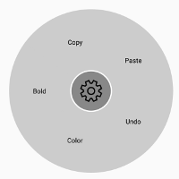
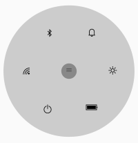
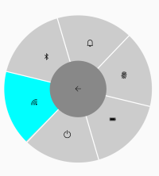
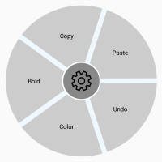
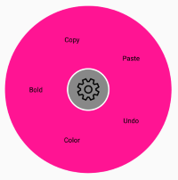

# Populating Items

This section explains how to populate items using the radial menu item and item source.

## Using radial menu items

By passing a collection of [SfRadialMenuItems](https://help.syncfusion.com/cr/xamarin-android/Syncfusion.SfRadialMenu.Android.SfRadialMenuItem.html), you can get the view of the `SfRadialMenu` control. The radial menu item class provides various options such as custom views, font icons, and images to customize the items. You can also add radial menu items by hierarchy.

### Adding outer rim items of the radial menu

The following code sample shows how to add the outer rim items of the radial menu.




using Android.App;
using Android.Widget;
using Android.OS;
using Syncfusion.SfRadialMenu.Android;
using Android.Graphics;
using Android.Views;
using System.Collections.Generic;

namespace GettingStarted
{
    [Activity(Label = "GettingStarted", MainLauncher = true)]
    public class MainActivity : Activity
    {
		protected override void OnCreate(Bundle savedInstanceState)
		{
			base.OnCreate(savedInstanceState);
			SfRadialMenu radialMenu = new SfRadialMenu(this);
			radialMenu.CenterButtonText = "\uE713";
			radialMenu.CenterButtonTypeface = Typeface.CreateFromAsset(this.Assets, "Segoe MDL2 Assets.ttf");
			radialMenu.CenterButtonRadius = 32;
			radialMenu.CenterButtonBorderColor = Color.White;
			List<SfRadialMenuItem> itemCollection = new List<SfRadialMenuItem>();
			itemCollection.Add(new SfRadialMenuItem(this) { Text = "Bold", TextSize = 12 });
			itemCollection.Add(new SfRadialMenuItem(this) { Text = "Copy", TextSize = 12 });
			itemCollection.Add(new SfRadialMenuItem(this) { Text = "Paste", TextSize = 12 });
			itemCollection.Add(new SfRadialMenuItem(this) { Text = "Undo", TextSize = 12 });
			itemCollection.Add(new SfRadialMenuItem(this) { Text = "Color", TextSize = 12 });
			radialMenu.Items = itemCollection;
			SetContentView(radialMenu);
		}
	}
}




### Adding nested items of a radial menu

You can populate the nested levels of items within a menu to group similar actions. For example, you can group the clipboard operations by adding clipboard as the main menu and cut, copy, and paste as its children.

The following code sample shows how to add the nested items of the radial menu.





using Android.App;
using Android.Widget;
using Android.OS;
using Syncfusion.SfRadialMenu.Android;
using Android.Graphics;
using Android.Views;
using System.Collections.Generic;

namespace GettingStarted
{
    [Activity(Label = "GettingStarted", MainLauncher = true)]
    public class MainActivity : Activity
    {
	protected override void OnCreate(Bundle savedInstanceState)
		{
			base.OnCreate(savedInstanceState);
			SfRadialMenu radialMenu = new SfRadialMenu(this);
			radialMenu.CenterButtonText = "\uE713";
			radialMenu.CenterButtonBackText = "\uE72b";
			radialMenu.CenterButtonTypeface = Typeface.CreateFromAsset(this.Assets, "Segoe MDL2 Assets.ttf");
			radialMenu.CenterButtonBackTypeface = Typeface.CreateFromAsset(this.Assets, "Segoe MDL2 Assets.ttf");
			radialMenu.CenterButtonRadius = 32;
			radialMenu.CenterButtonBorderColor = Color.White;

			string[] mainItem = new string[] { "Bold", "Copy", "Paste", "Undo", "Color" };
			string[] colorItem = new string[] { "Font", "Gradient", "Highlight" };

			// Adding radial menu outer rim items.

			for (int i = 0; i < 5; i++)
			{
				SfRadialMenuItem mainMenuItems = new SfRadialMenuItem(this);
				mainMenuItems.Text = mainItem[i];
				mainMenuItems.TextSize = 12;
				radialMenu.Items.Add(mainMenuItems);
			}

			// Adding inner rim items.

			for (int i = 0; i < 3; i++)
			{
				SfRadialMenuItem colorSubMenuItem = new SfRadialMenuItem(this);
				colorSubMenuItem.Text = colorItem[i];
				colorSubMenuItem.TextSize = 12;
				colorSubMenuItem.ItemWidth = 50;
				radialMenu.Items[4].Items.Add(colorSubMenuItem);
			}	

			SetContentView(radialMenu);
		}
	}
}




## Animation duration

The duration of animation in the radial menu can be changed using the [AnimationDuration](https://help.syncfusion.com/cr/xamarin-android/Syncfusion.SfRadialMenu.Android.SfRadialMenu.html#Syncfusion_SfRadialMenu_Android_SfRadialMenu_AnimationDuration) property. It is used to change the speed of opening and closing  the radial menu.




using Android.App;
using Android.Widget;
using Android.OS;
using Syncfusion.SfRadialMenu.Android;
using Android.Graphics;
using Android.Views;
using System.Collections.Generic;

namespace GettingStarted
{
    [Activity(Label = "GettingStarted", MainLauncher = true)]
    public class MainActivity : Activity
    {
	protected override void OnCreate(Bundle savedInstanceState)
		{
			base.OnCreate(savedInstanceState);
			SfRadialMenu radialMenu = new SfRadialMenu(this);
			radialMenu.CenterButtonText = "\uE713";
			radialMenu.CenterButtonBackText = "\uE72b";
			radialMenu.CenterButtonTypeface = Typeface.CreateFromAsset(this.Assets, "Segoe MDL2 Assets.ttf");
			radialMenu.CenterButtonBackTypeface = Typeface.CreateFromAsset(this.Assets, "Segoe MDL2 Assets.ttf");
			radialMenu.CenterButtonRadius = 32;
			radialMenu.CenterButtonBorderColor = Color.White;
            radialMenu.AnimationDuration = 1000;
			string[] mainItem = new string[] { "Bold", "Copy", "Paste", "Undo", "Color" };
			string[] colorItem = new string[] { "Font", "Gradient", "Highlight" };

			// Adding radial menu outer rim items.

			for (int i = 0; i < 5; i++)
			{
				SfRadialMenuItem mainMenuItems = new SfRadialMenuItem(this);
				mainMenuItems.Text = mainItem[i];
				mainMenuItems.TextSize = 12;
				radialMenu.Items.Add(mainMenuItems);
			}

			// Adding inner rim items.

			for (int i = 0; i < 3; i++)
			{
				SfRadialMenuItem colorSubMenuItem = new SfRadialMenuItem(this);
				colorSubMenuItem.Text = colorItem[i];
				colorSubMenuItem.TextSize = 12;
				colorSubMenuItem.ItemWidth = 50;
				radialMenu.Items[4].Items.Add(colorSubMenuItem);
			}	
			
			SetContentView(radialMenu);
		}
	}
}




## IsOpen

The [IsOpen](https://help.syncfusion.com/cr/xamarin-android/Syncfusion.SfRadialMenu.Android.SfRadialMenu.html#Syncfusion_SfRadialMenu_Android_SfRadialMenu_IsOpen) property indicates whether the radial menu is in an open or closed state.




using Android.App;
using Android.Widget;
using Android.OS;
using Syncfusion.SfRadialMenu.Android;
using Android.Graphics;
using Android.Views;
using System.Collections.Generic;

namespace GettingStarted
{
    [Activity(Label = "GettingStarted", MainLauncher = true)]
    public class MainActivity : Activity
    {
        protected override void OnCreate(Bundle savedInstanceState)
        {
            base.OnCreate(savedInstanceState);
            SfRadialMenu radialMenu = new SfRadialMenu(this);

            //Initializing RadialMenu's properties
            radialMenu.CenterButtonText = "\uE713";
            radialMenu.CenterButtonBackText = "\uE72b";
            radialMenu.CenterButtonRadius = 50;
            radialMenu.CenterButtonTextSize = 10;
            radialMenu.CenterButtonBackTextSize = 10;
            radialMenu.TextAlignment = TextAlignment.Center;
            radialMenu.SeparatorThickness = 2;
            radialMenu.CenterButtonTypeface = Typeface.CreateFromAsset(this.Assets, "Segoe_MDL2_Assets.ttf");
            radialMenu.CenterButtonBackTypeface = Typeface.CreateFromAsset(this.Assets, "Segoe_MDL2_Assets.ttf");
            radialMenu.IsOpen = true;

            //Adding Main menu Items

            string[] menuItems = new string[] { "\uE701", "\uE702", "\uEA8F", "\uE793", "\uE83F", "\uE7E8" };
            string[] WiFi = new string[] { "\uE701", "\uE702", "\uEA8F", "\uE928", "\uE83F", "\uE7E8" };

            for (int i = 0; i < 6; i++)
            {
                SfRadialMenuItem mainMenuItems = new SfRadialMenuItem(this);
                mainMenuItems.FontIconText = menuItems[i];
                mainMenuItems.IconFont = Typeface.CreateFromAsset(this.Assets, "Segoe_MDL2_Assets.ttf");
                radialMenu.Items.Add(mainMenuItems);
            }

            for (int i = 0; i < 6; i++)
            {
                SfRadialMenuItem WiFiSubMenuItems = new SfRadialMenuItem(this);
                WiFiSubMenuItems.FontIconText = WiFi[i];
                WiFiSubMenuItems.ItemHeight = 30;
                WiFiSubMenuItems.ItemWidth = 40;
                WiFiSubMenuItems.TextColor = Color.White;
                WiFiSubMenuItems.IconFont = Typeface.CreateFromAsset(this.Assets, "Segoe_MDL2_Assets.ttf");
                radialMenu.Items[0].Items.Add(WiFiSubMenuItems);
            }

            radialMenu.CenterButtonPlacement = SfRadialMenuCenterButtonPlacement.Center;
            SetContentView(radialMenu);
        }
    }
}




## Selection color of the radial menu

The selection color of an item can be changed using the `SelectionColor` property of the radial menu.




using Android.App;
using Android.Widget;
using Android.OS;
using Syncfusion.SfRadialMenu.Android;
using Android.Graphics;
using Android.Views;
using System.Collections.Generic;

namespace GettingStarted
{
    [Activity(Label = "GettingStarted", MainLauncher = true)]
    public class MainActivity : Activity
    {
        protected override void OnCreate(Bundle savedInstanceState)
        {
            base.OnCreate(savedInstanceState);
            SfRadialMenu radialMenu = new SfRadialMenu(this);

            //Initializing RadialMenu's properties
            radialMenu.CenterButtonText = "\uE713";
            radialMenu.CenterButtonBackText = "\uE72b";
            radialMenu.CenterButtonRadius = 50;
            radialMenu.CenterButtonTextSize = 10;
            radialMenu.CenterButtonBackTextSize = 10;
            radialMenu.TextAlignment = TextAlignment.Center;
            radialMenu.SeparatorThickness = 2;
            radialMenu.CenterButtonTypeface = Typeface.CreateFromAsset(this.Assets, "Segoe_MDL2_Assets.ttf");
            radialMenu.CenterButtonBackTypeface = Typeface.CreateFromAsset(this.Assets, "Segoe_MDL2_Assets.ttf");
            radialMenu.SelectionColor = Color.Aqua;

            //Adding Main menu Items

            string[] menuItems = new string[] { "\uE701", "\uE702", "\uEA8F", "\uE793", "\uE83F", "\uE7E8" };
            string[] WiFi = new string[] { "\uE701", "\uE702", "\uEA8F", "\uE928", "\uE83F", "\uE7E8" };

            for (int i = 0; i < 6; i++)
            {
                SfRadialMenuItem mainMenuItems = new SfRadialMenuItem(this);
                mainMenuItems.FontIconText = menuItems[i];
                mainMenuItems.IconFont = Typeface.CreateFromAsset(this.Assets, "Segoe_MDL2_Assets.ttf");
                radialMenu.Items.Add(mainMenuItems);
            }

            for (int i = 0; i < 6; i++)
            {
                SfRadialMenuItem WiFiSubMenuItems = new SfRadialMenuItem(this);
                WiFiSubMenuItems.FontIconText = WiFi[i];
                WiFiSubMenuItems.ItemHeight = 30;
                WiFiSubMenuItems.ItemWidth = 40;
                WiFiSubMenuItems.TextColor = Color.White;
                WiFiSubMenuItems.IconFont = Typeface.CreateFromAsset(this.Assets, "Segoe_MDL2_Assets.ttf");
                radialMenu.Items[0].Items.Add(WiFiSubMenuItems);
            }

            radialMenu.CenterButtonPlacement = SfRadialMenuCenterButtonPlacement.Center;
            SetContentView(radialMenu);
        }
    }
}




## Separator thickness and color in the radial menu

The thickness of the strip between the two items can be changed using the [SeparatorThickness](https://help.syncfusion.com/cr/xamarin-android/Syncfusion.SfRadialMenu.Android.SfRadialMenu.html#Syncfusion_SfRadialMenu_Android_SfRadialMenu_SeparatorThickness) property, and the color of the strip can be changed using the [SeparatorColor](https://help.syncfusion.com/cr/xamarin-android/Syncfusion.SfRadialMenu.Android.SfRadialMenu.html#Syncfusion_SfRadialMenu_Android_SfRadialMenu_SeparatorColor) property.




using Android.App;
using Android.Widget;
using Android.OS;
using Syncfusion.SfRadialMenu.Android;
using Android.Graphics;
using Android.Views;
using System.Collections.Generic;

namespace GettingStarted
{
    [Activity(Label = "GettingStarted", MainLauncher = true)]
    public class MainActivity : Activity
    {
        protected override void OnCreate(Bundle savedInstanceState)
        {
            base.OnCreate(savedInstanceState);
            SfRadialMenu radialMenu = new SfRadialMenu(this);
            radialMenu.CenterButtonText = "\uE713";
            radialMenu.SeparatorThickness = 10;
            radialMenu.SeparatorColor = Color.AliceBlue;
            radialMenu.CenterButtonTypeface = Typeface.CreateFromAsset(this.Assets, "Segoe_MDL2_Assets.ttf");
            radialMenu.CenterButtonRadius = 32;
            radialMenu.CenterButtonBorderColor = Color.White;
            List<SfRadialMenuItem> itemCollection = new List<SfRadialMenuItem>();
            itemCollection.Add(new SfRadialMenuItem(this) { Text = "Bold", TextSize = 12 });
            itemCollection.Add(new SfRadialMenuItem(this) { Text = "Copy", TextSize = 12 });
            itemCollection.Add(new SfRadialMenuItem(this) { Text = "Paste", TextSize = 12 });
            itemCollection.Add(new SfRadialMenuItem(this) { Text = "Undo", TextSize = 12 });
            itemCollection.Add(new SfRadialMenuItem(this) { Text = "Color", TextSize = 12 });
            radialMenu.Items = itemCollection;
            SetContentView(radialMenu);
        }
    }
}




## Rim color and rim radius in radial menu

The radius of the rim can be changed using the [RimRadius](https://help.syncfusion.com/cr/xamarin-android/Syncfusion.SfRadialMenu.Android.SfRadialMenu.html#Syncfusion_SfRadialMenu_Android_SfRadialMenu_RimRadius) property, and the color of the rim can be changed using the [RimColor](https://help.syncfusion.com/cr/xamarin-android/Syncfusion.SfRadialMenu.Android.SfRadialMenu.html#Syncfusion_SfRadialMenu_Android_SfRadialMenu_RimColor) property.




using Android.App;
using Android.Widget;
using Android.OS;
using Syncfusion.SfRadialMenu.Android;
using Android.Graphics;
using Android.Views;
using System.Collections.Generic;

namespace GettingStarted
{
    [Activity(Label = "GettingStarted", MainLauncher = true)]
    public class MainActivity : Activity
    {
        protected override void OnCreate(Bundle savedInstanceState)
        {
            base.OnCreate(savedInstanceState);
            SfRadialMenu radialMenu = new SfRadialMenu(this);
            radialMenu.CenterButtonText = "\uE713";
            radialMenu.RimRadius = 150;
            radialMenu.RimColor = Color.ParseColor("#FF1493");
            radialMenu.CenterButtonTypeface = Typeface.CreateFromAsset(this.Assets, "Segoe_MDL2_Assets.ttf");
            radialMenu.CenterButtonRadius = 32;
            radialMenu.CenterButtonBorderColor = Color.White;
            List<SfRadialMenuItem> itemCollection = new List<SfRadialMenuItem>();
            itemCollection.Add(new SfRadialMenuItem(this) { Text = "Bold", TextSize = 12 });
            itemCollection.Add(new SfRadialMenuItem(this) { Text = "Copy", TextSize = 12 });
            itemCollection.Add(new SfRadialMenuItem(this) { Text = "Paste", TextSize = 12 });
            itemCollection.Add(new SfRadialMenuItem(this) { Text = "Undo", TextSize = 12 });
            itemCollection.Add(new SfRadialMenuItem(this) { Text = "Color", TextSize = 12 });
            radialMenu.Items = itemCollection;
            SetContentView(radialMenu);
        }
    }
}




