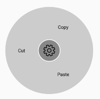
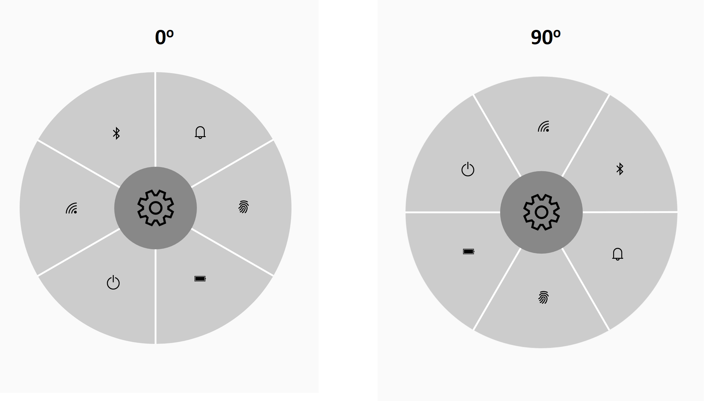

# Layout Types

The two different [LayoutTypes](https://help.syncfusion.com/cr/xamarin-android/Syncfusion.SfRadialMenu.Android.SfRadialMenu.html#Syncfusion_SfRadialMenu_Android_SfRadialMenu_LayoutType) available in the radial menu are:

* Default
* Custom

Both the layout types divide the available space equally among all the children in the circular panel.

## Default

The number of segments in the panel is determined by the children count in a level. As the segment count in each hierarchical level differs, radial menu items are arranged in a sequential order as added to the radial menu.




using Android.App;
using Android.Widget;
using Android.OS;
using Syncfusion.SfRadialMenu.Android;
using Android.Graphics;
using Android.Views;
using System.Collections.Generic;

namespace GettingStarted
{
    [Activity(Label = "GettingStarted", MainLauncher = true)]
    public class MainActivity : Activity
    {
        protected override void OnCreate(Bundle savedInstanceState)
        {
            base.OnCreate(savedInstanceState);
            SfRadialMenu radialMenu = new SfRadialMenu(this);
            radialMenu.CenterButtonText = "\uE713";
            radialMenu.CenterButtonBackText = "\uE72b";
            radialMenu.CenterButtonTypeface = Typeface.CreateFromAsset(this.Assets, "Segoe_MDL2_Assets.ttf");
            radialMenu.CenterButtonBackTypeface = Typeface.CreateFromAsset(this.Assets, "Segoe_MDL2_Assets.ttf");
            radialMenu.CenterButtonRadius = 32;
            radialMenu.CenterButtonBorderColor = Color.White;
            radialMenu.LayoutType = LayoutType.Default;
            string[] mainItem = new string[] { "Bold", "Copy", "Paste", "Undo", "Color" };
            string[] colorItem = new string[] { "Font", "Gradient", "Highlight" };

            // Adding radial menu outer rim items.

            for (int i = 0; i < 5; i++)
            {
                SfRadialMenuItem mainMenuItems = new SfRadialMenuItem(this);
                mainMenuItems.Text = mainItem[i];
                mainMenuItems.TextSize = 12;
                radialMenu.Items.Add(mainMenuItems);
            }

            // Adding inner rim items.

            for (int i = 0; i < 3; i++)
            {
                SfRadialMenuItem colorSubMenuItem = new SfRadialMenuItem(this);
                colorSubMenuItem.Text = colorItem[i];
                colorSubMenuItem.TextSize = 12;
                colorSubMenuItem.ItemWidth = 50;
                radialMenu.Items[4].Items.Add(colorSubMenuItem);
            }

            SetContentView(radialMenu);
        }
    }
}




## Custom

The number of segments in the panel is determined using the [VisibleSegmentsCount](https://help.syncfusion.com/cr/xamarin-android/Syncfusion.SfRadialMenu.Android.SfRadialMenu.html#Syncfusion_SfRadialMenu_Android_SfRadialMenu_VisibleSegmentsCount) property. As the segment count in all the hierarchical levels is the same, radial menu items are arranged in any order based on the [SegmentIndex](https://help.syncfusion.com/cr/xamarin-android/Syncfusion.SfRadialMenu.Android.SfRadialMenuItem.html#Syncfusion_SfRadialMenu_Android_SfRadialMenuItem_SegmentIndex) property.




using Android.App;
using Android.Widget;
using Android.OS;
using Syncfusion.SfRadialMenu.Android;
using Android.Graphics;
using Android.Views;
using System.Collections.Generic;

namespace GettingStarted
{
    [Activity(Label = "GettingStarted", MainLauncher = true)]
    public class MainActivity : Activity
    {
        protected override void OnCreate(Bundle savedInstanceState)
        {
            base.OnCreate(savedInstanceState);
            SfRadialMenu radialMenu = new SfRadialMenu(this);
            radialMenu.CenterButtonText = "\uE713";
            radialMenu.CenterButtonBackText = "\uE72b";
            radialMenu.CenterButtonTypeface = Typeface.CreateFromAsset(this.Assets, "Segoe_MDL2_Assets.ttf");
            radialMenu.CenterButtonBackTypeface = Typeface.CreateFromAsset(this.Assets, "Segoe_MDL2_Assets.ttf");
            radialMenu.CenterButtonRadius = 32;
            radialMenu.CenterButtonBorderColor = Color.White;
            radialMenu.LayoutType = LayoutType.Custom;
            string[] mainItem = new string[] { "Bold", "Copy", "Paste", "Undo", "Color" };
            string[] colorItem = new string[] { "Font", "Gradient", "Highlight" };

            // Adding radial menu outer rim items.

            for (int i = 0; i < 5; i++)
            {
                SfRadialMenuItem mainMenuItems = new SfRadialMenuItem(this);
                mainMenuItems.Text = mainItem[i];
                mainMenuItems.TextSize = 12;
                radialMenu.Items.Add(mainMenuItems);
            }

            // Adding inner rim items.

            for (int i = 0; i < 3; i++)
            {
                SfRadialMenuItem colorSubMenuItem = new SfRadialMenuItem(this);
                colorSubMenuItem.Text = colorItem[i];
                colorSubMenuItem.TextSize = 12;
                colorSubMenuItem.ItemWidth = 50;
                radialMenu.Items[4].Items.Add(colorSubMenuItem);
            }

            SetContentView(radialMenu);
        }
    }
}




## VisibleSegmentsCount

The [VisibleSegmentsCount](https://help.syncfusion.com/cr/xamarin-android/Syncfusion.SfRadialMenu.Android.SfRadialMenu.html#Syncfusion_SfRadialMenu_Android_SfRadialMenu_VisibleSegmentsCount) property is used to specify the number of segments available in the circular panel. When the children count is greater than the value given in the VisibleSegmentsCount property, the overflowing children are not arranged in the panel. When children count is lesser than the VisibleSegmentsCount property, the remaining segments are left free.




using Android.App;
using Android.Widget;
using Android.OS;
using Syncfusion.SfRadialMenu.Android;
using Android.Graphics;
using Android.Views;
using System.Collections.Generic;

namespace GettingStarted
{
    [Activity(Label = "GettingStarted", MainLauncher = true)]
    public class MainActivity : Activity
    {
        protected override void OnCreate(Bundle savedInstanceState)
        {
            base.OnCreate(savedInstanceState);
            SfRadialMenu radialMenu = new SfRadialMenu(this);
            radialMenu.CenterButtonText = "\uE713";
            radialMenu.CenterButtonBackText = "\uE72b";
            radialMenu.CenterButtonTypeface = Typeface.CreateFromAsset(this.Assets, "Segoe_MDL2_Assets.ttf");
            radialMenu.CenterButtonBackTypeface = Typeface.CreateFromAsset(this.Assets, "Segoe_MDL2_Assets.ttf");
            radialMenu.CenterButtonRadius = 32;
            radialMenu.CenterButtonBorderColor = Color.White;
            radialMenu.LayoutType = LayoutType.Custom;
            radialMenu.VisibleSegmentsCount = 5;
            string[] mainItem = new string[] { "Bold", "Copy", "Paste", "Undo", "Color" };
            string[] colorItem = new string[] { "Font", "Gradient", "Highlight" };

            // Adding radial menu outer rim items.

            for (int i = 0; i < 5; i++)
            {
                SfRadialMenuItem mainMenuItems = new SfRadialMenuItem(this);
                mainMenuItems.Text = mainItem[i];
                mainMenuItems.TextSize = 12;
                radialMenu.Items.Add(mainMenuItems);
            }

            // Adding inner rim items.

            for (int i = 0; i < 3; i++)
            {
                SfRadialMenuItem colorSubMenuItem = new SfRadialMenuItem(this);
                colorSubMenuItem.Text = colorItem[i];
                colorSubMenuItem.TextSize = 12;
                colorSubMenuItem.ItemWidth = 50;
                radialMenu.Items[4].Items.Add(colorSubMenuItem);
            }

            SetContentView(radialMenu);
        }
    }
}




## SegmentIndex

The [SegmentIndex](https://help.syncfusion.com/cr/xamarin-android/Syncfusion.SfRadialMenu.Android.SfRadialMenuItem.html#Syncfusion_SfRadialMenu_Android_SfRadialMenuItem_SegmentIndex) property is used to specify the index of the radial menu item in circular panel. Based on the index, the radial menu items are inserted in the segment. When the SegmentIndex is not specified for a RadialMenuItem, the menu item is arranged in the next available free segment.




using Android.App;
using Android.Widget;
using Android.OS;
using Syncfusion.SfRadialMenu.Android;
using Android.Graphics;
using Android.Views;
using System.Collections.Generic;

namespace GettingStarted
{
    [Activity(Label = "GettingStarted", MainLauncher = true)]
    public class MainActivity : Activity
    {
        protected override void OnCreate(Bundle savedInstanceState)
        {
            base.OnCreate(savedInstanceState);
            SfRadialMenu radialMenu = new SfRadialMenu(this);
            radialMenu.CenterButtonText = "\uE713";
            radialMenu.VisibleSegmentsCount = 3;
            radialMenu.CenterButtonRadius = 32;
            radialMenu.CenterButtonTypeface = Typeface.CreateFromAsset(this.Assets, "Segoe_MDL2_Assets.ttf");
            string[] layer = new string[]
            {
                "\uE734",
                "\uE700",
                "\uE72d"
            };
            List<int> segmentIndex = new List<int>() { 1, 0, 2 };
            List<Color> iconColor = new List<Color>() { Color.White, Color.Orange, Color.Green };
            for (int i = 0; i < radialMenu.VisibleSegmentsCount; i++)
            {
                SfRadialMenuItem mainMenuItems = new SfRadialMenuItem(this);
                mainMenuItems.FontIconSize = 20;
                mainMenuItems.FontIconText = layer[i];
                mainMenuItems.IconFont = Typeface.CreateFromAsset(this.Assets, "Segoe_MDL2_Assets.ttf");
                mainMenuItems.FontIconColor = iconColor[i];
                mainMenuItems.SegmentIndex = segmentIndex[i];
                radialMenu.Items.Add(mainMenuItems);
            }

            SetContentView(radialMenu);
        }
    }
}
		



N> It is necessary to set the VisibleSegmentsCount for the SegmentIndex API to be set.

## StartAngle

The `StartAngle` property is used to set the angle from which the arrangement of radial menu items should start.




using Android.App;
using Android.Widget;
using Android.OS;
using Syncfusion.SfRadialMenu.Android;
using Android.Graphics;
using Android.Views;
using System.Collections.Generic;

namespace GettingStarted
{
    [Activity(Label = "GettingStarted", MainLauncher = true)]
    public class MainActivity : Activity
    {
        protected override void OnCreate(Bundle savedInstanceState)
        {
            base.OnCreate(savedInstanceState);
            SfRadialMenu radialMenu = new SfRadialMenu(this);

            //Initializing RadialMenu's properties
            radialMenu.CenterButtonText = "\uE713";
            radialMenu.CenterButtonBackText = "\uE72b";
            radialMenu.CenterButtonRadius = 50;
            radialMenu.CenterButtonTextSize = 10;
            radialMenu.CenterButtonBackTextSize = 10;
            radialMenu.TextAlignment = TextAlignment.Center;
            radialMenu.SeparatorThickness = 2;
            radialMenu.StartAngle = 90;
            radialMenu.CenterButtonTypeface = Typeface.CreateFromAsset(this.Assets, "Segoe_MDL2_Assets.ttf");
            radialMenu.CenterButtonBackTypeface = Typeface.CreateFromAsset(this.Assets, "Segoe_MDL2_Assets.ttf");

            //Adding Main menu Items

            string[] menuItems = new string[] { "\uE701", "\uE702", "\uEA8F", "\uE793", "\uE83F", "\uE7E8" };
            string[] WiFi = new string[] { "\uE701", "\uE702", "\uEA8F", "\uE928", "\uE83F", "\uE7E8" };

            for (int i = 0; i < 6; i++)
            {
                SfRadialMenuItem mainMenuItems = new SfRadialMenuItem(this);
                mainMenuItems.FontIconText = menuItems[i];
                mainMenuItems.IconFont = Typeface.CreateFromAsset(this.Assets, "Segoe_MDL2_Assets.ttf");
                radialMenu.Items.Add(mainMenuItems);
            }

            for (int i = 0; i < 6; i++)
            {
                SfRadialMenuItem WiFiSubMenuItems = new SfRadialMenuItem(this);
                WiFiSubMenuItems.FontIconText = WiFi[i];
                WiFiSubMenuItems.ItemHeight = 30;
                WiFiSubMenuItems.ItemWidth = 40;
                WiFiSubMenuItems.TextColor = Color.White;
                WiFiSubMenuItems.IconFont = Typeface.CreateFromAsset(this.Assets, "Segoe_MDL2_Assets.ttf");
                radialMenu.Items[0].Items.Add(WiFiSubMenuItems);
            }

            radialMenu.CenterButtonPlacement = SfRadialMenuCenterButtonPlacement.Center;
            SetContentView(radialMenu);
        }
    }
}




