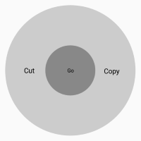
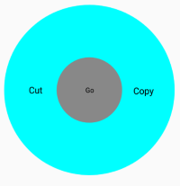
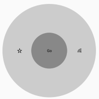
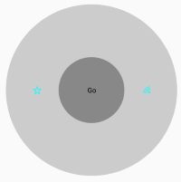

# SfRadialMenuItem Customization

The [SfRadialMenuItem](https://help.syncfusion.com/cr/xamarin-android/Syncfusion.SfRadialMenu.Android.SfRadialMenuItem.html) class provides various options such as `Custom Views`, `FontIcons`, and `Images` to customize the items. You can add radial menu items by hierarchy. To add a SfRadialMenuItem with SfRadialMenu, create an instance of SfRadialMenuItem, and add it to the [Items](https://help.syncfusion.com/cr/xamarin-android/Syncfusion.SfRadialMenu.Android.SfRadialMenu.html#Syncfusion_SfRadialMenu_Android_SfRadialMenu_Items) property that is available in SfRadialMenu.

## Items

The [Items](https://help.syncfusion.com/cr/xamarin-android/Syncfusion.SfRadialMenu.Android.SfRadialMenu.html#Syncfusion_SfRadialMenu_Android_SfRadialMenu_Items) property populates the items of an inner rim in `SfRadialMenu` when the items of an outer rim are tapped.




using Android.App;
using Android.Widget;
using Android.OS;
using Syncfusion.SfRadialMenu.Android;
using Android.Graphics;
using Android.Views;
using System.Collections.Generic;

namespace GettingStarted
{
    [Activity(Label = "GettingStarted", MainLauncher = true)]
    public class MainActivity : Activity
    {
        protected override void OnCreate(Bundle savedInstanceState)
        {
            base.OnCreate(savedInstanceState);
            SfRadialMenu radialMenu = new SfRadialMenu(this);
            radialMenu.CenterButtonText = "Go";
            radialMenu.CenterButtonBackText = "Back";
            radialMenu.CenterButtonRadius = 50;
            radialMenu.CenterButtonTextSize = 10;
            radialMenu.CenterButtonBackTextSize = 10;
            radialMenu.Items.Add(new SfRadialMenuItem(this) { Text = "Cut" });
            radialMenu.Items.Add(new SfRadialMenuItem(this) { Text = "Copy" });
            radialMenu.Items[0].Items.Add(new SfRadialMenuItem(this) { Text = "Paste" });
            SetContentView(radialMenu);
        }
    }
}




## Text

The [Text](https://help.syncfusion.com/cr/xamarin-android/Syncfusion.SfRadialMenu.Android.SfRadialMenuItem.html#Syncfusion_SfRadialMenu_Android_SfRadialMenuItem_Text) property provides text to the [SfRadialMenuItem](https://help.syncfusion.com/cr/xamarin-android/Syncfusion.SfRadialMenu.Android.SfRadialMenuItem.html).




 using Android.App;
using Android.Widget;
using Android.OS;
using Syncfusion.SfRadialMenu.Android;
using Android.Graphics;
using Android.Views;
using System.Collections.Generic;

namespace GettingStarted
{
    [Activity(Label = "GettingStarted", MainLauncher = true)]
    public class MainActivity : Activity
    {
        protected override void OnCreate(Bundle savedInstanceState)
        {
            base.OnCreate(savedInstanceState);
            SfRadialMenu radialMenu = new SfRadialMenu(this);
            radialMenu.CenterButtonText = "Go";
            radialMenu.CenterButtonBackText = "Back";
            radialMenu.CenterButtonRadius = 50;
            radialMenu.CenterButtonTextSize = 10;
            radialMenu.CenterButtonBackTextSize = 10;
            radialMenu.Items.Add(new SfRadialMenuItem(this) { Text = "Cut" });
            radialMenu.Items.Add(new SfRadialMenuItem(this) { Text = "Copy" });
            radialMenu.Items[0].Items.Add(new SfRadialMenuItem(this) { Text = "Paste" });
            SetContentView(radialMenu);
        }
    }
}




## ItemHeight

The [ItemHeight](https://help.syncfusion.com/cr/xamarin-android/Syncfusion.SfRadialMenu.Android.SfRadialMenuItem.html#Syncfusion_SfRadialMenu_Android_SfRadialMenuItem_ItemHeight) changes the height of the [SfRadialMenuItem](https://help.syncfusion.com/cr/xamarin-android/Syncfusion.SfRadialMenu.Android.SfRadialMenuItem.html).




using Android.App;
using Android.Widget;
using Android.OS;
using Syncfusion.SfRadialMenu.Android;
using Android.Graphics;
using Android.Views;
using System.Collections.Generic;

namespace GettingStarted
{
    [Activity(Label = "GettingStarted", MainLauncher = true)]
    public class MainActivity : Activity
    {
        protected override void OnCreate(Bundle savedInstanceState)
        {
            base.OnCreate(savedInstanceState);
            SfRadialMenu radialMenu = new SfRadialMenu(this);
            radialMenu.CenterButtonText = "Go";
            radialMenu.CenterButtonBackText = "Back";
            radialMenu.CenterButtonRadius = 50;
            radialMenu.CenterButtonTextSize = 10;
            radialMenu.CenterButtonBackTextSize = 10;
            radialMenu.Items.Add(new SfRadialMenuItem(this) { Text = "Cut", ItemHeight = 25 });
            radialMenu.Items.Add(new SfRadialMenuItem(this) { Text = "Copy", ItemHeight = 25 });
            radialMenu.Items[0].Items.Add(new SfRadialMenuItem(this) { Text = "Paste" });
            SetContentView(radialMenu);
        }
    }
}




## ItemWidth

The [ItemWidth](https://help.syncfusion.com/cr/xamarin-android/Syncfusion.SfRadialMenu.Android.SfRadialMenuItem.html#Syncfusion_SfRadialMenu_Android_SfRadialMenuItem_ItemWidth) property changes the width of the [SfRadialMenuItem](https://help.syncfusion.com/cr/xamarin-android/Syncfusion.SfRadialMenu.Android.SfRadialMenuItem.html).




using Android.App;
using Android.Widget;
using Android.OS;
using Syncfusion.SfRadialMenu.Android;
using Android.Graphics;
using Android.Views;
using System.Collections.Generic;

namespace GettingStarted
{
    [Activity(Label = "GettingStarted", MainLauncher = true)]
    public class MainActivity : Activity
    {
        protected override void OnCreate(Bundle savedInstanceState)
        {
            base.OnCreate(savedInstanceState);
            SfRadialMenu radialMenu = new SfRadialMenu(this);
            radialMenu.CenterButtonText = "Go";
            radialMenu.CenterButtonBackText = "Back";
            radialMenu.CenterButtonRadius = 50;
            radialMenu.CenterButtonTextSize = 10;
            radialMenu.CenterButtonBackTextSize = 10;
            radialMenu.Items.Add(new SfRadialMenuItem(this) { Text = "Cut" , ItemWidth = 50});
            radialMenu.Items.Add(new SfRadialMenuItem(this) { Text = "Copy" , ItemWidth = 50}); radialMenu.Items[0].Items.Add(new SfRadialMenuItem(this) { Text = "Paste"});
            SetContentView(radialMenu);
        }
    }
}




## BackgroundColor

The [BackgroundColor](https://help.syncfusion.com/cr/xamarin-android/Syncfusion.SfRadialMenu.Android.SfRadialMenuItem.html#Syncfusion_SfRadialMenu_Android_SfRadialMenuItem_BackgroundColor) property changes the background color of the [SfRadialMenuItem](https://help.syncfusion.com/cr/xamarin-android/Syncfusion.SfRadialMenu.Android.SfRadialMenuItem.html).




using Android.App;
using Android.Widget;
using Android.OS;
using Syncfusion.SfRadialMenu.Android;
using Android.Graphics;
using Android.Views;
using System.Collections.Generic;

namespace GettingStarted
{
    [Activity(Label = "GettingStarted", MainLauncher = true)]
    public class MainActivity : Activity
    {
        protected override void OnCreate(Bundle savedInstanceState)
        {
            base.OnCreate(savedInstanceState);
            SfRadialMenu radialMenu = new SfRadialMenu(this);
            radialMenu.CenterButtonText = "Go";
            radialMenu.CenterButtonBackText = "Back";
            radialMenu.CenterButtonRadius = 50;
            radialMenu.CenterButtonTextSize = 10;
            radialMenu.CenterButtonBackTextSize = 10;
            radialMenu.Items.Add(new SfRadialMenuItem(this) {Text = "Cut", BackgroundColor= Color.ParseColor("#FFFF33")});
            radialMenu.Items.Add(new SfRadialMenuItem(this) {Text = "Copy", BackgroundColor= Color.ParseColor("#FFFF33")});
            radialMenu.Items[0].Items.Add(new SfRadialMenuItem(this) { Text = "Paste" });
            SetContentView(radialMenu);
        }
    }
}




## TextTypeFace

The [TextTypeFace](https://help.syncfusion.com/cr/xamarin-android/Syncfusion.SfRadialMenu.Android.SfRadialMenuItem.html#Syncfusion_SfRadialMenu_Android_SfRadialMenuItem_TextTypeFace) property changes the font family of the text in [SfRadialMenuItem](https://help.syncfusion.com/cr/xamarin-android/Syncfusion.SfRadialMenu.Android.SfRadialMenuItem.html).




using Android.App;
using Android.Widget;
using Android.OS;
using Syncfusion.SfRadialMenu.Android;
using Android.Graphics;
using Android.Views;
using System.Collections.Generic;

namespace GettingStarted
{
    [Activity(Label = "GettingStarted", MainLauncher = true)]
    public class MainActivity : Activity
    {
        protected override void OnCreate(Bundle savedInstanceState)
        {
            base.OnCreate(savedInstanceState);
            SfRadialMenu radialMenu = new SfRadialMenu(this);
            radialMenu.CenterButtonText = "Go";
            radialMenu.CenterButtonBackText = "Back";
            radialMenu.CenterButtonRadius = 50;
            radialMenu.CenterButtonTextSize = 10;
            radialMenu.CenterButtonBackTextSize = 10;
            radialMenu.Items.Add(new SfRadialMenuItem(this) {Text = "Cut", TextTypeFace=Typeface.Create("Times New Roman",TypefaceStyle.Bold)});
            radialMenu.Items.Add(new SfRadialMenuItem(this) {Text = "Copy", TextTypeFace=Typeface.Create("Times New Roman",TypefaceStyle.Bold)});
            radialMenu.Items[0].Items.Add(new SfRadialMenuItem(this) { Text = "Paste" });
            SetContentView(radialMenu);
        }
    }
}




## TextSize

The [TextSize](https://help.syncfusion.com/cr/xamarin-android/Syncfusion.SfRadialMenu.Android.SfRadialMenuItem.html#Syncfusion_SfRadialMenu_Android_SfRadialMenuItem_TextSize) property changes the text size of the [SfRadialMenuItem](https://help.syncfusion.com/cr/xamarin-android/Syncfusion.SfRadialMenu.Android.SfRadialMenuItem.html).




using Android.App;
using Android.Widget;
using Android.OS;
using Syncfusion.SfRadialMenu.Android;
using Android.Graphics;
using Android.Views;
using System.Collections.Generic;

namespace GettingStarted
{
    [Activity(Label = "GettingStarted", MainLauncher = true)]
    public class MainActivity : Activity
    {
        protected override void OnCreate(Bundle savedInstanceState)
        {
            base.OnCreate(savedInstanceState);
            SfRadialMenu radialMenu = new SfRadialMenu(this);
            radialMenu.CenterButtonText = "Go";
            radialMenu.CenterButtonBackText = "Back";
            radialMenu.CenterButtonRadius = 50;
            radialMenu.CenterButtonTextSize = 10;
            radialMenu.CenterButtonBackTextSize = 10;
			radialMenu.Items.Add(new SfRadialMenuItem(this) {Text = "Cut", TextTypeFace=Typeface.Create("Times New Roman",TypefaceStyle.Bold,TextSize = 20)});
            radialMenu.Items.Add(new SfRadialMenuItem(this) {Text = "Copy", TextTypeFace=Typeface.Create("Times New Roman",TypefaceStyle.Bold,TextSize = 20)});
            radialMenu.Items[0].Items.Add(new SfRadialMenuItem(this) { Text = "Paste" });
            SetContentView(radialMenu);
        }
    }
}




## Image

The [Image](https://help.syncfusion.com/cr/xamarin-android/Syncfusion.SfRadialMenu.Android.SfRadialMenuItem.html#Syncfusion_SfRadialMenu_Android_SfRadialMenuItem_Image) property provides image support to the [SfRadialMenuItem](https://help.syncfusion.com/cr/xamarin-android/Syncfusion.SfRadialMenu.Android.SfRadialMenuItem.html).




using Android.App;
using Android.Widget;
using Android.OS;
using Syncfusion.SfRadialMenu.Android;
using Android.Graphics;
using Android.Views;
using System.Collections.Generic;

namespace GettingStarted
{
    [Activity(Label = "GettingStarted", MainLauncher = true)]
    public class MainActivity : Activity
    {
        protected override void OnCreate(Bundle savedInstanceState)
        {
            base.OnCreate(savedInstanceState);
            SfRadialMenu radialMenu = new SfRadialMenu(this);
			radialMenu.CenterButtonText = "Go";
            radialMenu.CenterButtonBackText = "Back";
            radialMenu.CenterButtonRadius = 50;
            radialMenu.CenterButtonTextSize = 10;
            radialMenu.CenterButtonBackTextSize = 10;
            radialMenu.Items.Add(new SfRadialMenuItem(this) { Image = "user.png" });
            radialMenu.Items.Add(new SfRadialMenuItem(this) { Image = "cartImg.png" });
            SetContentView(radialMenu);
        }
    }
}




## BackgroundImage

The [BackgroundImage](https://help.syncfusion.com/cr/xamarin-android/Syncfusion.SfRadialMenu.Android.SfRadialMenuItem.html#Syncfusion_SfRadialMenu_Android_SfRadialMenuItem_BackgroundImage) property provides the background image support to the [SfRadialMenuItem](https://help.syncfusion.com/cr/xamarin-android/Syncfusion.SfRadialMenu.Android.SfRadialMenuItem.html).




using Android.App;
using Android.Widget;
using Android.OS;
using Syncfusion.SfRadialMenu.Android;
using Android.Graphics;
using Android.Views;
using System.Collections.Generic;

namespace GettingStarted
{
    [Activity(Label = "GettingStarted", MainLauncher = true)]
    public class MainActivity : Activity
    {
        protected override void OnCreate(Bundle savedInstanceState)
        {
            base.OnCreate(savedInstanceState);
            SfRadialMenu radialMenu = new SfRadialMenu(this);
			radialMenu.CenterButtonText = "Go";
            radialMenu.CenterButtonBackText = "Back";
            radialMenu.CenterButtonRadius = 50;
            radialMenu.CenterButtonTextSize = 10;
            radialMenu.CenterButtonBackTextSize = 10;
            radialMenu.Items.Add(new SfRadialMenuItem(this) { BackgroundImage = "editor.png" });
            radialMenu.Items.Add(new SfRadialMenuItem(this) { BackgroundImage = "cartImg.png" });
            SetContentView(radialMenu);
        }
    }
}




## FontIconText

The [FontIconText](https://help.syncfusion.com/cr/xamarin-android/Syncfusion.SfRadialMenu.Android.SfRadialMenuItem.html#Syncfusion_SfRadialMenu_Android_SfRadialMenuItem_FontIconText) property provides font icon support to the [SfRadialMenuItem](https://help.syncfusion.com/cr/xamarin-android/Syncfusion.SfRadialMenu.Android.SfRadialMenuItem.html).




using Android.App;
using Android.Widget;
using Android.OS;
using Syncfusion.SfRadialMenu.Android;
using Android.Graphics;
using Android.Views;
using System.Collections.Generic;

namespace GettingStarted
{
    [Activity(Label = "GettingStarted", MainLauncher = true)]
    public class MainActivity : Activity
    {
        protected override void OnCreate(Bundle savedInstanceState)
        {
            base.OnCreate(savedInstanceState);
            SfRadialMenu radialMenu = new SfRadialMenu(this);
			radialMenu.CenterButtonText = "Go";
            radialMenu.CenterButtonBackText = "Back";
            radialMenu.CenterButtonRadius = 50;
            radialMenu.CenterButtonTextSize = 10;
            radialMenu.CenterButtonBackTextSize = 10;
            radialMenu.Items.Add(new SfRadialMenuItem(this) {FontIconText= "\uE734",IconFont= Typeface.CreateFromAsset(this.Assets, "Segoe_MDL2_Assets.ttf")});  
            radialMenu.Items.Add(new SfRadialMenuItem(this) {FontIconText= "\uE701",IconFont= Typeface.CreateFromAsset(this.Assets, "Segoe_MDL2_Assets.ttf")});            
            SetContentView(radialMenu);
        }
    }
}




## FontIconColor

The [FontIconColor](https://help.syncfusion.com/cr/xamarin-android/Syncfusion.SfRadialMenu.Android.SfRadialMenuItem.html#Syncfusion_SfRadialMenu_Android_SfRadialMenuItem_FontIconColor) property changes the color of the font icon in [SfRadialMenuItem](https://help.syncfusion.com/cr/xamarin-android/Syncfusion.SfRadialMenu.Android.SfRadialMenuItem.html).




using Android.App;
using Android.Widget;
using Android.OS;
using Syncfusion.SfRadialMenu.Android;
using Android.Graphics;
using Android.Views;
using System.Collections.Generic;

namespace GettingStarted
{
    [Activity(Label = "GettingStarted", MainLauncher = true)]
    public class MainActivity : Activity
    {
        protected override void OnCreate(Bundle savedInstanceState)
        {
            base.OnCreate(savedInstanceState);
            SfRadialMenu radialMenu = new SfRadialMenu(this);
            radialMenu.CenterButtonText = "Go";
            radialMenu.CenterButtonBackText = "Back";
            radialMenu.CenterButtonRadius = 50;
            radialMenu.CenterButtonTextSize = 10;
            radialMenu.CenterButtonBackTextSize = 10;
            radialMenu.Items.Add(new SfRadialMenuItem(this) { FontIconText = "\uE734", IconFont = Typeface.CreateFromAsset(this.Assets, "Segoe_MDL2_Assets.ttf"), FontIconColor = Color.ParseColor("#313131") });
            radialMenu.Items.Add(new SfRadialMenuItem(this) { FontIconText = "\uE701", IconFont = Typeface.CreateFromAsset(this.Assets, "Segoe_MDL2_Assets.ttf"), FontIconColor = Color.ParseColor("#313131") });
            SetContentView(radialMenu);
        }
    }
}




## FontIconSize

The [FontIconSize](https://help.syncfusion.com/cr/xamarin-android/Syncfusion.SfRadialMenu.Android.SfRadialMenuItem.html#Syncfusion_SfRadialMenu_Android_SfRadialMenuItem_FontIconSize) property changes the size of the font icon in the [SfRadialMenuItem](https://help.syncfusion.com/cr/xamarin-android/Syncfusion.SfRadialMenu.Android.SfRadialMenuItem.html).




using Android.App;
using Android.Widget;
using Android.OS;
using Syncfusion.SfRadialMenu.Android;
using Android.Graphics;
using Android.Views;
using System.Collections.Generic;

namespace GettingStarted
{
    [Activity(Label = "GettingStarted", MainLauncher = true)]
    public class MainActivity : Activity
    {
        protected override void OnCreate(Bundle savedInstanceState)
        {
            base.OnCreate(savedInstanceState);
            SfRadialMenu radialMenu = new SfRadialMenu(this);
			radialMenu.CenterButtonText = "Go";
            radialMenu.CenterButtonBackText = "Back";
            radialMenu.CenterButtonRadius = 50;
            radialMenu.CenterButtonTextSize = 10;
            radialMenu.CenterButtonBackTextSize = 10;
            radialMenu.Items.Add(new SfRadialMenuItem(this) {FontIconText= "\uE734",IconFont = Typeface.CreateFromAsset(this.Assets, "Segoe MDL2 Assets.ttf"),FontIconSize = 10});  
            radialMenu.Items.Add(new SfRadialMenuItem(this) {FontIconText= "\uE701",IconFont = Typeface.CreateFromAsset(this.Assets, "Segoe MDL2 Assets.ttf"),FontIconSize = 10});  
			SetContentView(radialMenu);
        }
    }
}




## IconFont

The [IconFont](https://help.syncfusion.com/cr/xamarin-android/Syncfusion.SfRadialMenu.Android.SfRadialMenuItem.html#Syncfusion_SfRadialMenu_Android_SfRadialMenuItem_IconFont) property changes the font family of the font icon in the [SfRadialMenuItem](https://help.syncfusion.com/cr/xamarin-android/Syncfusion.SfRadialMenu.Android.SfRadialMenuItem.html).




using Android.App;
using Android.Widget;
using Android.OS;
using Syncfusion.SfRadialMenu.Android;
using Android.Graphics;
using Android.Views;
using System.Collections.Generic;

namespace GettingStarted
{
    [Activity(Label = "GettingStarted", MainLauncher = true)]
    public class MainActivity : Activity
    {
        protected override void OnCreate(Bundle savedInstanceState)
        {
            base.OnCreate(savedInstanceState);
            SfRadialMenu radialMenu = new SfRadialMenu(this);
			radialMenu.CenterButtonText = "Go";
            radialMenu.CenterButtonBackText = "Back";
            radialMenu.CenterButtonRadius = 50;
            radialMenu.CenterButtonTextSize = 10;
            radialMenu.CenterButtonBackTextSize = 10;
            radialMenu.Items.Add(new SfRadialMenuItem(this) {FontIconText= "\uE734",IconFont = Typeface.CreateFromAsset(this.Assets, "Segoe_MDL2_Assets.ttf")}); 
            radialMenu.Items.Add(new SfRadialMenuItem(this) {FontIconText= "\uE701",IconFont = Typeface.CreateFromAsset(this.Assets, "Segoe_MDL2_Assets.ttf")});    
			SetContentView(radialMenu);
        }
    }
}




N> https://xamarinhelp.com/custom-fonts-xamarin-forms/ provides how to add the TTF file to each platform.

## View

The [View](https://help.syncfusion.com/cr/xamarin-android/Syncfusion.SfRadialMenu.Android.SfRadialMenuItem.html#Syncfusion_SfRadialMenu_Android_SfRadialMenuItem_View) property provides custom views to the [SfRadialMenuItem](https://help.syncfusion.com/cr/xamarin-android/Syncfusion.SfRadialMenu.Android.SfRadialMenuItem.html).




using Android.App;
using Android.Widget;
using Android.OS;
using Syncfusion.SfRadialMenu.Android;
using Android.Graphics;
using Android.Views;
using System.Collections.Generic;

namespace GettingStarted
{
    [Activity(Label = "GettingStarted", MainLauncher = true)]
    public class MainActivity : Activity
    {
        protected override void OnCreate(Bundle savedInstanceState)
        {
            base.OnCreate(savedInstanceState);
            SfRadialMenu radialMenu = new SfRadialMenu(this);
			radialMenu.CenterButtonText = "Go";
            radialMenu.CenterButtonBackText = "Back";
            radialMenu.CenterButtonRadius = 50;
            radialMenu.CenterButtonTextSize = 10;
            radialMenu.CenterButtonBackTextSize = 10;
            radialMenu.Items.Add(new SfRadialMenuItem(this) { View = new TextView(this) { Text = "Cut",TextAlignment = TextAlignment.Center}});
            radialMenu.Items.Add(new SfRadialMenuItem(this) { View = new TextView(this) { Text = "Copy",TextAlignment = TextAlignment.Center}});
			SetContentView(radialMenu);
        }
    }
}




