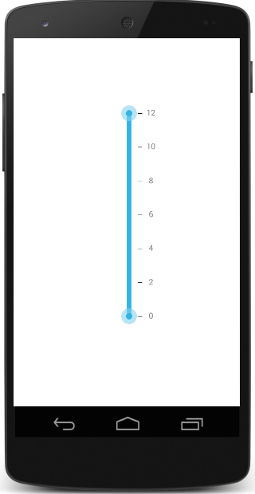

# Getting Started

This section explains you the steps to configure a SfRangeSlider control in a real-time scenario and also provides a walk-through on some of the customization features available in SfRangeSlider control.

## Referencing Essential Studio Components in Your Solution

After installing Essential Studio for Xamarin, you can find all the required assemblies in the installation folders,

{Syncfusion Installed location}\Essential Studio\12.4.0.24\lib

Add the following assembly references to the Android project,

android\Syncfusion.SfRangeSlider.Android.dll

## Add SfRangeSlider

* Adding namespace for the added assemblies. 





	using Com.Syncfusion.RangeSlider; 





* Now instantiate and add the SfRangeSlider control with a required optimal name.



		

	SfRangeSlider rangeSlider = new SfRangeSlider(this);
	SetContentView(rangeSlider);





## Restricting Values

SfRangeSlider provides option to restrict slider range between minimum and maximum values. Following code explains how to set the range using `Minimum` and `Maximum` properties in the SfRangeSlider.





	rangeSlider.Minimum=0; 
	rangeSlider.Maximum=24; 
	rangeSlider.DirectionReversed=false; 





## Set Range

SfRangeSlider provides option to set single thumb and double thumb. While setting the double thumb, each thumb value can be set using `RangeStart` and `RangeEnd` properties.

N> The `ShowRange` property is used to switch between a single thumb and double thumb. The `Orientation` property sets the type of orientation.





	rangeSlider.Minimum=0; 
	rangeSlider.Maximum=24; 
	rangeSlider.DirectionReversed=false; 
	rangeSlider.RangeEnd=20; 
	rangeSlider.RangeStart=4;
	rangeSlider.ShowRange=true; 
	rangeSlider.Orientation=Orientation.Horizontal;





## Ticks and Labels Customization

The ticks can be set by setting the `TickFrequency` and `TickPlacement`. Likewise, value labels can be set by setting the `ShowValueLabel` property to true. The position of label can be varied by the `LabelPlacement` property.





	rangeSlider.TickFrequency=4; 
	rangeSlider.ShowValueLabel=true; 
	rangeSlider.ValuePlacement=ValuePlacement.TopLeft; 
	rangeSlider.TickPlacement=TickPlacement.BottomRight;





N> The TickFrequency determines the interval between the ticks.

## Adding Snapping Mode

The movement of the thumb can be varied in different ways. This is achieved by setting the SnapsTo property.





rangeSlider.SnapsTo=SnapsTo.Ticks; 
rangeSlider.StepFrequency=6;





