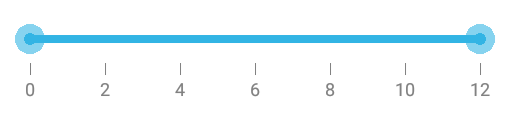
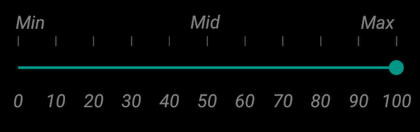

# Customizing labels

## ShowValueLabel

This property allows us to display labels for the ticks. When it sets to true, it displays the label for all the ticks based on the `ValuePlacement` property.

N> The default value of the `ShowValueLabel` property is false.





	rangeSlider.ShowValueLabel= True;





## Set Custom Label

To display custom labels, `ShowCustomLabel` property should be set to true and need to populate the `CustomLabels` property with observable collection of items by specifying the custom labels for corresponding values.




	
SfRangeSlider rangeSlider; 
ObservableCollection<Items>  customCollection;
public RangeSliderPage ()
{
      customCollection = new ObservableCollection<Items> ();
      customCollection.Add(new Items(){Label = "Min", Value= 0});
      customCollection.Add(new Items() { Label = "Max", Value = 100 });
      rangeSlider = new SfRangeSlider ();
      rangeSlider.HeightRequest = 400;
      rangeSlider.ShowCustomLabel = true;
      rangeSlider.CustomLabels = customCollection
}





## ValuePlacement

The `ValuePlacement` property describes the position of the Value respective to ticks. 

Available options for this property are:

* BottomRight

* TopLeft





	rangeSlider.ValuePlacement=ValuePlacement.TopLeft;









	rangeSlider.ValuePlacement=ValuePlacement.BottomRight;





## LabelPlacement

The `LabelPlacement` property describes the position of the labels respective to ticks. 

Available options for this property are:

* BottomRight

* TopLeft





	rangeSlider.LabelPlacement=LabelPlacement.TopLeft;





## Customizing label font

The range slider control provides the `TypeFace` and `TextSize` properties to customize the value text and custom label text.



namespace GettingStarted
{
      [Activity(Label = "GettingStarted", MainLauncher = true, Icon = "@mipmap/icon")]
      public class MainActivity : Activity
      {
            protected override void OnCreate(Bundle savedInstanceState)
            {
                  base.OnCreate(savedInstanceState);
                  LinearLayout linearLayout = new LinearLayout(this);
                  linearLayout.LayoutParameters = new LayoutParams(LayoutParams.MatchParent,LayoutParams.MatchParent);
                  SfRangeSlider rangeSlider = new SfRangeSlider(this);
                  rangeSlider.ShowValueLabel = true;
                  rangeSlider.Typeface = Typeface.Create("Times New Roman", TypefaceStyle.Italic);
                  rangeSlider.TextSize = 15;
                  rangeSlider.ShowCustomLabel = true;
                  rangeSlider.CustomLabels = new List<Items>()
                  {
                        new Items() { Value = 0, Label = "Min" },
                        new Items() { Value = 50, Label = "Mid" },
                        new Items() { Value = 100, Label = "Max" }
                  };
                  rangeSlider.Orientation = Com.Syncfusion.Sfrangeslider.Orientation.Horizontal;
                  linearLayout.AddView(rangeSlider);
                  SetContentView(linearLayout);
            }
      }
}



## Customizing label color

The `LabelColor` property used to change the color of the label.





	rangeSlider.Labelcolor = Color.Red;





