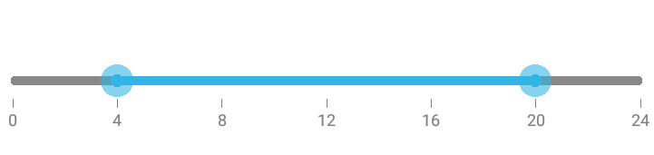
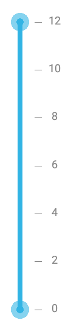

# Orientation

SfRangeSlider provides option to display the values and the slider either horizontally or vertically.

N> The default option is Horizontal.

## Horizontal





rangeSlider.Orientation=Orientation.Horizontal





## Vertical





rangeSlider.Orientation=Orientation.Vertical





