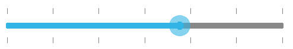

# Customizing ticks

Tick marks can be placed along the track in a uniform manner or it's position can also be customized.

## TickPlacement

The `TickPlacement` property determines where to draw tick marks in relation to the track. Available options for this property are,

* BottomRight

* Inline

* None

* Outside

* TopLeft

N> The default option is Inline.

### BottomRight

Tick marks are placed either below the track in horizontal orientation or right of the track in vertical orientation.



	rangeSlider.TickPlacement=TickPlacement.BottomRight;



### TopLeft

Tick marks are placed either above the track in horizontal orientation or left of the track in vertical orientation.



	rangeSlider.TickPlacement=TickPlacement.TopLeft;



### Inline

Tick marks are placed along the track.



	rangeSlider.TickPlacement=TickPlacement.Inline;



### Outside

Tick marks are placed on both sides of the track either in horizontal or vertical orientation.



	rangeSlider.TickPlacement=TickPlacement.Outside;



## Customizing tick color

The range slider control provides the `TickColor` property to customize the color of ticks in tick bar.



namespace GettingStarted
{
      [Activity(Label = "GettingStarted", MainLauncher = true, Icon = "@mipmap/icon")]
      public class MainActivity : Activity
      {
            protected override void OnCreate(Bundle savedInstanceState)
            {
				base.OnCreate(savedInstanceState);
				LinearLayout linearLayout = new LinearLayout(this);
				linearLayout.LayoutParameters = new LayoutParams(LayoutParams.MatchParent, LayoutParams.MatchParent);
				SfRangeSlider rangeSlider = new SfRangeSlider(this);
				rangeSlider.ShowValueLabel = true;
				rangeSlider.TickColor = Color.Rgb(255, 0, 0);
				rangeSlider.TickPlacement = TickPlacement.TopLeft;
				rangeSlider.Orientation = Com.Syncfusion.Sfrangeslider.Orientation.Horizontal;
				linearLayout.AddView(rangeSlider);
				SetContentView(linearLayout);
            }
      }
}



## Tick length

The `TickLength` property used to customize the length of the ticks.



	rangeSlider.TickLength = 20;


