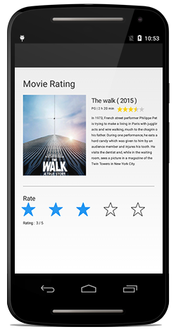

---

layout: post
title: Getting Started with Syncfusion Rating control for Xamarin.Android
description: A quick tour to initial users on Syncfusion Rating control for Xamarin.Android platform
platform: Xamarin.Android
control: Rating
documentation: ug

---

# Getting Started

This section explains how to configure the SfRating control in a real-time scenario and also provides a walk-through on some of the customization features available in the SfRating control.

## Referencing Essential Studio components in your solution

After installing Essential Studio for Xamarin, you can find all the required assemblies in the installation folders,

{Syncfusion Installed location}\Essential Studio\12.4.0.24\lib

N> Assemblies are available in an unzipped package location in Mac.

Add the following assembly reference to the Android project:

[android\Syncfusion.SfRating.Andriod.dll]

## Add and configure the SfRating control

* The following namespace needs to be added.





using Com.Syncfusion.Rating;
	




* Create an instance for SfRating control, and add it to application.





SfRating rating;
protected override void OnCreate(Bundle savedInstanceState)
{
    base.OnCreate(savedInstanceState);
    rating = new SfRating(this);
    SetContentView(rating);
}
	




## Set number of rating items

The number of rating items to be displayed can be customized in the SfRating control. Users can create a rating application with 5 items as follows.

N> The default value of this property is 5.





rating.ItemCount = 5;





## SetValue

The display value can be set in the SfRating control, which is selected among the items. The following code sample demonstrates how to set the display value of 3 with 5 ratings items.

N> The default value of this property is 0.





rating.Value=3;





## Precision

To enable full, half, and exact values of rating, set the `Precision` property.





rating.Precision = Precision.Standard;





The complete Getting Started sample is available in this [documentation](http://www.syncfusion.com/downloads/support/directtrac/general/ze/SfRating_GettingStarted-436521212.zip).

