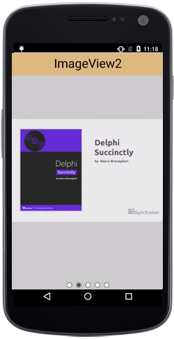

# Populating Data

SfRotator items can be populated with a collection of image data or any other custom view. `DataSource` property is used to hold the collection of RotatorItems in Rotator.

To get the view of Rotator, we have two ways with SfRotatorItem

* `ImageContent` - Populating the RotatorItem with collection of Image data.

* `Content` - Populating the RotatorItem with custom view.

## Using ImageContent 

`ImageContent` property in RotatorItem helps to view the Rotator from Resource folder image item.
We can add the Resource folder's images to the Items of Rotator.



Context context = this;

SfRotator rotator = new SfRotator(context);

List<SfRotatorItem> collection = new List<SfRotatorItem>();

for(int i = 1; i < 5; i++)
{
	SfRotatorItem item = new SfRotatorItem(context);
	item.ImageContent = "movie" + i;
	collection.Add(item);
}

// Assign the collection of Image date to Rotator's DataSource

rotator.DataSource = collection;

rotator.SelectedIndex = 2;

SetContentView(rotator);



## Using Content

`Content` property in RotatorItem helps to view the Rotator from any of custom view. 



Context context = this;

SfRotator rotator = new SfRotator(context);

// Collection of RotatorItem

List<SfRotatorItem> collection = new List<SfRotatorItem>();

// Resource of ImageView in RotatorItem's Content

int[] images = { Resource.Drawable.movie1, Resource.Drawable.movie2, Resource.Drawable.movie3, Resource.Drawable.movie4, Resource.Drawable.movie5 };

// Resource of Button in RotatorItem's Content

string[] strings = { "ImageView1", "ImageView2", "ImageView3", "ImageView4", "ImageView5" };

for (int i = 0; i < 5; i++)
{
	SfRotatorItem sfRotatorItem = new SfRotatorItem(context);
	LinearLayout linearLayout = new LinearLayout(context);
	linearLayout.Orientation = Orientation.Vertical;
	ImageView imageView = new ImageView(context);
	imageView.SetImageResource(images[i]);
	Button button = new Button(context);
	button.Text = strings[i];
	button.TextSize = 33;
	button.SetBackgroundColor(Android.Graphics.Color.BurlyWood);
	linearLayout.AddView(button);
	linearLayout.AddView(imageView);
	sfRotatorItem.Content = linearLayout;
	collection.Add(sfRotatorItem);
}

// Assign the collection of custom view  Rotator's DataSource

rotator.DataSource = collection;

rotator.SelectedIndex = 2;

SetContentView(rotator);



# Through RotatorAdapter

RotatorAdapter object acts as a bridge between an RotatorAdapterView and the underlying data for that view. The Adapter provides access to the data items. The Adapter is also responsible for making a View for each item in the data set.

Needed things to achieve this,

* `DataSource` - Determines the count of custom view will reflect on Rotator control
* `Adapter` - This property will carry the custom view on Rotator.
* `CustomAdapter Class`- Which inherits the RotatorAdapter class and use the GetItemView and GetThumbnailView method.

### CustomAdapter Class



public class AdapterClass :RotatorAdapter
{
	Context context;
	int[] collectionOfImages;

	// Override method to get the Dotted view Rotator control.

	public override Android.Views.View GetItemView(SfRotator p0, int p1)
	{

		ImageView imageView = new ImageView(con1);
		imageView.SetImageResource(collectionOfImages[p1]);
		return imageView;
	} 
	// Override method to get the Thumbnail view Rotator control.
		
	public override Android.Views.View GetThumbnailView(SfRotator p0, int p1)
	{
		ImageView imageView = new ImageView(con1);
		imageView.SetImageResource(collectionOfImages[p1]);
		return imageView;
	}
	public AdapterClass(Context con,int [] list)
	{
		context = con;
		collectionOfImages = list;
	}

}



### In MainActivity.cs



public class MainActivity : Activity
{
	protected override void OnCreate(Bundle savedInstanceState)
	{
		
	base.OnCreate(savedInstanceState);

	Context context = this;

	SfRotator rotator = new SfRotator(context);

	List<SfRotatorItem> collection = new List<SfRotatorItem>();
	collection.Add(new SfRotatorItem(this));
	collection.Add(new SfRotatorItem(this));
	collection.Add(new SfRotatorItem(this));
	collection.Add(new SfRotatorItem(this));
	collection.Add(new SfRotatorItem(this));

	// Determines the count of custom view will reflect on Rotator control

	rotator.DataSource = collection;

	// Resources of used custom view in Adapter

	int[] images = { Resource.Drawable.movie1, Resource.Drawable.movie2, Resource.Drawable.movie3, Resource.Drawable.movie4, Resource.Drawable.movie5 };

	rotator.SelectedIndex = 2;

	// RotatorAdapter usage

	rotator.Adapter = new AdapterClass(this,images);

	SetContentView(rotator);

	}
}



