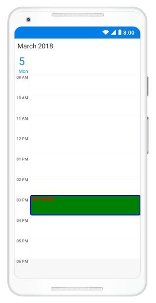

---

layout: post
title: Populating Appointment in Xamarin.Android SfSchedule | Syncfusion
description: This section explains on how to Populate Appointments in SfSchedule control for Xamarin.Android platform.
platform: xamarin.android
control: SfSchedule
documentation: ug

---

# Appointments in Xamarin.Android Schedule (SfSchedule)

[ScheduleAppointment](https://help.syncfusion.com/cr/xamarin-android/Com.Syncfusion.Schedule.ScheduleAppointment.html) is a class, which holds the details about the appointment to be rendered in schedule. It has some basic properties such as [StartTime](https://help.syncfusion.com/cr/xamarin-android/Com.Syncfusion.Schedule.ScheduleAppointment.html#Com_Syncfusion_Schedule_ScheduleAppointment_StartTime), [EndTime](https://help.syncfusion.com/cr/xamarin-android/Com.Syncfusion.Schedule.ScheduleAppointment.html#Com_Syncfusion_Schedule_ScheduleAppointment_EndTime), [Subject](https://help.syncfusion.com/cr/xamarin-android/Com.Syncfusion.Schedule.ScheduleAppointment.html#Com_Syncfusion_Schedule_ScheduleAppointment_Subject) and some additional information about the appointment can be added using [Color](https://help.syncfusion.com/cr/xamarin-android/Com.Syncfusion.Schedule.ScheduleAppointment.html#Com_Syncfusion_Schedule_ScheduleAppointment_Color), [Notes](https://help.syncfusion.com/cr/xamarin-android/Com.Syncfusion.Schedule.ScheduleAppointment.html#Com_Syncfusion_Schedule_ScheduleAppointment_Notes), [Location](https://help.syncfusion.com/cr/xamarin-android/Com.Syncfusion.Schedule.ScheduleAppointment.html#Com_Syncfusion_Schedule_ScheduleAppointment_Location), [All Day](https://help.syncfusion.com/cr/xamarin-android/Com.Syncfusion.Schedule.ScheduleAppointment.html#Com_Syncfusion_Schedule_ScheduleAppointment_IsAllDay), [Recurring properties](https://help.syncfusion.com/cr/xamarin-android/Com.Syncfusion.Schedule.ScheduleAppointment.html#Com_Syncfusion_Schedule_ScheduleAppointment_RecurrenceProperties).



using Com.Syncfusion.Schedule;
using Java.Util;

//Creating an instance for SfSchedule Control
SfSchedule schedule = new SfSchedule(this);

// Creating an instance for schedule appointment Collection
ScheduleAppointmentCollection scheduleAppointmentCollection = new   ScheduleAppointmentCollection();

Calendar currentDate = Calendar.Instance;
Calendar startTime = (Calendar)currentDate.Clone();

//setting start time for the event
startTime.Set(currentDate.Get(CalendarField.Year),
              currentDate.Get(CalendarField.Month),
              currentDate.Get(CalendarField.DayOfMonth),
              10, 0, 0);

Calendar endTime = (Calendar)currentDate.Clone();

//setting end time for the event
endTime.Set(currentDate.Get(CalendarField.Year),
            currentDate.Get(CalendarField.Month),
            currentDate.Get(CalendarField.DayOfMonth),
            12, 0, 0);

//Adding Schedule appointment in schedule appointment collection
scheduleAppointmentCollection.Add(new ScheduleAppointment()
{
    StartTime = startTime,
    EndTime = endTime,
    Subject = "Client Meeting",
    Color = Color.Red,
    Location = "Hutchison road",
});

//Adding schedule appointment collection to SfSchedule DataSource
schedule.ItemsSource = scheduleAppointmentCollection;
SetContentView(schedule);



## Mapping
Schedule supports full data binding to any type of IEnumerable source. Specify the [AppointmentMapping](https://help.syncfusion.com/cr/xamarin-android/Com.Syncfusion.Schedule.AppointmentMapping.html) attributes to map the properties in the underlying data source to the schedule appointments.

| PropertyName | Description |
| ------------------------------------------------------------------------------------------------------------------------------------------------------------------------------------------------|------------------------------------------------------------------------------------------------------------------------------------|
| [StartTime](https://help.syncfusion.com/cr/xamarin-android/Com.Syncfusion.Schedule.ScheduleAppointment.html#Com_Syncfusion_Schedule_ScheduleAppointment_StartTime) | This property is to map the property name of custom class which is equivalent for StartTime of ScheduleAppointment. |
| [EndTime](https://help.syncfusion.com/cr/xamarin-android/Com.Syncfusion.Schedule.ScheduleAppointment.html#Com_Syncfusion_Schedule_ScheduleAppointment_EndTime) | This property is to map the property name of custom class which is equivalent for EndTime of ScheduleAppointment. |
| [Subject](https://help.syncfusion.com/cr/xamarin-android/Com.Syncfusion.Schedule.ScheduleAppointment.html#Com_Syncfusion_Schedule_ScheduleAppointment_Subject) | This property is to map the property name of custom class which is equivalent for Subject of ScheduleAppointment. |
| [Color](https://help.syncfusion.com/cr/xamarin-android/Com.Syncfusion.Schedule.ScheduleAppointment.html#Com_Syncfusion_Schedule_ScheduleAppointment_Color) | This property is to map the property name of custom class which is equivalent for Color of ScheduleAppointment. |
| [IsAllDay](https://help.syncfusion.com/cr/xamarin-android/Com.Syncfusion.Schedule.ScheduleAppointment.html#Com_Syncfusion_Schedule_ScheduleAppointment_IsAllDay) | This property is to map the property name of custom class which is equivalent for IsAllDay of ScheduleAppointment. |
| [RecurrenceRule](https://help.syncfusion.com/cr/xamarin-android/Com.Syncfusion.Schedule.ScheduleAppointment.html#Com_Syncfusion_Schedule_ScheduleAppointment_RecurrenceRule) | This property is to map the property name of custom class which is equivalent for RecurrenceRule of ScheduleAppointment. |
| [Notes](https://help.syncfusion.com/cr/xamarin-android/Com.Syncfusion.Schedule.ScheduleAppointment.html#Com_Syncfusion_Schedule_ScheduleAppointment_Notes) | This property is to map the property name of custom class which is equivalent for Notes of ScheduleAppointment. |
| [Location](https://help.syncfusion.com/cr/xamarin-android/Com.Syncfusion.Schedule.ScheduleAppointment.html#Com_Syncfusion_Schedule_ScheduleAppointment_Location) | This  property is to map the property name of custom class which is  equivalent for Location of ScheduleAppointment. |
| [MinHeight](https://help.syncfusion.com/cr/xamarin-android/Com.Syncfusion.Schedule.ScheduleAppointment.html#Com_Syncfusion_Schedule_ScheduleAppointment_MinHeight) | This property is to map the property name of custom class which is equivalent for MinHeight of ScheduleAppointment. |
| [StartTimeZone](https://help.syncfusion.com/cr/xamarin-android/Com.Syncfusion.Schedule.ScheduleAppointment.html#Com_Syncfusion_Schedule_ScheduleAppointment_StartTimeZone) | This property is to map the property name of custom class which is equivalent for StartTimeZone of ScheduleAppointment. |
| [EndTimeZone](https://help.syncfusion.com/cr/xamarin-android/Com.Syncfusion.Schedule.ScheduleAppointment.html#Com_Syncfusion_Schedule_ScheduleAppointment_EndTimeZone)| This property is to map the property name of custom class which is equivalent for EndTimeZone of ScheduleAppointment. |
 
>**Note**
CustomAppointment class should contain two Calendar fields and a string field as mandatory.

### Creating custom Appointments
You can create custom class `Meeting` with mandatory fields `From`, `To` and `EventName`.



/// 
   
/// Represents custom data properties.   
/// 
 
public class Meeting
{
	public string EventName { get; set; }
	public Calendar	 From { get; set; }
	public Calendar To { get; set; }
	public int Color { get; set; }
}



>**Note**
You can inherit this class from INotifyPropertyChanged for dynamic changes in custom data.

You can map those properties of `Meeting` class with our SfSchedule control by using [AppointmentMapping](https://help.syncfusion.com/cr/xamarin-android/Com.Syncfusion.Schedule.AppointmentMapping.html).



/// 
   
/// Represents custom data properties.   
/// 
 
 AppointmentMapping dataMapping = new AppointmentMapping();
 dataMapping.Subject = "EventName";
 dataMapping.StartTime = "From";
 dataMapping.EndTime = "To";
 dataMapping.Color = "Color";
 sschedule.AppointmentMapping = dataMapping;



You can schedule meetings for a day by setting `From` and `To` of `Meeting` class. Create meetings of type `ObservableCollection <Meeting>` and assign those appointments collection `Meetings` to the [ItemsSource](https://help.syncfusion.com/cr/xamarin-android/Com.Syncfusion.Schedule.SfSchedule.html#Com_Syncfusion_Schedule_SfSchedule_ItemsSource) property which is of `IEnumerable` type.



Calendar currentDate = Calendar.Instance;
Calendar startTime = (Calendar)currentDate.Clone();
Calendar endTime = (Calendar)currentDate.Clone();
//setting start time for the event
startTime.Set(currentDate.Get(CalendarField.Year),
			  currentDate.Get(CalendarField.Month),
			  currentDate.Get(CalendarField.DayOfMonth),
			  10, 0, 0);
//setting end time for the event
endTime.Set(currentDate.Get(CalendarField.Year),
			currentDate.Get(CalendarField.Month),
			currentDate.Get(CalendarField.DayOfMonth),
			11, 0, 0);

// Creating instance for custom appointment class
Meeting meeting = new Meeting();
// Setting start time of an event
meeting.From = startTime;
// Setting end time of an event
meeting.To = endTime;
// Setting start time for an event
meeting.EventName = "Anniversary";
// Setting color for an event
meeting.Color = Color.Green;
// Creating instance for collection of custom appointments
var Meetings = new ObservableCollection<Meeting>();
// Adding a custom appointment in CustomAppointmentCollection
Meetings.Add(meeting);
// Adding custom appointments in DataSource of SfSchedule
schedule.ItemsSource = Meetings;



## Spanned Appointments
Spanned Appointment is an appointment which lasts more than 24 hours. It doesn’t block out time slots in `SfSchedule`, it will render in [All-Day appointment](https://help.syncfusion.com/xamarin-android/sfschedule/data-bindings#all-day-appointment-panel) panel exclusively.



using Com.Syncfusion.Schedule;
using Java.Util;

//Creating an instance for SfSchedule Control
SfSchedule schedule = new SfSchedule(this);

// Creating an instance for schedule appointment Collection
ScheduleAppointmentCollection scheduleAppointmentCollection = new   ScheduleAppointmentCollection();

Calendar currentDate = Calendar.Instance;
Calendar startTime = (Calendar)currentDate.Clone();

//setting start time for the event
startTime.Set(currentDate.Get(CalendarField.Year),
              currentDate.Get(CalendarField.Month),
              currentDate.Get(CalendarField.DayOfMonth),
              10, 0, 0);

Calendar endTime = (Calendar)currentDate.Clone();

//setting end time for the event
endTime.Set(currentDate.Get(CalendarField.Year),
            currentDate.Get(CalendarField.Month),
            currentDate.Get(CalendarField.DayOfMonth)+2,
            12, 0, 0);

//Adding Schedule appointment in schedule appointment collection
scheduleAppointmentCollection.Add(new ScheduleAppointment()
{
    StartTime = startTime,
    EndTime = endTime,
    Subject = "Client Meeting",
    Color = Color.Red,
    Location = "Hutchison road",
});

//Adding schedule appointment collection to SfSchedule DataSource
schedule.ItemsSource = scheduleAppointmentCollection;
SetContentView(schedule);



## All Day Appointments
All-Day appointment is an appointment which is scheduled for a whole day. It can be set by using `IsAllDay` property in the `ScheduleAppointment`.



//Adding Schedule appointment in schedule appointment collection
scheduleAppointmentCollection.Add(new ScheduleAppointment()
{
    StartTime = startTime,
    EndTime = endTime,
    Subject = "Client Meeting",
    Color = Color.Red,
    Location = "Hutchison road",
    IsAllDay = true
});



>**NOTE**
Appointment which lasts through an entire day (exact 24 hours) will be considered as all day appointment without setting `IsAllDay` property. For example  06/09/2018 12:00AM to 06/10/2018 12:00AM.

### All-Day Appointment Panel
All-day appointment and Spanned appointment doesn't block out entire time slot in SfSchedule, rather it will render in separate layout exclusively for all-day appointment. It can be enabled by setting `ShowAllDay` property of `DayViewSettings`, `WeekViewSettings` and `WorkWeekViewSettings` of `DayView`, `WeekView` and `WorkWeekView` respectively.



//Setting schedule view
schedule.ScheduleView = ScheduleView.WeekView;

//Creating week view settings for SfSchedule WeekView
WeekViewSettings weekViewSettings = new WeekViewSettings();
weekViewSettings.ShowAllDay = true;
schedule.WeekViewSettings = weekViewSettings;



>**NOTE**
Appointments which lasts less than 24 hours with different start date and end date will be rendered in time slot.

All-Day panel background can be customized by setting `AllDayAppointmentBackgroundColor` 
of the respective view settings.



weekViewSettings.AllDayAppointmentBackgroundColor = Color.Silver;



## Recurrence Appointment
Recurring appointment on a daily, weekly, monthly, or yearly interval. Recurring appointments can be created by setting `RecurrenceRule` property in Schedule appointments.

### Recurrence Rule
The `RecurrenceRule` is a string value, that contains the details of the recurrence appointments like repeat type - daily/weekly/monthly/yearly, how many times it needs to be repeated, the interval duration and also the time period to render the appointment, etc.
`RecurrenceRule` has the following properties and based on this property value, the recurrence appointments are rendered in the SfSchedule control with its respective time period.

| PropertyName | Purpose |
|--------------|----------------------------------------------------------------------------------------------------------------------------------------------------------------------------------------------------------------------------------------------------------------------------------------------------------------------------------------------------------------------------------------------------------------------------------------------------|
| FREQ | Maintains the Repeat type value of the appointment. (Example: Daily, Weekly, Monthly, Yearly, Every week day) Example: FREQ=DAILY;INTERVAL=1 |
| INTERVAL | Maintains the interval value of the appointments. For example, when you create the daily appointment at an interval of 2, the appointments are rendered on the days Monday, Wednesday and Friday. (creates the appointment on all days by leaving the interval of one day gap) Example: FREQ=DAILY;INTERVAL=1 |
| COUNT | It holds the appointment’s count value. For example, when the recurrence appointment count value is 10, it means 10 appointments are created in the recurrence series. Example: FREQ=DAILY;INTERVAL=1;COUNT=10 |
| UNTIL | This property is used to store the recurrence end date value. For example, when you set the end date of appointment as 6/30/2014, the UNTIL property holds the end date value when the recurrence actually ends. Example: FREQ=DAILY;INTERVAL=1;UNTIL=8/25/2014 |
| BYDAY | It holds the “DAY” values of an appointment to render.For example, when you create the weekly appointment, select the day(s) from the day options (Monday/Tuesday/Wednesday/Thursday/Friday/Saturday/Sunday).  When Monday is selected, the first two letters of the selected day “MO” is stored in the “BYDAY” property.  When you select multiple days, the values are separated by commas. Example: FREQ=WEEKLY;INTERVAL=1;BYDAY=MO,WE;COUNT=10 |
| BYMONTHDAY | This property is used to store the date value of the Month while creating the Month recurrence appointment. For example, when you create a Monthly recurrence appointment in the date 3, it means the BYMONTHDAY holds the value 3 and creates the appointment on 3rd day of every month. Example: FREQ=MONTHLY;BYMONTHDAY=3;INTERVAL=1;COUNT=10 |
| BYMONTH | This property is used to store the index value of the selected Month while creating the yearly appointments. For example, when you create the yearly appointment in the Month June, it means the index value for June month is 6 and it is stored in the BYMONTH field.  The appointment is created on every 6th month of a year. Example: FREQ=YEARLY;BYMONTHDAY=16;BYMONTH=6;INTERVAL=1;COUNT=10 |
| BYSETPOS | This property is used to store the index value of the week. For example, when you create the monthly appointment in second week of the month, the index value of the second week (2) is stored in BYSETPOS. Example: FREQ=MONTHLY;BYDAY=MO;BYSETPOS=2;UNTIL=8/11/2014 |

### Recurrence Pattern
The recurrence patterns used in the control are in iCal standard. The schedule control supports all four types of [recurrence patterns](https://help.syncfusion.com/cr/xamarin-android/Com.Syncfusion.Schedule.RecurrenceProperties.html). You can set the recurrence type using the [RecurrenceType](https://help.syncfusion.com/cr/xamarin-android/Com.Syncfusion.Schedule.Enums.RecurrenceType.html) property of the RecurrenceRule.

| RecurrenceType | RecurrenceProperties | Description                                                                                 |
|----------------|----------------------|---------------------------------------------------------------------------------------------|
| Daily | [Interval](https://help.syncfusion.com/cr/xamarin-android/Com.Syncfusion.Schedule.RecurrenceProperties.html#Com_Syncfusion_Schedule_RecurrenceProperties_Interval)    | Gets or sets the day interval on which recurrence has to be set.|
| Weekly  | [Interval](https://help.syncfusion.com/cr/xamarin-android/Com.Syncfusion.Schedule.RecurrenceProperties.html#Com_Syncfusion_Schedule_RecurrenceProperties_Interval)  | Gets or sets the day interval on which recurrence has to be set.|
|                | [DayOfWeek](https://help.syncfusion.com/cr/xamarin-android/Com.Syncfusion.Schedule.RecurrenceProperties.html#Com_Syncfusion_Schedule_RecurrenceProperties_DayOfWeek) | Gets or sets the day of week on which recurrence has to be set.|
|                | [WeekDays](https://help.syncfusion.com/cr/xamarin-android/Com.Syncfusion.Schedule.RecurrenceProperties.html)  | Gets or sets the day/days in a week on which recurrence has to be set.|
|				 | [Week](https://help.syncfusion.com/cr/xamarin-android/Com.Syncfusion.Schedule.RecurrenceProperties.html#Com_Syncfusion_Schedule_RecurrenceProperties_Week) | Gets or sets the week of month on which recurrence has to be set.|
| Monthly        | [Interval](https://help.syncfusion.com/cr/xamarin-android/Com.Syncfusion.Schedule.RecurrenceProperties.html#Com_Syncfusion_Schedule_RecurrenceProperties_Interval) | Gets or sets the day interval on which  recurrence has to be set.|
|                | [DayOfWeek](https://help.syncfusion.com/cr/xamarin-android/Com.Syncfusion.Schedule.RecurrenceProperties.html#Com_Syncfusion_Schedule_RecurrenceProperties_DayOfWeek)  | Gets or sets the day of week on which  recurrence has to be set.|
|				 | [Week](https://help.syncfusion.com/cr/xamarin-android/Com.Syncfusion.Schedule.RecurrenceProperties.html#Com_Syncfusion_Schedule_RecurrenceProperties_Week) | Gets or sets the week of month on which recurrence has to be set.|
|                | [DayOfMonth](https://help.syncfusion.com/cr/xamarin-android/Com.Syncfusion.Schedule.RecurrenceProperties.html#Com_Syncfusion_Schedule_RecurrenceProperties_DayOfMonth) | Gets or sets the day on which recurrence has to be set for every month.|
| Yearly         | [Interval](https://help.syncfusion.com/cr/xamarin-android/Com.Syncfusion.Schedule.RecurrenceProperties.html#Com_Syncfusion_Schedule_RecurrenceProperties_Interval) | Gets or sets the day interval on which recurrence has to be set.|
|                | [DayOfMonth](https://help.syncfusion.com/cr/xamarin-android/Com.Syncfusion.Schedule.RecurrenceProperties.html#Com_Syncfusion_Schedule_RecurrenceProperties_DayOfMonth) | Gets or sets the day on which recurrence has to be set for every month.|
|                | [DayOfWeek](https://help.syncfusion.com/cr/xamarin-android/Com.Syncfusion.Schedule.RecurrenceProperties.html#Com_Syncfusion_Schedule_RecurrenceProperties_DayOfWeek) | Gets or sets the day of week on which  recurrence has to be set.|
|				 | [Month](https://help.syncfusion.com/cr/xamarin-android/Com.Syncfusion.Schedule.RecurrenceProperties.html#Com_Syncfusion_Schedule_RecurrenceProperties_Month)				| Gets or sets the specific month of year on which recurrence has to be set.|
|				 | [Week](https://help.syncfusion.com/cr/xamarin-android/Com.Syncfusion.Schedule.RecurrenceProperties.html#Com_Syncfusion_Schedule_RecurrenceProperties_Week) | Gets or sets the week of month on which recurrence has to be set.|
| Common         | [RecurrenceRange](https://help.syncfusion.com/cr/xamarin-android/Com.Syncfusion.Schedule.RecurrenceProperties.html#Com_Syncfusion_Schedule_RecurrenceProperties_RecurrenceRange) | Gets or sets the type of the recurrence range for the time limit of recurrence appointment. |
|                | [RecurrenceCount](https://help.syncfusion.com/cr/xamarin-android/Com.Syncfusion.Schedule.RecurrenceProperties.html#Com_Syncfusion_Schedule_RecurrenceProperties_RecurrenceCount) | Gets or sets the count for recurring appointment.|
|                | [StartDate](https://help.syncfusion.com/cr/xamarin-android/Com.Syncfusion.Schedule.RecurrenceProperties.html#Com_Syncfusion_Schedule_RecurrenceProperties_StartDate) | Gets or sets the date to start the recurrence appointment.|
|                | [EndDate](https://help.syncfusion.com/cr/xamarin-android/Com.Syncfusion.Schedule.RecurrenceProperties.html#Com_Syncfusion_Schedule_RecurrenceProperties_EndDate) | Gets or sets the date to end the recurrence appointment.|

Find the following `RecurrenceRule` possibilities available in the Schedule control while creating the recurrence appointment.

| PossibilityType | Description | RecurrenceProperties | Examples |
|-----------------|----------------------------------------------------------------|----------------------------------------------------------------------------------------------------------------------------------------------------------------------------------------------------------------------------------------------------------|-----------------------------------------------------------------------|
| Daily | Appointment is created with Ends Never | RecurrenceType = RecurrenceType.Daily, Interval = 1, RecurrenceRange = RecurrenceRange.NoEndDate | FREQ=DAILY; INTERVAL=1 |
|  | Appointment is created with Ends After | RecurrenceType = RecurrenceType.Daily, Interval = 1, RecurrenceRange = RecurrenceRange.Count, RecurrenceCount = 15 | FREQ=DAILY; INTERVAL=1; COUNT=5 |
|  | Appointment is created with Ends On | RecurrenceType = RecurrenceType.Daily, Interval = 1, RecurrenceRange = RecurrenceRange.EndDate, EndDate = new DateTime(2017, 06, 20) | FREQ=DAILY; INTERVAL=1; UNTIL=06/20/2017 |
|  | Appointment is created with Every (Interval) | RecurrenceType = RecurrenceType.Daily, Interval = 2, RecurrenceRange = RecurrenceRange.Count, RecurrenceCount = 10 | FREQ=DAILY; INTERVAL=2; COUNT=10 |
| Weekly | Appointment is created with Ends Never | RecurrenceType = RecurrenceType.Weekly, Interval = 1, WeekDays = WeekDays.Monday `|`WeekDays.Wednesday`|`WeekDays.Friday,RecurrenceRange  = RecurrenceRange.NoEndDate | FREQ=WEEKLY; INTERVAL=1; BYDAY=MO, WE, FR |
|  | Appointment is created with Ends After | RecurrenceType = RecurrenceType.Weekly, Interval = 1, WeekDays = WeekDays.Thursday, RecurrenceRange = RecurrenceRange.Count, RecurrenceCount = 10 | FREQ=WEEKLY; INTERVAL=1; BYDAY=TH; COUNT=10 |
|  | Appointment is created with Ends On | RecurrenceType = RecurrenceType.Weekly, Interval = 1, WeekDays = WeekDays.Monday, RecurrenceRange = RecurrenceRange.EndDate, EndDate = new DateTime(2017, 07, 20) | FREQ=WEEKLY; INTERVAL=1; BYDAY=MO; UNTIL=07/20/2017 |
|  | Appointment is created with selecting multiple day | RecurrenceType = RecurrenceType.Weekly, Interval = 2, WeekDays = WeekDays.Monday`|`WeekDays.Wednesday`|`WeekDays.Friday, RecurrenceRange = RecurrenceRange.Count, RecurrenceCount = 10 | FREQ=WEEKLY; INTERVAL=2; BYDAY=MO, WE, FR; COUNT=10 |
| Every Day | Appointment is created with Ends Never | RecurrenceType = RecurrenceType.Weekly, Interval = 1, WeekDays = WeekDays.Monday`|`WeekDays.Tuesday`|`WeekDays.Wednesday`|`WeekDays.Thursday`|`WeekDays.Friday, RecurrenceRange = RecurrenceRange.NoEndDate | FREQ=WEEKLY; BYDAY=MO, TU, WE, TH, FR |
|  | Appointment is created with Ends After | RecurrenceType = RecurrenceType.Weekly, Interval = 1, WeekDays = WeekDays.Monday`|`WeekDays.Tuesday`|`WeekDays.Wednesday`|`WeekDays.Thursday`|`WeekDays.Friday, RecurrenceRange = RecurrenceRange.Count, RecurrenceCount = 10 | FREQ=WEEKLY; BYDAY=MO, TU, WE, TH, FR; COUNT=10 |
|  | Appointment is created with Ends On | RecurrenceType = RecurrenceType.Weekly, Interval = 1, WeekDays = WeekDays.Monday`|`WeekDays.Tuesday`|`WeekDays.Wednesday`|`WeekDays.Thursday`|`WeekDays.Friday, RecurrenceRange = RecurrenceRange.EndDate, EndDate = new DateTime(2017, 07, 15) | FREQ=WEEKLY; BYDAY=MO, TU, WE, TH, FR; UNTIL=07/15/2017 |
| Monthly | Appointment is created with selected date Ends Never | RecurrenceType = RecurrenceType.Monthly, Interval = 1, DayOfMonth = 15, RecurrenceRange = RecurrenceRange.NoEndDate | FREQ=MONTHLY; BYMONTHDAY=15; INTERVAL=1 |
|  | Appointment is created with selected date and Ends After | RecurrenceType = RecurrenceType.Monthly, Interval = 1, DayOfMonth = 16, RecurrenceRange = RecurrenceRange.Count, RecurrenceCount = 10 | FREQ=MONTHLY; BYMONTHDAY=16; INTERVAL=1; COUNT=10 |
|  | Appointment is created with selected date and Ends On | RecurrenceType = RecurrenceType.Monthly, Interval = 1, DayOfMonth = 16, RecurrenceRange = RecurrenceRange.EndDate, EndDate = new DateTime(2018, 06, 11) | FREQ=MONTHLY; BYMONTHDAY=17; INTERVAL=1; UNTIL=06/11/2018 |
|  | Appointment is created with selected day Ends Never | RecurrenceType = RecurrenceType.Monthly, Interval = 1, Week = 2, DayOfWeek = 6, RecurrenceRange = RecurrenceRange.NoEndDate | FREQ=MONTHLY; BYDAY=FR; BYSETPOS=2; INTERVAL=1 |
|  | Appointment is created with selected day and Ends After | RecurrenceType = RecurrenceType.Monthly, Interval = 1, Week = 4, DayOfWeek = 4, RecurrenceRange = RecurrenceRange.Count, RecurrenceCount = 10 | FREQ=MONTHLY; BYDAY=WE; BYSETPOS=4; INTERVAL=1; COUNT=10 |
|  | Appointment is created with selected day and Ends On | RecurrenceType = RecurrenceType.Monthly, Interval = 1, Week = 4, DayOfWeek = 6, RecurrenceRange = RecurrenceRange.EndDate, EndDate = new DateTime(2018, 06, 11) | FREQ=MONTHLY; BYDAY=FR; BYSETPOS=4; INTERVAL=1; UNTIL=06/11/2018 |
| Yearly | Appointment is created with selected date and month Ends Never | RecurrenceType = RecurrenceType.Yearly, Interval = 1, Month = 12, DayOfMonth = 15, RecurrenceRange = RecurrenceRange.NoEndDate | FREQ=YEARLY; BYMONTHDAY=15; BYMONTH=12; INTERVAL=1 |
|  | Appointment is created with selected date and month Ends After | RecurrenceType = RecurrenceType.Yearly, Interval = 1, Month = 12, DayOfMonth = 10, RecurrenceRange = RecurrenceRange.Count, RecurrenceCount = 10 | FREQ=YEARLY; BYMONTHDAY=10; BYMONTH=12; INTERVAL=1; COUNT=10 |
|  | Appointment is created with selected date and month Ends On | RecurrenceType = RecurrenceType.Yearly, Interval = 1, Month = 12, DayOfMonth = 12, RecurrenceRange = RecurrenceRange.EndDate, EndDate = new DateTime(2018, 06, 11) | FREQ=YEARLY; BYMONTHDAY=12; BYMONTH=12; INTERVAL=1; UNTIL=06/11//2018 |

### Adding Recurrence Appointment using Recurrence Builder
Schedule appointment [RecurrenceRule](https://help.syncfusion.com/cr/xamarin-android/Com.Syncfusion.Schedule.ScheduleAppointment.html#Com_Syncfusion_Schedule_ScheduleAppointment_RecurrenceRule) is used to populate the required recurring appointment collection in a specific pattern. `RRULE` can be easily created through `RecurrenceBuilder` engine by simple APIs available in Schedule control.



// Creating instance for schedule appointment collection
ScheduleAppointmentCollection scheduleAppointmentCollection = new ScheduleAppointmentCollection();

//Adding schedule appointment in schedule appointment collection
var scheduleAppointment = new ScheduleAppointment()
{
    StartTime = startTime,
    EndTime = endTime,
    Subject = "Client Meeting",
    Location = "Hutchison road",
};

//Adding schedule appointment in schedule appointment collection
scheduleAppointmentCollection.Add(scheduleAppointment);

// Creating recurrence rule
RecurrenceProperties recurrenceProperties = new RecurrenceProperties();
recurrenceProperties.RecurrenceType = RecurrenceType.Daily;
recurrenceProperties.RecurrenceRange = RecurrenceRange.Count;
recurrenceProperties.Interval = 2;
recurrenceProperties.RecurrenceCount = 10;

// Setting recurrence rule to schedule appointment
scheduleAppointment.RecurrenceRule = ScheduleHelper.RRuleGenerator(recurrenceProperties, scheduleAppointment.StartTime, scheduleAppointment.EndTime);

//Adding Schedule appointment collection to SfSchedule DataSource
schedule.ItemsSource = scheduleAppointmentCollection;



## Recurrence Pattern Exceptions 
You can delete or change any recurrence pattern appointment by handling exception dates and exception appointments to that recurring appointment.

### Recurrence Exception Dates
You can delete any occurrence appointment which is exception from the recurrence pattern appointment by adding exception dates to the recurring appointment. 
 
### Recurrence Exception appointment
You can also change any occurrence appointment which is exception from recurrence pattern appointment by adding the recurrence exception appointment in the schedule `ItemsSource`.

### Create recurrence exceptions for schedule appointment

You can add/remove the recurrence exception appointments and recurrence exception dates to `ScheduleAppointment` by using its property, [RecurrenceExceptionDates](https://help.syncfusion.com/cr/xamarin-android/Com.Syncfusion.Schedule.ScheduleAppointment.html#Com_Syncfusion_Schedule_ScheduleAppointment_RecurrenceExceptionDates), [RecurrenceId](https://help.syncfusion.com/cr/xamarin-android/Com.Syncfusion.Schedule.ScheduleAppointment.html#Com_Syncfusion_Schedule_ScheduleAppointment_RecurrenceId), [ExceptionOccurrenceActualDate](https://help.syncfusion.com/cr/xamarin-android/Com.Syncfusion.Schedule.ScheduleAppointment.html#Com_Syncfusion_Schedule_ScheduleAppointment_ExceptionOccurrenceActualDate).

#### Delete occurrence from recurrence pattern appointment or adding exception dates to recurrence pattern appointment
You can delete any of occurrence which is exception from recurrence pattern appointment by using `RecurrenceExceptionDates` property of `ScheduleAppointment`.The deleted occurrence date will be considered as recurrence exception dates.


 // Create the new exception date.
var exceptionDate = Calendar.Instance;
exceptionDate.Set(2017, 08, 07);

var startTime = Calendar.Instance;
 
//setting start time for the event
startTime.Set(2017, 08, 03, 10, 0, 0);
var endTime = Calendar.Instance;

//setting end time for the event
endTime.Set(2017, 08, 03, 12, 0, 0);
var recurrenceAppointment = new ScheduleAppointment
{
	StartTime = startTime,
	EndTime = endTime,
	Subject = "Daily Occurs",
	Color = Color.Blue,
	RecurrenceRule = "FREQ=DAILY;COUNT=20",
	RecurrenceExceptionDates = new ObservableCollection<Calendar> { exceptionDate }
};



>**NOTE**
•	Exception dates should be Universal Time Coordinates (UTC) time zone.
•	You can also update the RecurrenceExceptionDates collection dynamically.

#### Delete occurrence from recurrence pattern dynamically or add exception dates to recurrence pattern dynamically
You can also delete any occurrence from the recurrence pattern appointment by adding exception date to the `RecurrenceExceptionDates` collection.



var exceptionDate = Calendar.Instance;
exceptionDate.Set(2017, 08, 08, 10, 0, 0);
var recurrenceAppointment = scheduleAppointmentCollection[0];
recurrenceAppointment.RecurrenceExceptionDates.Add(exceptionDate);



#### Add deleted occurrence to recurrence pattern dynamically or remove exception dates from recurrence pattern dynamically
You can also add the deleted occurrence to the recurrence pattern appointment by removing exception date from the `RecurrenceExceptionDates` collection.



var recurrenceAppointment = scheduleAppointmentCollection[0];
recurrenceAppointment.RecurrenceExceptionDates.RemoveAt(0);



>**NOTE**
If you add the deleted occurrence to the recurrence pattern by removing exception date when any [exception appointment](#recurrence-exception-appointment) has been created for the mentioned exception date, the respective exception appointment will be deleted by matching with `RecurrenceId` and `ExceptionOccurrenceActualDate` from Schedule `ItemsSource` and recurrence pattern appointment created for that exception date.

#### Add all deleted occurrences to recurrence pattern dynamically or clear exception dates from recurrence pattern dynamically
You can also add all deleted occurrences to the recurrence pattern appointment by clearing the exception dates from the `RecurrenceExceptionDates` collection.



var recurrenceAppointment = scheduleAppointmentCollection[0];
recurrenceAppointment.RecurrenceExceptionDates.Clear();



#### Add exception appointment to recurrence pattern
You can change any occurrence appointment which is an exception from the recurrence pattern appointment by using the `RecurrenceId` property which is used to map the exception appointment with recurrence pattern appointment and `ExceptionOccurrenceActualDate` property which is used to mention the actual pattern occurrence date of exception appointment of `ScheduleAppointment`.
You should add the created exception recurrence appointment to the schedule `ItemsSource`.


var exceptionDate = Calendar.Instance;
exceptionDate.Set(2017, 08, 07, 10, 0, 0);

// Add Recurrence appointment 
var recurrenceAppointment = new ScheduleAppointment
{
	StartTime = startTime,
	EndTime = endTime,
	Subject = "Daily Occurs",
	Color = Color.Blue,
	RecurrenceRule = "FREQ=DAILY;COUNT=20",
    RecurrenceExceptionDates = new ObservableCollection<Calendar> { exceptionDate }
};

// Add exception appointment to the current recurrence pattern
var exceptionStartTime = Calendar.Instance;
exceptionStartTime.Set(2017, 08, 07, 13, 0, 0);
var exceptionEndTime = Calendar.Instance;
exceptionEndTime.Set(2017, 08, 07, 14, 0, 0);
var exceptionAppointment = new ScheduleAppointment
{
	StartTime = exceptionStartTime,
	EndTime = exceptionEndTime,
	Subject = "Meeting",
	Color = Color.Red,
	// Recurrence Id should be parent appointment object
	RecurrenceId = recurrenceAppointment,
	//Actual occurrence date
	ExceptionOccurrenceActualDate = exceptionDate
};



>**NOTE**
•	`RecurrenceId` should be a recurrence pattern appointment object.
•	Exception appointment should be a normal appointment and should not be created as recurring appointment, since its occurrence is from recurrence pattern.
•	`ExceptionOccurrenceActualDate` should be in Universal Time Coordinates (UTC) time zone.

#### Add exception appointment to recurrence pattern dynamically
You can also add exception appointment dynamically for added exception date by adding exception appointment to the schedule `ItemsSource` which is exception from the recurrence pattern appointment by using the `RecurrenceId` property which is used to map the exception appointment with recurrence pattern appointment and `ExceptionOccurrenceActualDate` property which is used to mention the actual pattern occurrence date of exception appointment of the `ScheduleAppointment` class.



var recurrenceAppointment = scheduleAppointmentCollection[0];
var exceptionDate = Calendar.Instance;
exceptionDate.Set(2017, 08, 08, 10, 0, 0);
var exceptionStartTime = Calendar.Instance;
exceptionStartTime.Set(2017, 08, 07, 13, 0, 0);
var exceptionEndTime = Calendar.Instance;
exceptionEndTime.Set(2017, 08, 07, 14, 0, 0);

// Add exception appointment to the current recurrence series
var exceptionAppointment = new ScheduleAppointment
{
	StartTime = exceptionStartTime,
	EndTime = exceptionEndTime,
	Subject = "Meeting",
	Color = Color.Red,
	// set the parent appointment to recurrence Id
	RecurrenceId = recurrenceAppointment,
	 //Actual occurrence date
	ExceptionOccurrenceActualDate = exceptionDate
};

//Adding exception appointment in schedule appointment collection
scheduleAppointmentCollection.Add(exceptionAppointment);


>**NOTE**
•	`RecurrenceId` should be a recurrence pattern appointment object.
•	Exception appointment should be a normal appointment and should not be created as recurring appointment, since its occurrence from recurrence pattern.
•	`ExceptionOccurrenceActualDate` should be in Universal Time Coordinates (UTC) time zone.

#### Remove exception appointment from recurrence pattern
You can directly remove the added exception appointment for recurrence pattern by removing it from schedule `ItemsSource`.



var exceptionAppointment = scheduleAppointmentCollection[1];
//Remove exception appointment from schedule appointment collection
scheduleAppointmentCollection.Remove(exceptionAppointment);



You can download the entire source code of this demo for Xamarin.Android from
here [RecurrenceExceptions](https://github.com/SyncfusionExamples/Create-Recurrence-Exceptions-to-schedule-recurring-appointments-in-Xamarin.Android).

### Create recurrence exceptions for custom appointment

You can add/remove the recurrence exception appointments and recurrence exception dates to the CustomAppointment, You can create a custom class `Meeting`(refer [DataBinding](#mapping)) with mandatory fields `RecurrenceExceptionDates`, `ActualDate`, `RecurrenceId`.

#### Delete occurrence from recurrence pattern appointment or adding exception dates to recurrence pattern appointment
You can delete any occurrence which is exception from the recurrence pattern appointment by using the [RecurrenceExceptionDates](https://help.syncfusion.com/cr/xamarin-android/Com.Syncfusion.Schedule.AppointmentMapping.html#Com_Syncfusion_Schedule_AppointmentMapping_RecurrenceExceptionDates) property of `AppointmentMapping` class which is used to map the exception dates to the schedule recurrence appointment. The deleted occurrence date will be considered as recurrence exception dates.
To add the exception dates in the recurrence series of custom appointment, add the RecurrenceExceptionDates property to custom class `Meeting`.



 public ObservableCollection<Calendar> RecurrenceExceptionDates { get; set; } = new ObservableCollection<Calendar>();



You should map this custom property `RecurrenceExceptionDates` of custom class with the `RecurrenceExceptionDates` property of `AppointmentMapping` class to map the exception dates to the schedule appointment.



// data mapping for custom appointments.
dataMapping.RecurrenceExceptionDates = "RecurrenceExceptionDates";
            
// Create the new exception date.
var exceptionDate = Calendar.Instance;
exceptionDate.Set(2017, 08, 07);
var startTime = Calendar.Instance;
 
//setting start time for the event
startTime.Set(2017, 08, 03, 10, 0, 0);
var endTime = Calendar.Instance;

//setting end time for the event
endTime.Set(2017, 08, 03, 12, 0, 0);
var recurrenceAppointment = new Meeting
{
	From = startTime,
	To = endTime,
	EventName = "Daily Occurs",
	Color = Color.Blue,
	RecurrenceRule = "FREQ=DAILY;COUNT=20",
	RecurrenceExceptionDates = new ObservableCollection<Calendar> { exceptionDate}
};



>**NOTE**
•	Exception dates should be in Universal Time Coordinates (UTC) time zone.
•	You can also dynamically update the custom property RecurrenceExceptionDates collection.

#### Delete occurrence from recurrence pattern dynamically or add exception dates to recurrence pattern dynamically
You can also delete any occurrence from the recurrence pattern appointment by adding exception date to the `RecurrenceExceptionDates` custom property collection.



var recurrenceAppointment = scheduleAppointmentCollection[0];
var exceptionDate = Calendar.Instance;
exceptionDate.Set(2017, 08, 08, 10, 0, 0);
recurrenceAppointment.RecurrenceExceptionDates.Add(exceptionDate);



#### Add deleted occurrence to recurrence pattern dynamically or remove exception dates from recurrence pattern dynamically
You can also add the deleted occurrence to the recurrence pattern appointment by removing exception date from the `RecurrenceExceptionDates` custom property collection.



var recurrenceAppointment = scheduleAppointmentCollection[0];
recurrenceAppointment.RecurrenceExceptionDates.RemoveAt(0);



>**NOTE**
If you add the deleted occurrence to the recurrence pattern by removing exception date when any [exception appointment](#recurrence-exception-appointment) has been created for the mentioned exception date, the respective exception appointment will be deleted by matching with `RecurrenceId` and `ActualDate` from the schedule `ItemsSource` and recurrence pattern appointment created for that exception date.

#### Add all deleted occurrence to recurrence pattern dynamically or clear exception dates from recurrence pattern dynamically
You can also add all deleted occurrence to the recurrence pattern appointment by clearing the exception dates from the `RecurrenceExceptionDates` custom property collection.



var recurrenceAppointment = scheduleAppointmentCollection[0];
recurrenceAppointment.RecurrenceExceptionDates.Clear();



#### Add exception appointment to recurrence pattern
You can change any occurrence appointment which is exception from the recurrence pattern appointment by using the [RecurrenceId](https://help.syncfusion.com/cr/xamarin-android/Com.Syncfusion.Schedule.AppointmentMapping.html#Com_Syncfusion_Schedule_AppointmentMapping_RecurrenceId) property of `AppointmentMapping` class which is used to map the custom exception appointment with schedule recurrence series appointment and [ExceptionOccurrenceActualDate](https://help.syncfusion.com/cr/xamarin-android/Com.Syncfusion.Schedule.AppointmentMapping.html#Com_Syncfusion_Schedule_AppointmentMapping_ExceptionOccurrenceActualDate) property of `AppointmentMapping` class which is used to mention the actual series occurrence date of exception appointment of schedule recurrence appointment.
For adding custom exception appointment to the recurrence series, add the `ActualDate` and `RecurrenceID` properties to custom class `Meeting`.



public Calendar ActualDate { get; set; }
public object RecurrenceID { get; set; }



You should map this custom property `RecurrenceID` of `Meeting` with the `RecurrenceId` property of `AppointmentMapping` class which is used to map the exception appointment with schedule recurrence series appointment `Meeting`.
You should also map this custom property `ActualDate` of `Meeting` with the `ExceptionOccurrenceActualDate` property of `AppointmentMapping` class which is used to mention the actual series occurrence date of exception appointment with schedule recurrence appointment.
You should add the created exception recurrence appointment to the schedule `ItemsSource`.



Calendar startTime = Calendar.Instance;
 
//setting start time for the event
startTime.Set(2017, 08, 03, 10, 0, 0);
Calendar endTime = Calendar.Instance;

//setting end time for the event
endTime.Set(2017, 08, 03, 12, 0, 0);

// Set exception date.
var exceptionDate = Calendar.Instance;
exceptionDate.Set(2017, 08, 07);

//Adding schedule appointment in schedule appointment collection 
var recurrenceAppointment = new Meeting
{
	From = startTime,
	To = endTime,
	EventName = "Daily Occurs",
	Color = Color.Blue,
	RecurrenceRule = "FREQ=DAILY;COUNT=20",
    RecurrenceExceptionDates = new ObservableCollection<Calendar> { exceptionDate }
};

// Add exception appointment to the current recurrence series
var exceptionStartTime = Calendar.Instance;
exceptionStartTime.Set(2017, 08, 07, 13, 0, 0);
var exceptionEndTime = Calendar.Instance;
exceptionEndTime.Set(2017, 08, 07, 14, 0, 0);
var exceptionAppointment = new Meeting
{
	From = exceptionStartTime,
	To = exceptionEndTime,
	EventName = "Meeting",
	Color = Color.Red,
	// set the parent appointment to recurrence Id.
	RecurrenceID = recurrenceAppointment,
	//Actual occurrence date
	ActualDate = exceptionDate
};



>**NOTE**
•	`RecurrenceId` should be a recurrence pattern appointment object.
•	Exception appointment should be a normal appointment and should not be created as recurring appointment, since its occurrence from recurrence pattern.
•	`ActualDate` should be in Universal Time Coordinates (UTC) time zone.

#### Add exception appointment to recurrence pattern dynamically

You can also add exception appointment dynamically for added exception date by adding exception appointment to the schedule `ItemsSource` by using the `RecurrenceId` property of `AppointmentMapping` class which is used to map the custom exception appointment with schedule recurrence series appointment and `ExceptionOccurrenceActualDate` property of the `AppointmentMapping` class which is used to mention the actual series occurrence date of exception appointment of schedule recurrence appointment.



   var recurrenceAppointment = scheduleAppointmentCollection[0];

// Set exception dates.
var exceptionDate = Calendar.Instance;
exceptionDate.Set(2017, 08, 07);
var exceptionStartTime = Calendar.Instance;
exceptionStartTime.Set(2017, 08, 07, 13, 0, 0);
var exceptionEndTime = Calendar.Instance;
exceptionEndTime.Set(2017, 08, 07, 14, 0, 0);
var exceptionAppointment = new Meeting
{
	From = exceptionStartTime,
	To = exceptionEndTime,
	EventName = "Meeting",
	Color = Color.Red,
	// set the parent appointment to recurrence Id.
	RecurrenceID = recurrenceAppointment,
	//Actual occurrence date
	ActualDate = exceptionDate
};
           
scheduleAppointmentCollection.Add(exceptionAppointment);



>**NOTE**
•	`RecurrenceId` should be a recurrence pattern appointment object.
•	Exception appointment should be a normal appointment and should not be created as recurring appointment, since its occurrence from recurrence pattern.
•	`ActualDate` should be in Universal Time Coordinates (UTC) time zone.

#### Remove exception appointment from recurrence pattern
You can directly remove the added exception appointment for recurrence pattern by removing from the schedule `ItemsSource`.



var exceptionAppointment = scheduleAppointmentCollection[1];
scheduleAppointmentCollection.Remove(exceptionAppointment);



You can download the entire source code of this demo for Xamarin.Android from
here [RecurrenceExceptions](https://github.com/SyncfusionExamples/Create-Recurrence-Exceptions-to-schedule-for-custom-recurring-appointments-in-Xamarin.Android).

## Appearance Customization
The default appearance of the appointment can be customized by using the [AppointmentStyle](https://help.syncfusion.com/cr/xamarin-android/Com.Syncfusion.Schedule.AppointmentStyle.html) property and [AppointmentLoadedEvent](https://help.syncfusion.com/cr/xamarin-android/Com.Syncfusion.Schedule.AppointmentLoadedEventArgs.html). The event and property is used to customize or override the default template of the Appointments.

•	[Customize appearance using Style](https://help.syncfusion.com/xamarin-android/sfschedule/data-bindings#customize-appearance-using-style) 
•	[Customize appearance using Event](https://help.syncfusion.com/xamarin-android/sfschedule/data-bindings#customize-appearance-using-event)
•	[Customize appearance using Custom View](https://help.syncfusion.com/xamarin-android/sfschedule/data-bindings#customize-appearance-using-custom-view)

### Customize appearance using Style
Schedule appointment can be customized by setting appointment style properties such as [TextColor](https://help.syncfusion.com/cr/xamarin-android/Com.Syncfusion.Schedule.AppointmentStyle.html#Com_Syncfusion_Schedule_AppointmentStyle_TextColor), [TextStyle](https://help.syncfusion.com/cr/xamarin-android/Com.Syncfusion.Schedule.AppointmentStyle.html#Com_Syncfusion_Schedule_AppointmentStyle_TextStyle), [BorderColor](https://help.syncfusion.com/cr/xamarin-android/Com.Syncfusion.Schedule.AppointmentStyle.html#Com_Syncfusion_Schedule_AppointmentStyle_BorderColor), [BorderCornerRadius](https://help.syncfusion.com/cr/xamarin-android/Com.Syncfusion.Schedule.AppointmentStyle.html#Com_Syncfusion_Schedule_AppointmentStyle_BorderCornerRadius), [BorderWidth](https://help.syncfusion.com/cr/xamarin-android/Com.Syncfusion.Schedule.AppointmentStyle.html#Com_Syncfusion_Schedule_AppointmentStyle_BorderWidth) to the `AppointmentStyle` property of `SfSchedule`.



//Creating appointment style
AppointmentStyle appointmentStyle = new AppointmentStyle();
appointmentStyle.TextColor = Color.Red;
appointmentStyle.TextStyle = Typeface.Create("Calibri", TypefaceStyle.Bold);
appointmentStyle.BorderColor = Color.Blue;
appointmentStyle.BorderCornerRadius = 12;
appointmentStyle.BorderWidth = 10;

//Setting appointment style
schedule.AppointmentStyle = appointmentStyle;



### Customize appearance using Event
Schedule appointment can be customized during runtime using [AppointmentLoadedEvent](https://help.syncfusion.com/cr/xamarin-android/Com.Syncfusion.Schedule.AppointmentLoadedEventArgs.html). `ScheduleAppointment` style can be customized using the `AppointmentStyle` property.

[AppointmentLoadedEventArgs](https://help.syncfusion.com/cr/xamarin-android/Com.Syncfusion.Schedule.AppointmentLoadedEventArgs.html) has below properties,

•	[Appointment](https://help.syncfusion.com/cr/xamarin-android/Com.Syncfusion.Schedule.AppointmentLoadedEventArgs.html#Com_Syncfusion_Schedule_AppointmentLoadedEventArgs_Appointment) – Contains the appointments values.
•	[AppointmentStyle](https://help.syncfusion.com/cr/xamarin-android/Com.Syncfusion.Schedule.AppointmentLoadedEventArgs.html#Com_Syncfusion_Schedule_AppointmentLoadedEventArgs_AppointmentStyle) – Gets and sets the appointments style.
•	[View](https://help.syncfusion.com/cr/xamarin-android/Com.Syncfusion.Schedule.AppointmentLoadedEventArgs.html#Com_Syncfusion_Schedule_AppointmentLoadedEventArgs_View) -  Sets the Custom UI for Appointments.
•	[Bounds](https://help.syncfusion.com/cr/xamarin-android/Com.Syncfusion.Schedule.AppointmentLoadedEventArgs.html#Com_Syncfusion_Schedule_AppointmentLoadedEventArgs_Bounds) – Contains the UI bounds of appointment.


  
schedule.AppointmentLoaded += schedule_AppointmentLoaded ;

...

private void schedule_AppointmentLoaded(object sender, AppointmentLoadedEventArgs args)
{
    args.AppointmentStyle = new AppointmentStyle();
    
    if(args.Appointment != null && args.Appointment.IsAllDay)
    {
        args.AppointmentStyle.BorderColor = Color.Red;
        args.AppointmentStyle.BorderCornerRadius = 12;
        args.AppointmentStyle.TextColor= Color.White;
        args.AppointmentStyle.BorderWidth = 10;
    }
    else
    {
        args.AppointmentStyle.BorderColor = Color.Blue;
        args.AppointmentStyle.BorderCornerRadius = 12;
        args.AppointmentStyle.TextColor= Color.Red;
        args.AppointmentStyle.BorderWidth = 10;
    }
}



## Customize appearance using Custom View
Default appointment UI can be changed using `View` property passed through `AppointmentLoadedEventArgs`.



schedule.AppointmentLoaded += schedule_AppointmentLoaded;

...

private void schedule_AppointmentLoaded(object sender, AppointmentLoadedEventArgs args)
{
    if (args.Appointment == null)
        return;
    if(args.Appointment.IsAllDay)
    {
        TextView textView = new TextView(this);
        textView.SetTextColor(Color.Black);
        textView.SetBackgroundColor(GetAndroidColorFromInt(args.Appointment.Color));
        textView.Text = arg.Appointment.Subject;
        arg.View = textView;
    }
    else if (args.Appointment.Subject == "Retrospective")
    {
        ImageButton button = new ImageButton(this);
        button.SetImageResource(Resource.Drawable.Meeting); // Meeting as Image name
        button.SetBackgroundColor(GetAndroidColorFromInt(args.Appointment.Color));
        arg.View = button;
    }
    else
    {
        ImageButton button = new ImageButton(this);
        button.SetImageResource(Resource.Drawable.Cake); // Cake as Image name
        button.SetBackgroundColor(GetAndroidColorFromInt(args.Appointment.Color));
        arg.View = button;
    }
}



### Customize Font Appearance

You can change the appearance of Font by setting the [TextStyle](https://help.syncfusion.com/cr/xamarin-android/Com.Syncfusion.Schedule.AppointmentStyle.html#Com_Syncfusion_Schedule_AppointmentStyle_TextStyle) property of [AppointmentStyle](https://help.syncfusion.com/xamarin-android/sfschedule/data-bindings#appearance-customization) property in Schedule.



 appointmentStyle.TextStyle = Typeface.CreateFromAsset(Assets, "Lobster-Regular.ttf");     



Refer [this](https://help.syncfusion.com/xamarin-android/sfschedule/monthview#custom-font-setting-in-xamarinandroid) to configure the custom fonts in Xamarin.Android.

## Selection
Schedule control has built-in events to handle tapped, double tapped and long pressed touch actions.

•	[CellTapped](https://help.syncfusion.com/cr/xamarin-android/Com.Syncfusion.Schedule.CellTappedEventArgs.html)
•	[CellDoubleTapped](https://help.syncfusion.com/cr/xamarin-android/Com.Syncfusion.Schedule.CellTappedEventArgs.html)
•	[CellLongPressed](https://help.syncfusion.com/cr/xamarin-android/Com.Syncfusion.Schedule.CellTappedEventArgs.html)

These events will be triggered while perform respective touch actions in timeslots, month cells and in appointments. All the three events contain the same argument [CellTappedEventArgs](https://help.syncfusion.com/cr/xamarin-android/Com.Syncfusion.Schedule.CellTappedEventArgs.html) which holds selected appointment and date time details in it.

• [ScheduleAppointment](https://help.syncfusion.com/cr/xamarin-android/Com.Syncfusion.Schedule.CellTappedEventArgs.html#Com_Syncfusion_Schedule_CellTappedEventArgs_ScheduleAppointment) -  Contains the selected appointment value, it will be null, if any time slots selected.
• [Calendar](https://help.syncfusion.com/cr/xamarin-android/Com.Syncfusion.Schedule.CellTappedEventArgs.html#Com_Syncfusion_Schedule_CellTappedEventArgs_Calendar) - Contains selected time slot DateTime value.



schedule.CellTapped += Schedule_CellTapped;
schedule.CellDoubleTapped += Schedule_CellDoubleTapped;
schedule.CellLongPressed += Schedule_CellLongPressed;

...

private void Schedule_CellTapped(object sender, CellTappedEventArgs e)
{
}
private void Schedule_CellDoubleTapped(object sender, CellTappedEventArgs e)
{
}
private void Schedule_CellLongPressed(object sender, CellTappedEventArgs e)
{
}




### Selection customization
The default selection of an appointment can be customized by using [SelectionBorderColor](https://help.syncfusion.com/cr/xamarin-android/Com.Syncfusion.Schedule.AppointmentStyle.html#Com_Syncfusion_Schedule_AppointmentStyle_SelectionBorderColor), [SelectionTextColor](https://help.syncfusion.com/cr/xamarin-android/Com.Syncfusion.Schedule.AppointmentStyle.html#Com_Syncfusion_Schedule_AppointmentStyle_SelectionTextColor) properties in `AppointmentStyle` property of `SfSchedule`. The property is used to customize or override the default selection of the appointments.

N> `BorderWidth` value must be set to highlight `SelectionBorderColor`.



//Creating an appointment style
AppointmentStyle appointmentStyle = new AppointmentStyle();
appointmentStyle.SelectionBorderColor = Color.Yellow;
appointmentStyle.SelectionTextColor = Color.Yellow;

//Setting an appointment style
schedule.AppointmentStyle = appointmentStyle;



## Minimum Appointment Height

[MinHeight](https://help.syncfusion.com/cr/xamarin-android/Com.Syncfusion.Schedule.ScheduleAppointment.html#Com_Syncfusion_Schedule_ScheduleAppointment_MinHeight) of an appointment is to set an arbitrary height to appointments when it has minimum duration, so that the subject can be readable.



SfSchedule schedule = new SfSchedule(this);
ScheduleAppointmentCollection scheduleAppointmentCollection = new ScheduleAppointmentCollection();
Calendar currentDate = Calendar.Instance;
Calendar startTime = (Calendar)currentDate.Clone();
Calendar endTime = (Calendar)currentDate.Clone();

startTime.Set(currentDate.Get(CalendarField.Year),
              currentDate.Get(CalendarField.Month),
              currentDate.Get(CalendarField.DayOfMonth),
              9,0,0);
endTime.Set(currentDate.Get(CalendarField.Year),
            currentDate.Get(CalendarField.Month),
            currentDate.Get(CalendarField.DayOfMonth),
            9,0,0);
Calendar startTime1 = (Calendar)currentDate.Clone();
Calendar endTime1 = (Calendar)currentDate.Clone();
startTime1.Set(currentDate.Get(CalendarField.Year),
               currentDate.Get(CalendarField.Month),
               currentDate.Get(CalendarField.DayOfMonth),
               11,0,0);
endTime1.Set(currentDate.Get(CalendarField.Year),
             currentDate.Get(CalendarField.Month),
             currentDate.Get(CalendarField.DayOfMonth),
             12,0,0);
scheduleAppointmentCollection.Add(new ScheduleAppointment()
{
    StartTime = startTime,
    EndTime = endTime,
    Subject = "Client Meeting",
    MinHeight = 30,
    Color = Color.ParseColor("#FFD80073")
});
scheduleAppointmentCollection.Add(new ScheduleAppointment()
{
    StartTime = startTime1,
    EndTime = endTime1,
    Subject = "Anniversary",
    Color = Color.ParseColor("#FFA2C139")
});
schedule.ItemsSource = scheduleAppointmentCollection;
SetContentView(schedule);



>**NOTE**
* `MinHeight` value will be set, when the an appointment height (duration) value lesser than MinHeight. 
* Appointment height (duration) value will be set, when the appointment height (duration) value greater than `MinHeight`.
* TimeInterval value will be set, when Minimum Height greater than TimeInterval with lesser appointment height (duration). 
* `MinHeight` has ScheduleAppointmentMapping Support. 
* All day Appointment does not support `MinHeight`.
