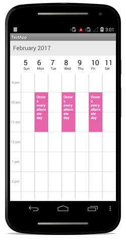

# Recurrence

Recursive appointments can be created by enabling `IsRecursive` property in Schedule appointments, to know more about adding appointments in the control, refer Schedule Appointment.

And then need to set the `RecurrenceRule` to populate the required recursive appointment collection in a specific pattern.

Recursive appointment can be created in any recurrence patterns, for instance, some events can be repeated every week such as “Server maintenance”, where as some on them may repeat every year like wedding anniversary. 

## Recurrence Pattern

* Recurrence pattern used in the control are in `iCal` standard 
* Schedule control supports all four types of recurrence patterns.
   * Daily Recurrence
   * Weekly Recurrence
   * Monthly Recurrence
   * Yearly Recurrence

## RRULE generator

RecurrenceGenerator/ recurrence builder is available with the control to create RRULE. RRULE can be easily created through this engine by simple APIs available.



    ScheduleAppointmentCollection appointmentCollection;
            //..//
            //creating new instance for schedule
            SfSchedule schedule = new SfSchedule(this);
            schedule.ScheduleView = ScheduleView.WeekView;
            appointmentCollection = new ScheduleAppointmentCollection();

            //Recurrence Appointment 1
            //Creating new events
            ScheduleAppointment appointment1 = new ScheduleAppointment();
            Calendar currentDate = Calendar.Instance;
            Calendar startTime = (Calendar)currentDate.Clone();
            Calendar endTime = (Calendar)currentDate.Clone();

            //setting start time for the event
            startTime.Set(
                currentDate.Get(CalendarField.Year),
                currentDate.Get(CalendarField.Month),
                currentDate.Get(CalendarField.DayOfMonth),
                10, 0, 0
            );

            //setting end time for the event
            endTime.Set(
                currentDate.Get(CalendarField.Year),
                currentDate.Get(CalendarField.Month),
                currentDate.Get(CalendarField.DayOfMonth),
                12, 0, 0
            );

            appointment1.StartTime = startTime;
            appointment1.EndTime = endTime;
            appointment1.Color = Color.ParseColor("#FF1BA1E2");

            //setting Subject for the event
            appointment1.Subject = "Client Meeting";
            appointment1.IsRecursive = true;

            //setting recurrence properties
            RecurrenceProperties recurrenceProp1 = new RecurrenceProperties();
            recurrenceProp1.RecurrenceType = RecurrenceType.Daily;
            recurrenceProp1.IsDailyEveryNDays = true;
            recurrenceProp1.DailyNDays = 2;
            recurrenceProp1.IsRangeRecurrenceCount = true;
            recurrenceProp1.IsRangeNoEndDate = false;
            recurrenceProp1.IsRangeEndDate = false;
            recurrenceProp1.RangeRecurrenceCount = 10;
            recurrenceProp1.RecurrenceRule = RecurrenceBuilder.RRuleGenerator(recurrenceProp1, appointment1.StartTime, appointment1.EndTime);
            appointment1.RecurrenceRule = recurrenceProp1.RecurrenceRule;

            //adding appointment to the collection  
            appointmentCollection.Add(appointment1);
            schedule.Appointments = appointmentCollection;

            // Set our view from the "main" layout resource
            SetContentView(schedule);



