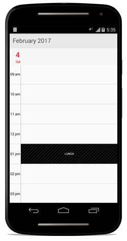
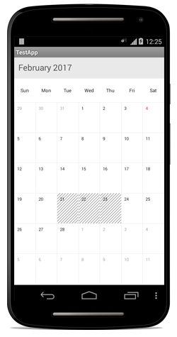

# Restricted Hours And Dates 

You can restrict the timeslots and certain month cells using `NonAccessibleBlocks` and `BlackOutDates` properties in the respective view settings of schedule.

## Non-Accessible blocks

### Day View

You can restrict/allocate certain timeslot as non-accessible block using `NonAccessibleBlocks` of `DayViewSettings`, so that you can allocate those timeslots for predefined events/activities like Lunch hour.



	//creating new instance for schedule
	SfSchedule schedule = new SfSchedule(this);
	
	//setting schedule view
	schedule.ScheduleView = ScheduleView.DayView;

	//setting non-accessing blocks.
	NonAccessibleBlocksCollection nonAccessibleBlocksCollection = new NonAccessibleBlocksCollection();
	NonAccessibleBlock lunchHour = new NonAccessibleBlock();
	lunchHour.StartTime=13;
	lunchHour.EndTime=14;
	lunchHour.Color=Color.Black;
	lunchHour.Text="LUNCH";
	nonAccessibleBlocksCollection.Add(lunchHour);
	dayViewSettings.NonAccessibleBlocks=nonAccessibleBlocksCollection;
	schedule.DayViewSettings=dayViewSettings;

	// Set our view from the "main" layout resource
	SetContentView(schedule);



### Week View

You can restrict/allocate certain timeslot as non-accessible block using `NonAccessibleBlocks` of `WeekViewSettings`, so that you can allocate those timeslots for predefined events/activities like Lunch hour.



	//creating new instance for schedule
	schedule = new SfSchedule(this);

	//setting schedule view
	schedule.ScheduleView = ScheduleView.WeekView;

	//setting non-accessing blocks.
	NonAccessibleBlocksCollection nonAccessibleBlocksCollection = new NonAccessibleBlocksCollection();
	NonAccessibleBlock lunchHour = new NonAccessibleBlock();
	lunchHour.StartTime=13;
	lunchHour.EndTime=14;
	lunchHour.Color=Color.Black;
	lunchHour.Text="LUNCH";
	nonAccessibleBlocksCollection.Add(lunchHour);
	weekViewSettings.NonAccessibleBlocks = nonAccessibleBlocksCollection;

	schedule.WeekViewSettings = weekViewSettings;

	// Set our view from the "main" layout resource
	SetContentView(schedule);



### WorkWeek View

You can restrict/allocate certain timeslot as non-accessible block using `NonAccessibleBlocks` of `WorkWeekViewSettings`, so that you can allocate those timeslots for predefined events/activities like Lunch hour.



	//creating new instance for schedule
	schedule = new SfSchedule(this);

	//setting schedule view
	schedule.ScheduleView = ScheduleView.WorkWeekView;

	//setting non-accessing blocks.
	NonAccessibleBlocksCollection nonAccessibleBlocksCollection = new NonAccessibleBlocksCollection();
	NonAccessibleBlock lunchHour = new NonAccessibleBlock();
	lunchHour.StartTime=13;
	lunchHour.EndTime=14;
	lunchHour.Color=Color.Black;
	lunchHour.Text="LUNCH";
	nonAccessibleBlocksCollection.Add(lunchHour);
	workWeekViewSettings.NonAccessibleBlocks = nonAccessibleBlocksCollection;

	schedule.WorkWeekViewSettings = workWeekViewSettings;

	// Set our view from the "main" layout resource
	SetContentView(schedule);



## Blackout Dates

You can restrict/allocate certain month cell as blackout days using `BlackoutDates` of `MonthViewSettings`, so that we can allocate those cells for predefined events/activities like Scheduled maintenance, planned leave etc.



	//creating new instance for schedule
	schedule = new SfSchedule(this);

	//setting schedule view
	schedule.ScheduleView = ScheduleView.MonthView;

	//setting month view settings properties
	MonthViewSettings monthViewSettings = new MonthViewSettings();

	//setting black out dates
	List<Calendar> blackDatesCollection = new List<Calendar>();
	Calendar currentDate = Calendar.Instance;
	Calendar firstDate = (Calendar)currentDate.Clone();
	firstDate.Set(
	currentDate.Get(CalendarField.Year),
	currentDate.Get(CalendarField.Month),
	21// currentDate.Get(CalendarField.DayOfMonth),
	);
	blackDatesCollection.Add(firstDate);
	Calendar secondDate = (Calendar)currentDate.Clone();
	secondDate.Set(
	currentDate.Get(CalendarField.Year),
	currentDate.Get(CalendarField.Month), 22
	);
	blackDatesCollection.Add(secondDate);
	Calendar thirdDate = (Calendar)currentDate.Clone();
	thirdDate.Set(
	currentDate.Get(CalendarField.Year),
	currentDate.Get(CalendarField.Month),
	23
	);
	blackDatesCollection.Add(thirdDate);
	monthViewSettings.BlackoutDates = blackDatesCollection;

	schedule.MonthViewSettings = monthViewSettings;

	// Set our view from the "main" layout resource
	SetContentView(schedule);



