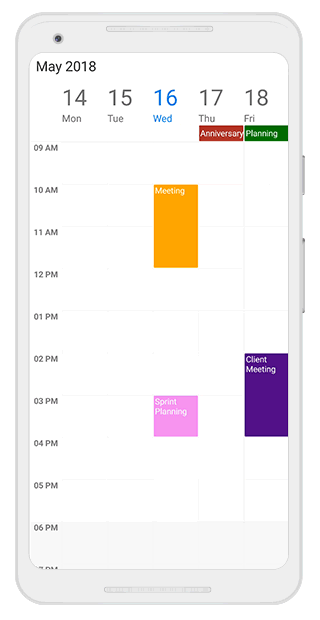
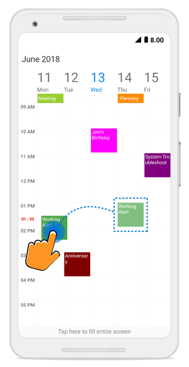

---

layout: post
title: Drag and Drop Appointments in Syncfusion SfSchedule control for Xamarin.Android
description: Learn how to Drag and Drop Appointments in SfSchedule control
platform: xamarin.android
control: SfSchedule
documentation: ug

---

# Appointment Drag and Drop
Appointments can be rescheduled using the drag and drop operation. To perform drag-and-drop operations within the schedule, enable the [AllowAppointmentDrag](https://help.syncfusion.com/cr/xamarin-android/Com.Syncfusion.Schedule.SfSchedule.html#Com_Syncfusion_Schedule_SfSchedule_AllowAppointmentDrag) property of `SfSchedule`.



schedule.AllowAppointmentDrag = true;



## Handle dragging based on the appointment
Using [AppointmentDragStarting](https://help.syncfusion.com/cr/xamarin-android/Com.Syncfusion.Schedule.SfSchedule.html) event, you can get the appointment details and handle whether the appointment can be draggable or not. This event will be triggered when the appointment is started dragging. The [AppointmentDragStartingEventArgs](https://help.syncfusion.com/cr/xamarin-android/Com.Syncfusion.Schedule.AppointmentDragStartingEventArgs.html) argument contains the following properties.

[Appointment](https://help.syncfusion.com/cr/xamarin-android/Com.Syncfusion.Schedule.AppointmentDragStartingEventArgs.html#Com_Syncfusion_Schedule_AppointmentDragStartingEventArgs_Appointment) - Gets the dragged appointment details.
[Cancel](https://msdn.microsoft.com/query/dev14.query?appId=Dev14IDEF1&l=EN-US&k=k(System.ComponentModel.CancelEventArgs.Cancel)&rd=true) - Appointment dragging can be handled (enable/disable) using this boolean property.



schedule.AppointmentDragStarting += Schedule_AppointmentDragStarting;

...

private void Schedule_AppointmentDragStarting(object sender, AppointmentDragStartingEventArgs e)
{
        var appointment = e.Appointment;
        e.Cancel = false;
}



### Disabling dragging when the appointment is AllDay appointment
Using `Cancel` property in the `AppointmentDragStartingEventArgs` argument of Schedule `AppointmentDragStarting` event, you can enable/disable the appointment dragging based on the requirement. In the below code, appointment dragging is disabled when the appointment is AllDay appointment.



schedule.AppointmentDragStarting += Schedule_AppointmentDragStarting;

...

private void Schedule_AppointmentDragStarting(object sender, AppointmentDragStartingEventArgs e)
{
        var appointment = e.Appointment as ScheduleAppointment;

      if (appointment.IsAllDay)
      {
            e.Cancel = true;
      }
}



## Get the dragging appointment position
Using [AppointmentDragOver](https://help.syncfusion.com/cr/xamarin-android/Com.Syncfusion.Schedule.SfSchedule.html) event, you can get the dragging appointment details, position and time of the particular location. The event will be continuously triggered when the appointment is being dragged. The [AppointmentDragEventArgs](https://help.syncfusion.com/cr/xamarin-android/Com.Syncfusion.Schedule.AppointmentDragEventArgs.html) argument contains the following properties.

[Appointment](https://help.syncfusion.com/cr/xamarin-android/Com.Syncfusion.Schedule.AppointmentDragEventArgs.html#Com_Syncfusion_Schedule_AppointmentDragEventArgs_Appointment) - Gets the dragging appointment details.
[DraggingPoint](https://help.syncfusion.com/cr/xamarin-android/Com.Syncfusion.Schedule.AppointmentDragEventArgs.html#Com_Syncfusion_Schedule_AppointmentDragEventArgs_DraggingPoint) - Gets the dragging point (X, Y) of the appointment in Schedule.
[DraggingTime](https://help.syncfusion.com/cr/xamarin-android/Com.Syncfusion.Schedule.AppointmentDragEventArgs.html#Com_Syncfusion_Schedule_AppointmentDragEventArgs_DraggingTime) - Gets the dragging time of the appointment in Schedule



schedule.AppointmentDragOver += Schedule_AppointmentDragOver;

...

private void Schedule_AppointmentDragOver(object sender, AppointmentDragEventArgs e)
{
        var appointment = e.Appointment;
        var draggingPoint = e.DraggingPoint;
        var draggingTime = e.DraggingTime;
}



### Displaying alert while dragging appointment over the blocked time slots
Using `draggingPoint` and `draggingTime` properties in the `AppointmentDragEventArgs` of Schedule `AppointmentDragOver` event you can get the current position and time of dragging appointment. In the below code, Indicating the message while dragging over the Schedule `NonAccessibleBlock`.



schedule.AppointmentDragOver += Schedule_AppointmentDragOver;

...

private void Schedule_AppointmentDragOver(object sender, AppointmentDragEventArgs e)
{
        //// checking whether dragging appointment time within NonAccessibleBlock
        if (schedule.WeekViewSettings.NonAccessibleBlocks[0].StartTime == e.DraggingTime.Get(CalendarField.HourOfDay) || (schedule.WeekViewSettings.NonAccessibleBlocks[0].StartTime - 1 == e.DraggingTime.Get(CalendarField.HourOfDay) && e.DraggingTime.Get(CalendarField.Minute) > 0))
        {
                label.Text = "Cannot be moved to blocked time slots";
        }
}



## Handle appointment dropping
Using [AppointmentDrop](https://help.syncfusion.com/cr/xamarin-android/Com.Syncfusion.Schedule.SfSchedule.html) event you can get the dropping appointment details, position, time and you can handle whether the appointment can be dropped to the specific position or not. This event will trigger after dropping the appointment. The [AppointmentDropEventArgs](https://help.syncfusion.com/cr/xamarin-android/Com.Syncfusion.Schedule.AppointmentDropEventArgs.html) argument contains the following properties.

[Appointment](https://help.syncfusion.com/cr/xamarin-android/Com.Syncfusion.Schedule.AppointmentDropEventArgs.html#Com_Syncfusion_Schedule_AppointmentDropEventArgs_Appointment) - Gets the details of the appointment to be dropped.
[Cancel](https://msdn.microsoft.com/query/dev14.query?appId=Dev14IDEF1&l=EN-US&k=k(System.ComponentModel.CancelEventArgs.Cancel)&rd=true) - Appointment dropping can be handled (enable / disable) using this Boolean property.
[DropTime](https://help.syncfusion.com/cr/xamarin-android/Com.Syncfusion.Schedule.AppointmentDropEventArgs.html#Com_Syncfusion_Schedule_AppointmentDropEventArgs_DropTime) - Gets the dropped time of the appointment in Schedule



schedule.AppointmentDrop += Schedule_AppointmentDrop;

...

private void Schedule_AppointmentDrop(object sender, AppointmentDropEventArgs e)
{
        var appointment = e.Appointment;
        e.Cancel = false;
        var dropTime = e.DropTime;
}



### Disabling dropping when dropping appointment within the Non-Accessible region
Using `Cancel` property in the `AppointmentDropEventArgs` argument of Schedule `AppointmentDrop` event, you can enable/disable the appointment dropping based on the requirement. In the below code, appointment dropping is disabled while dropping in the Non-Accessible block region.



schedule.AppointmentDrop += Schedule_AppointmentDrop;

...

private void Schedule_AppointmentDrop(object sender, AppointmentDropEventArgs e)
{
        //// checking whether dropping appointment time within NonAccessibleBlock
        if (schedule.WeekViewSettings.NonAccessibleBlocks[0].StartTime == e.DropTime.Get(CalendarField.HourOfDay) || (schedule.WeekViewSettings.NonAccessibleBlocks[0].StartTime - 1 == e.DropTime.Get(CalendarField.HourOfDay) && e.DropTime.Get(CalendarField.Minute) > 0))
        {
                e.Cancel = true;
        }
}



## Customizing the Drag and Drop environment
Using [DragDropSettings](https://help.syncfusion.com/cr/xamarin-android/Com.Syncfusion.Schedule.DragDropSettings.html) property of schedule, you can handle the behavior of drag and drop in Schedule.



DragDropSettings dragDropSettings = new DragDropSettings();
dragDropSettings.AllowNavigate = true;
dragDropSettings.AllowScroll = false;
var timeSpan = new TimeSpan(0, 0, 0, 1, 0);
dragDropSettings.AutoNavigationDelay = timeSpan;
dragDropSettings.ShowTimeIndicator = true;
dragDropSettings.TimeIndicatorStyle = timeIndicatorStyle;
schedule.DragDropSettings = dragDropSettings;



### Disabling navigation when dragging appointment
Using [AllowNavigate](https://help.syncfusion.com/cr/xamarin-android/Com.Syncfusion.Schedule.DragDropSettings.html#Com_Syncfusion_Schedule_DragDropSettings_AllowNavigate) boolean property can handle the Appointment dragging, whether navigate to next/previous view or not while dragging the appointment to the endpoint of the current view in Schedule. Default value of the `AllowNavigate` property is true and  Schedule will navigate to next/previous view when dragging the appointment the endpoint of the current view.



dragDropSettings.AllowNavigate = false;



### Handling navigation delay while holding dragged appointment
Using [AutoNavigationDelay](https://help.syncfusion.com/cr/xamarin-android/Com.Syncfusion.Schedule.DragDropSettings.html#Com_Syncfusion_Schedule_DragDropSettings_AutoNavigationDelay)  `TimeSpan` property can handle the navigation time when navigating to next/previous view while holding the dragged appointment.



var timeSpan = new TimeSpan(0, 0, 0, 1, 0);
dragDropSettings.AutoNavigationDelay = timeSpan;



### Disabling scroll when dragging appointment
Using [AllowScroll](https://help.syncfusion.com/cr/xamarin-android/Com.Syncfusion.Schedule.DragDropSettings.html#Com_Syncfusion_Schedule_DragDropSettings_AllowScroll) boolean property can handle the Appointment dragging, whether scroll (below/above) the Schedule or not while dragging the appointment to the endpoint of the current view in Schedule. Default value of the `AllowScroll` property is true.



dragDropSettings.AllowScroll = false;



### Disabling dragging time indicator
[ShowTimeIndicator](https://help.syncfusion.com/cr/xamarin-android/Com.Syncfusion.Schedule.DragDropSettings.html#Com_Syncfusion_Schedule_DragDropSettings_ShowTimeIndicator) - Using this boolean property can handle the time indicator whether it should visible or not, which shows the dragged appointment current position time in time text slots. Default value of the `ShowTimeIndicator` property is true.



dragDropSettings.ShowTimeIndicator = false;



## Customize appearance of dragging Time Indicator
Using [TimeIndicatorStyle](https://help.syncfusion.com/cr/xamarin-android/Com.Syncfusion.Schedule.DragDropSettings.html#Com_Syncfusion_Schedule_DragDropSettings_TimeIndicatorStyle) property can handle the time indicator style which contains [TextColor](https://help.syncfusion.com/cr/xamarin-android/Com.Syncfusion.Schedule.TimeIndicatorStyle.html#Com_Syncfusion_Schedule_TimeIndicatorStyle_TextColor), [TextSize](https://help.syncfusion.com/cr/xamarin-android/Com.Syncfusion.Schedule.TimeIndicatorStyle.html#Com_Syncfusion_Schedule_TimeIndicatorStyle_TextSize) and [TextFormat](https://help.syncfusion.com/cr/xamarin-android/Com.Syncfusion.Schedule.TimeIndicatorStyle.html#Com_Syncfusion_Schedule_TimeIndicatorStyle_TextFormat).



TimeIndicatorStyle timeIndicatorStyle = new TimeIndicatorStyle();
timeIndicatorStyle.TextColor = Color.Red;
timeIndicatorStyle.TextSize = 15;
timeIndicatorStyle.TextFormat = "hh : mm";
dragDropSettings.TimeIndicatorStyle = timeIndicatorStyle;
schedule.DragDropSettings = dragDropSettings;



>**Notes**
* While dropping appointment to `AllDay` panel from time slots, appointment start and end time will change to 12.00 AM.
* While dropping appointment to time slots from `AllDay` panel, appointment duration will change as one (1) hour from the dropped time.
* Doesn't support control to control drag and drop.
