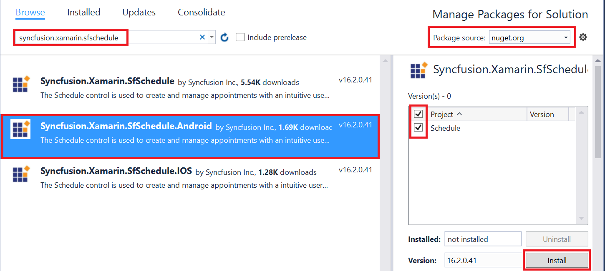

--- 
layout: post 
title: Getting started with Syncfusion Essential Schedule for Xamarin.Android 
description: A quick tour to initial users on Syncfusion SfSchedule control for Xamarin.Android platform 
platform: Xamarin.Android 
control: SfSchedule 
documentation: ug 
--- 
 
# Getting Started 
 
This section provides you an overview for working with SfSchedule for Xamarin.Android and also provides a walk through to configure SfSchedule control in real time scenario. 
 
## Assembly Configuration 

You can download our Xamarin components directly from our website, refer [here](https://help.syncfusion.com/xamarin-android/introduction/download-and-installation) for assistance.
 
Once the assemblies has been downloaded and explored as mentioned above,you can find all the required assemblies in the installation folders. 
 
{Syncfusion Essential Studio Installed location}\Essential Studio\syncfusionessentialstudio-releaseversion\Xamarin\lib 
 
Eg: C:\Program Files (x86)\Syncfusion\Essential Studio\15.1.0.41\Xamarin\lib 
 
>**NOTE**
Assemblies can be found in unzipped package location in Mac
 
## Adding SfSchedule Reference
Syncfusion Xamarin components are available in [nuget.org](https://www.nuget.org/). To add SfSchedule to your project, open the NuGet package manager in Visual Studio, and search for Syncfusion.Xamarin.SfSchedule, and then install it.  

To know more about obtaining our components, refer this [link](https://help.syncfusion.com/xamarin-android/introduction/download-and-installation). Also, if you prefer to manually refer the assemblies instead of NuGet,refer the assembly mentioned in the table below.
 
<table> 
<tr> 
<th>Project</th> 
<th>Required assembly</th> 
</tr> 
<tr> 
<td>Xamarin.Android</td> 
<td>android\Syncfusion.SfSchedule.Android.dll </td> 
</tr> 
</table> 

>**Important**
Starting with v16.2.0.x, if you reference Syncfusion assemblies from trial setup or from the NuGet feed, you also have to include a license key in your projects. Please refer to this [link](https://help.syncfusion.com/common/essential-studio/licensing/license-key) to know about registering Syncfusion license key in your Xamarin application to use our components.
 
## Create a simple application with SfSchedule 
 
This section explains how to create a simple application using SfSchedule control. SfSchedule control can be configured entirely in C# code. This is how the final output will look like on Android devices.
 
 

You can download the entire source code of this demo for Xamarin.Android from   
here [ScheduleGettingStarted](http://www.syncfusion.com/downloads/support/directtrac/general/ze/ScheduleGettingStarted1888257278.zip). 
 
This section provides a walks through to create `MeetingRoomScheduler` using our Schedule control.
 
* [Creating a new project](#creating-a-new-project) 
* [Adding SfSchedule to the project](#adding-sfschedule-to-the-project)      
* [Changing Schedule Views](#changing-schedule-views)   
* [Binding data to SfSchedule control](#binding-data-to-sfschedule-control) 

## Creating a new project 
 
Create a new Android application in Xamarin Studio or Visual Studio for Xamarin.Android. 
 
Add the required assembly references to the project as discussed in the [Assembly Configuration](#assembly-configuration) section. 
 
Import SfSchedule control namespace `Syncfusion.SfSchedule.Android`. 
 
## Adding SfSchedule to the project 
 
Create an instance of SfSchedule control and add as a child to the view hosted in the Activity. 



using Syncfusion.SfSchedule.Android;

SfSchedule schedule;
protected override void OnCreate(Bundle bundle)
{
    base.OnCreate(bundle);
    //Creating new instance for SfSchedule
    schedule = new SfSchedule(this);
    SetContentView(schedule);
}


 
## Changing Schedule Views 
 
SfSchedule control provides five different types of views to display dates and it can be assigned to the control by using [ScheduleView](https://help.syncfusion.com/cr/xamarin-android/Com.Syncfusion.Schedule.SfSchedule.html#Com_Syncfusion_Schedule_SfSchedule_ScheduleView) property. By default the control is assigned with `DayView`.Current date will be displayed initially for all the Schedule views.
 
Schedule control will be rendered with `Sunday` as the first day of the week, but you can customize to any day by using [FirstDayOfWeek](https://help.syncfusion.com/cr/xamarin-android/Com.Syncfusion.Schedule.SfSchedule.html#Com_Syncfusion_Schedule_SfSchedule_FirstDayOfWeek) property of `SfSchedule`. 



//setting first day of the week
schedule.FirstDayOfWeek = Calendar.Tuesday;


 
 

### Day View 
 
`DayView` is used to display a single day, current day will be visible by default. Appointments on a specific day will be arranged in respective timeslots based on its duration. 



//setting schedule view
schedule.ScheduleView = ScheduleView.DayView;


 
 

### Week View 
 
`WeekView` is to view all days of a particular week. Appointments will be arranged based on the dates on the week in respective timeslots. 



//setting schedule view
schedule.ScheduleView = ScheduleView.WeekView;


 
 

### Work Week View 
 
`WorkWeekView` is to view only working days of a particular week. By default, Saturday and Sunday are the non-working days. You can be customize it with any days of a Week. Appointments arranged in timeslots based on its duration with respective day of the week. 



//setting schedule view
schedule.ScheduleView = ScheduleView.WorkWeekView;


 
 

>**NOTE**
Appointments in non-working days will not be displayed.

### Timeline view   
 
`TimelineView` displays the dates in horizontal time axis with the desired day's count. You can see the past or future dates by scrolling to the right or left. Each view displays events accurately across the time slots with an intuitive drag-and-drop feature.  
    
     

schedule.ScheduleView = ScheduleView.Timeline;
   
   
    

### Month View 
 
`MonthView` in Schedule control is to view entire dates of a particular month. Appointments can be viewed in inline by setting [ShowAppointmentsInline](https://help.syncfusion.com/cr/xamarin-android/Com.Syncfusion.Schedule.MonthViewSettings.html#Com_Syncfusion_Schedule_MonthViewSettings_ShowAppointmentsInline) property of [MonthViewSettings](https://help.syncfusion.com/cr/xamarin-android/Com.Syncfusion.Schedule.SfSchedule.html#Com_Syncfusion_Schedule_SfSchedule_MonthViewSettings) of `SfSchedule` as true. 



//setting schedule view
schedule.ScheduleView = ScheduleView.MonthView;
schedule.MonthViewSettings.ShowAppointmentsInline = true;


 
 

## Binding data to SfSchedule control  
 
You can add events to the schedule by creating collection of [ScheduleAppointment](https://help.syncfusion.com/cr/xamarin-android/Com.Syncfusion.Schedule.ScheduleAppointment.html) using [ScheduleAppointmentCollection](https://help.syncfusion.com/cr/xamarin-android/Com.Syncfusion.Schedule.ScheduleAppointmentCollection.html).  
 
### Adding Appointments  
 
`ScheduleAppointment` is a class, which holds the details about the appointment to be rendered in schedule. It has some basic properties such as [StartTime](https://help.syncfusion.com/cr/xamarin-android/Com.Syncfusion.Schedule.ScheduleAppointment.html#Com_Syncfusion_Schedule_ScheduleAppointment_StartTime), [EndTime](https://help.syncfusion.com/cr/xamarin-android/Com.Syncfusion.Schedule.ScheduleAppointment.html#Com_Syncfusion_Schedule_ScheduleAppointment_EndTime), [Subject](https://help.syncfusion.com/cr/xamarin-android/Com.Syncfusion.Schedule.ScheduleAppointment.html#Com_Syncfusion_Schedule_ScheduleAppointment_Subject) and some additional information about the appointment can be added using [Color](https://help.syncfusion.com/cr/xamarin-android/Com.Syncfusion.Schedule.ScheduleAppointment.html#Com_Syncfusion_Schedule_ScheduleAppointment_Color), [Notes](https://help.syncfusion.com/cr/xamarin-android/Com.Syncfusion.Schedule.ScheduleAppointment.html#Com_Syncfusion_Schedule_ScheduleAppointment_Notes), [Location](https://help.syncfusion.com/cr/xamarin-android/Com.Syncfusion.Schedule.ScheduleAppointment.html#Com_Syncfusion_Schedule_ScheduleAppointment_Location), [IsAllDay](https://help.syncfusion.com/cr/xamarin-android/Com.Syncfusion.Schedule.ScheduleAppointment.html#Com_Syncfusion_Schedule_ScheduleAppointment_IsAllDay), [IsRecursive](https://help.syncfusion.com/cr/xamarin-android/Com.Syncfusion.Schedule.ScheduleAppointment.html#Com_Syncfusion_Schedule_ScheduleAppointment_IsRecursive) properties. 

Here are steps to render `MeetingRoomScheduler` using SfSchedule control.

* [Adding data for class](#adding-data-for-class)
* [Populating data collection](#populating-data-collection) 
* [Setting appointments for SfSchedule](#setting-appointments-for-sfschedule) 

#### Adding data for class

##### Adding event names

You can add `Subject` to the appointments created by creating a collection for the same. 



List<string> subjectCollection;

/// 

/// Creates subject collection.
/// 

private void CreateSubjectCollection()
{
    subjectCollection = new List<string>();
    subjectCollection.Add("GoToMeeting");
    subjectCollection.Add("Business Meeting");
    subjectCollection.Add("Conference");
    subjectCollection.Add("Project Status Discussion");
    subjectCollection.Add("Auditing");
    subjectCollection.Add("Client Meeting");
    subjectCollection.Add("Generate Report");
    subjectCollection.Add("Target Meeting");
    subjectCollection.Add("General Meeting");
    subjectCollection.Add("Pay House Rent");
    subjectCollection.Add("Car Service");
    subjectCollection.Add("Medical Check Up");
    subjectCollection.Add("Wedding Anniversary");
    subjectCollection.Add("Sam's Birthday");
    subjectCollection.Add("Jenny's Birthday");
}



##### Adding color collection 

You can add `Color` to the appointments created by creating a collection for the same. 



List<string> colorCollection;

/// 

/// Creates color collection.
/// 

private void CreateColorCollection()
{
    colorCollection = new List<string>();
    colorCollection.Add("#117EB4");
    colorCollection.Add("#B4112E");
    colorCollection.Add("#C44343");
    colorCollection.Add("#11B45E");
    colorCollection.Add("#43BEC4");
    colorCollection.Add("#B4112E");
    colorCollection.Add("#C44343");
    colorCollection.Add("#117EB4");
    colorCollection.Add("#C4435A");
    colorCollection.Add("#DF5348");
    colorCollection.Add("#43c484");
    colorCollection.Add("#11B49B");
    colorCollection.Add("#C44378");
    colorCollection.Add("#DF8D48");
    colorCollection.Add("#11B45E");
    colorCollection.Add("#43BEC4");
}



#### Populating data collection

Schedule control has a built-in capability to handle the appointment arrangement internally based on the ScheduleAppointment collections.



ScheduleAppointmentCollection Meetings;
int workStartHour = 9;

/// 

/// Creates meetings and stores in a collection.
/// 

private void CreateAppointments()
{
    Meetings = new ScheduleAppointmentCollection();
    Java.Util.Random randomTime = new Java.Util.Random();
    CreateSubjectCollection();
    CreateColorCollection();
    Calendar calendar = Calendar.Instance;
    Calendar DateFrom = Calendar.Instance;
    DateFrom.Add(CalendarField.Date, -10);
    Calendar DateTo = Calendar.Instance;
    DateTo.Add(CalendarField.Date, 10);
    Calendar dateRangeStart = Calendar.Instance;
    dateRangeStart.Add(CalendarField.Date, -3);
    Calendar dateRangeEnd = Calendar.Instance;
    dateRangeEnd.Add(CalendarField.Date, 3);
    for (calendar = DateFrom; calendar.Before(DateTo); calendar.Add(CalendarField.Date, 1))
    {
        if (calendar.After(dateRangeStart) && calendar.Before(dateRangeEnd))
        {
            for (int AdditionalAppointmentIndex = 0; AdditionalAppointmentIndex < 3; AdditionalAppointmentIndex++)
            {
                ScheduleAppointment meeting = new ScheduleAppointment();
                int hour = workStartHour + randomTime.NextInt(9);
                Calendar startTimeCalendar = Calendar.Instance;
                startTimeCalendar.Set(calendar.Get(CalendarField.Year),
                                      calendar.Get(CalendarField.Month),
                                      calendar.Get(CalendarField.Date),
                                      hour, 0);
                meeting.StartTime = startTimeCalendar;
                Calendar endTimeCalendar = Calendar.Instance;
                endTimeCalendar.Set(calendar.Get(CalendarField.Year),
                                    calendar.Get(CalendarField.Month),
                                    calendar.Get(CalendarField.Date),
                                    hour + 1, 0);
                meeting.EndTime = endTimeCalendar;
                meeting.Color = Color.ParseColor(colorCollection[randomTime.NextInt(9)]);
                meeting.Subject = subjectCollection[randomTime.NextInt(9)];
                Meetings.Add(meeting);
            }
        }
        else
        {
            ScheduleAppointment meeting = new ScheduleAppointment();
            int hour = workStartHour + randomTime.NextInt(9);
            Calendar startTimeCalendar = Calendar.Instance;
            startTimeCalendar.Set(calendar.Get(CalendarField.Year),
                                  calendar.Get(CalendarField.Month),
                                  calendar.Get(CalendarField.Date),
                                  hour, 0);
            meeting.StartTime = startTimeCalendar;
            Calendar endTimeCalendar = Calendar.Instance;
            endTimeCalendar.Set(calendar.Get(CalendarField.Year),
                                calendar.Get(CalendarField.Month),
                                calendar.Get(CalendarField.Date),
                                hour + 1, 0);
            meeting.EndTime = endTimeCalendar;
            meeting.Color = Color.ParseColor(colorCollection[randomTime.NextInt(9)]);
            meeting.Subject = subjectCollection[randomTime.NextInt(9)];
            Meetings.Add(meeting);
        }
    }
}


 
#### Setting appointments for SfSchedule 

Create meetings of type `ScheduleAppointmentCollection` and assign those appointments collection `Meetings` to the [ItemsSource](https://help.syncfusion.com/cr/xamarin-android/Com.Syncfusion.Schedule.SfSchedule.html#Com_Syncfusion_Schedule_SfSchedule_ItemsSource) property.



CreateAppointments();
schedule.ItemsSource = Meetings;



 
