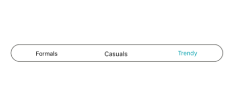

# Notify the selection changes in SfSegmentedControl in Xamarin.Android

The segmented control handles the Selection changed when there is a change from one segment item to another. It can be handled by two ways.

## User interface

When users navigate from one item to another, selection is changed, so that the [`SelectedIndex`](https://help.syncfusion.com/cr/xamarin-android/Syncfusion.Android.Buttons.SfSegmentedControl.html#Syncfusion_Android_Buttons_SfSegmentedControl_SelectedIndex) value is updated to the new index of the item. The segmented control provides the [`SelectionChanged`](https://help.syncfusion.com/cr/xamarin-android/Syncfusion.Android.Buttons.SfSegmentedControl.html) event, which is triggered when the selection is changed with the [`SelectionChangedEventArgs`](https://help.syncfusion.com/cr/xamarin-android/Syncfusion.Android.Buttons.SelectionChangedEventArgs.html).

[`Index`](https://help.syncfusion.com/cr/xamarin-android/Syncfusion.Android.Buttons.SelectionChangedEventArgs.html#Syncfusion_Android_Buttons_SelectionChangedEventArgs_Index) - Gets the current index value of the selected item.



segmentedControl.SelectionChanged += (object sender, SelectionChangedEventArgs e) => 
{
    var selectedIndex = e.Index;
};



## Selected Index through programmatically.

You can set the default value programmatically for the selection to be placed. The selection gets updated based on the index value given for the [`SelectedIndex`](https://help.syncfusion.com/cr/xamarin-android/Syncfusion.Android.Buttons.SfSegmentedControl.html#Syncfusion_Android_Buttons_SfSegmentedControl_SelectedIndex). 



segmentedControl.SelectedIndex = 2;



