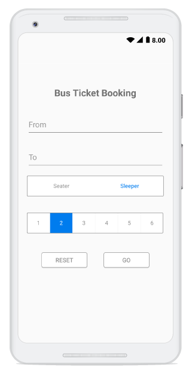
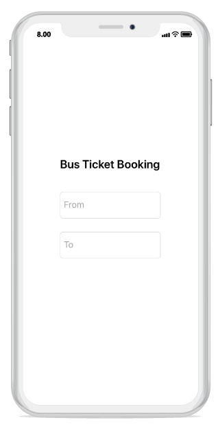
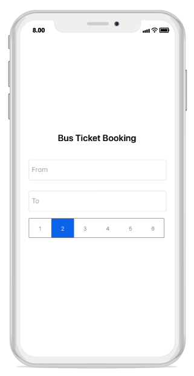
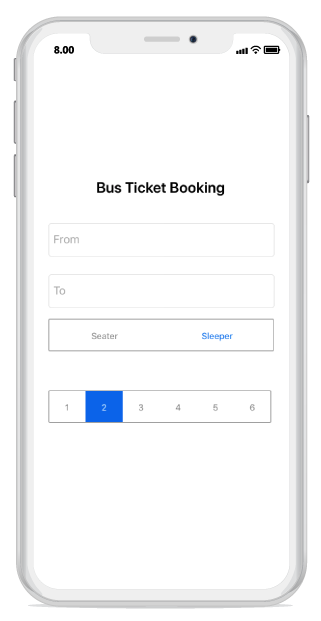

# Getting Started Xamarin.Android SegmentedControl (SfSegmentedControl)

This section provides a quick overview for working with the segmented control for Xamarin.Android. Walk through the entire process of creating a real-world application with segmented control.

## Assembly deployment

After installing Essential Studio for Xamarin, find all the required assemblies in the installation folders,   
{Syncfusion Essential Studio Installed location}\Essential Studio\16.2.0.41\Xamarin\lib
Eg: C:\Program Files (x86)\Syncfusion\Essential Studio\16.2.0.41\Xamarin\lib

N> Assemblies can be found in unzipped package location in Mac.

## Adding SfSegmentedControl Reference

Syncfusion Xamarin components are available in [nuget.org](https://www.nuget.org/). To add SfSegmentedControl to your project, open the NuGet package manager in Visual Studio, and search for [Syncfusion.Xamarin.Buttons.Android](https://www.nuget.org/packages/Syncfusion.Xamarin.Buttons.Android/#), and then install it.

To know more about obtaining our components, refer to this [link](https://help.syncfusion.com/xamarin-android/introduction/download-and-installation). Also, if you prefer to manually refer the assemblies instead of NuGet, please refer the below assembly.

android\Syncfusion.Buttons.Android.dll

### Create a simple segmented control

This section explains how to create a segmented control and configure it.The segmented control can be configured entirely in C# code. This is how the final output will look like in Android devices.

## Creating the project

Create a new Android application in Visual Studio for Xamarin.Android.

## Adding SfSegmentedControl in Xamarin.Android

1. Add the required assembly reference to the project as discussed in the [Assembly deployment](#assembly-deployment) section.

2. Import the control namespace as



[C#]

using Syncfusion.Android.Buttons;



3. Create an instance of the segmented control and add it as a child to the view hosted in the activity.



[C#]

...
protected override void OnCreate(Bundle savedInstanceState)
{
    base.OnCreate(savedInstanceState);

    SfSegmentedControl segmentedControl = new SfSegmentedControl(this);
    SetContentView(segmentedControl);
}
...
		


### Adding supportive views to the application.
 
For the completeness of the ticket booking application, few framework controls are added to the application, to get the data from the user.

Initial view for the application can be created by the following code snippet.



[C#]

...
public class MainActivity : Activity
{
    protected override void OnCreate(Bundle savedInstanceState)
    {
        base.OnCreate(savedInstanceState);

        LinearLayout mainLayout = new LinearLayout(this);
        mainLayout.Orientation = Orientation.Vertical;
        mainLayout.LayoutParameters = new ViewGroup.LayoutParams(ViewGroup.LayoutParams.MatchParent, ViewGroup.LayoutParams.MatchParent);
        mainLayout.SetBackgroundColor(Color.WhiteSmoke);
        mainLayout.SetPadding(50,50,50,50);

        //Adding text view as the header part of the application.
        TextView headerLabel = new TextView(this);
        headerLabel.LayoutParameters = new ViewGroup.LayoutParams(ViewGroup.LayoutParams.MatchParent, 100);
        headerLabel.Text = "Bus Ticket Booking";
        headerLabel.SetTextColor(Color.Black);
        headerLabel.TextSize =25;
        headerLabel.TextAlignment = TextAlignment.Center;
        headerLabel.TextAlignment = TextAlignment.Gravity;

        //Adding the editor to enter the origin location.
        EditText fromEditor = new EditText(this);
        fromEditor.LayoutParameters = new ViewGroup.LayoutParams(ViewGroup.LayoutParams.MatchParent 170);
        fromEditor.Hint = "From";
        fromEditor.SetTextColor(Color.Black);
        fromEditor.SetHintTextColor(Color.Gray);

        //Adding editor to enter the destination location.
        EditText toEditor = new EditText(this);
        toEditor.LayoutParameters = new ViewGroup.LayoutParams(ViewGroup.LayoutParams.MatchParent,250);
        toEditor.Hint = "To";
        toEditor.SetTextColor(Color.Black);
        toEditor.SetHintTextColor(Color.Gray);

        mainLayout.AddView(headerLabel);
        mainLayout.AddView(fromEditor);
        mainLayout.AddView(toEditor);

        SetContentView(mainLayout);
    }
}

..


## Adding data/items to SfSegmentedControl

We can add the data inside the segmented control in 3 different ways. 

1. Populating string of data
2. SfSegmentItem
3. Custom view

Items inside the segmented control can be added through the [`ItemsSource`](https://help.syncfusion.com/cr/xamarin-android/Syncfusion.Android.Buttons.SfSegmentedControl.html#Syncfusion_Android_Buttons_SfSegmentedControl_ItemsSource) property of [`SfSegmentedControl`](https://help.syncfusion.com/cr/xamarin-android/Syncfusion.Android.Buttons.SfSegmentedControl.html), which holds the collection/list of items.

## Adding data as a String

With the help of  `System.Collections.Generic` we can add string data as [`ItemsSource`](https://help.syncfusion.com/cr/xamarin-android/Syncfusion.Android.Buttons.SfSegmentedControl.html#Syncfusion_Android_Buttons_SfSegmentedControl_ItemsSource) to SfSegmentedControl.



[C#]

...

protected override void OnCreate(Bundle savedInstanceState)
{
    base.OnCreate(savedInstanceState);

    LinearLayout mainLayout = new LinearLayout(this);
    mainLayout.Orientation = Orientation.Vertical;
    mainLayout.LayoutParameters = new ViewGroup.LayoutParams(ViewGroup.LayoutParams.MatchParent, ViewGroup.LayoutParams.MatchParent);
    mainLayout.SetBackgroundColor(Color.WhiteSmoke);
    mainLayout.SetPadding(50,50,50,50);
    
    //Adding text view as the header part of the application.
    TextView headerLabel = new TextView(this);
    headerLabel.LayoutParameters = new ViewGroup.LayoutParams(ViewGroup.LayoutParams.MatchParent, 100);
    headerLabel.Text = "Bus Ticket Booking";
    headerLabel.SetTextColor(Color.Black);
    headerLabel.TextSize =25;
    headerLabel.TextAlignment = TextAlignment.Center;
    headerLabel.TextAlignment = TextAlignment.Gravity;

    //Adding the editor to enter the origin location.
    EditText fromEditor = new EditText(this);
    fromEditor.LayoutParameters = new ViewGroup.LayoutParams(ViewGroup.LayoutParams.MatchParent 170);
    fromEditor.Hint = "From";
    fromEditor.SetTextColor(Color.Black);
    fromEditor.SetHintTextColor(Color.Gray);

    //Adding editor to enter the destination location.
    EditText toEditor = new EditText(this);
    toEditor.LayoutParameters = new ViewGroup.LayoutParams(ViewGroup.LayoutParams.MatchParent,250);
    toEditor.Hint = "To";
    toEditor.SetTextColor(Color.Black);
    toEditor.SetHintTextColor(Color.Gray);

    //segmented control to add item as string data.
    SfSegmentedControl segmentedControl = new SfSegmentedControl(this)
    {
        LayoutParameters = new ViewGroup.LayoutParams(ViewGroup.LayoutParams.MatchParent, 200),
        SelectionTextColor = Color.White,
        BackColor = Color.Transparent,
        SegmentHeight = 50,
        BorderColor = Color.ParseColor("#929292"),
        FontColor = Color.ParseColor("#929292"),
        SegmentBackgroundColor = Color.Transparent,
        VisibleSegmentsCount = 6,
        DisplayMode = SegmentDisplayMode.Text,
        ItemsSource = new List<string>
        {
            "1","2","3","4","5","6"
        }
    };

    mainLayout.AddView(headerLabel);
    mainLayout.AddView(fromEditor);
    mainLayout.AddView(toEditor);
    mainLayout.AddView(segmentedControl);

    SetContentView(mainLayout);
}

...



## Adding data as a SfSegmentItem

By using [`SfSegmentItem`](https://help.syncfusion.com/cr/xamarin-android/Syncfusion.Android.Buttons.SfSegmentItem.html) class, we can add data inside the segmented control.



[C#]

...
SfSegmentedControl segment = new SfSegmentedControl(this)
{
    SelectionTextColor = Color.White,
    LayoutParameters = new ViewGroup.LayoutParams(ViewGroup.LayoutParams.MatchParent, 200),
    BorderColor = Color.ParseColor("#007CEE"),
    FontColor = Color.Black,
    SelectedIndex = 2,
    FontSize = 15,
    SegmentHeight = 50,
    SegmentBackgroundColor = Color.Transparent,
    VisibleSegmentsCount = 5,
    DisplayMode = SegmentDisplayMode.Text,
    ItemsSource = new ObservableCollection<SfSegmentItem>
    {
        new SfSegmentItem(){Text="Sleepers"},
        new SfSegmentItem(){Text="Seaters"},
    },

    SelectionIndicatorSettings = new SelectionIndicatorSettings()
    {
        Color = Color.Transparent
    }

};
...



## Adding data as Custom View.

We can add any custom view to the segmented control



[C#]

...

Button resetButtonView = new Button(this) { Text = "Reset", TextAlignment = TextAlignment.Center };
resetButtonView.SetHeight(50);
resetButtonView.SetBackgroundColor(Color.White);
resetButtonView.SetTextColor(Color.Gray);

Button goButtonView = new Button(this) { Text = "Go", TextAlignment = TextAlignment.Center };
goButtonView.SetHeight(50);
goButtonView.SetTextColor(Color.Gray);
goButtonView.SetBackgroundColor(Color.White);

...

//segmented control to add item as View.
SfSegmentedControl segmentView = new SfSegmentedControl(this)
{
    LayoutParameters = new ViewGroup.LayoutParams(ViewGroup.LayoutParams.MatchParent, 200),
    BorderColor = Color.Transparent,
    SegmentHeight = 50,
    VisibleSegmentsCount = 2,
    SegmentPadding = 30,
    ItemsSource = new ObservableCollection<View>
    {
        resetButtonView,
        goButtonView
    },

};

...



## Customizing segmented control appearance

### Share space equally to all the items.

To share the Item space equally to segmented control, set the number of segment item that has to be visible on the available screen width and that can be distributed in the available space though the [`VisibleSegmentsCount`](https://help.syncfusion.com/cr/xamarin-android/Syncfusion.Android.Buttons.SfSegmentedControl.html#Syncfusion_Android_Buttons_SfSegmentedControl_VisibleSegmentsCount) property of [`SfSegmentedControl`](https://help.syncfusion.com/cr/xamarin-android/Syncfusion.Android.Buttons.SfSegmentedControl.html).



[C#]

segmentedControl.VisibleSegmentsCount = 5;



### Display Mode

We can change the appearance of the segmented control by using the [`DisplayMode`](https://help.syncfusion.com/cr/xamarin-android/Syncfusion.Android.Buttons.SfSegmentedControl.html#Syncfusion_Android_Buttons_SfSegmentedControl_DisplayMode) property of [`SfSegmentedControl`](https://help.syncfusion.com/cr/xamarin-android/Syncfusion.Android.Buttons.SfSegmentedControl.html). We can set the [`DisplayMode`](https://help.syncfusion.com/cr/xamarin-android/Syncfusion.Android.Buttons.SfSegmentedControl.html#Syncfusion_Android_Buttons_SfSegmentedControl_DisplayMode) to either Image or Text or ImageWithText.



[C#]

segmentedControl.DisplayMode = SegmentDisplayMode.Text;



## Customizing selection indicator appearance

The Selection indicator can be used to indicate the selected index of the segmented control. It can be customized with the built-in APIs that are available in the [`SelectionIndicatorSettings`](https://help.syncfusion.com/cr/xamarin-android/Syncfusion.Android.Buttons.SfSegmentedControl.html#Syncfusion_Android_Buttons_SfSegmentedControl_SelectionIndicatorSettings) property of SfSegmentedControl.

To know more about customizing selection indicator refer [feature link](https://help.syncfusion.com/xamarin-android/sfsegmentedcontrol/indicating-the-selected-item)

N> For custom view user need to handle click event manually for the view which have been used.
eg. For Button we have to use its "Click" event.

The below given code can be included on the Custom view to get the click event output.



[C#]

...
AlertDialog.Builder resultsDialog =  new AlertDialog.Builder(this);
resultsDialog.SetTitle("Status");
..

Button resetButtonView = new Button(this){ Text = "Reset" };
Button goButtonView = new Button(this){ Text = "Go" };

resetButtonView.Click += (object sender, EventArgs e) =>
{
    resultsDialog.SetMessage("Fields has been reset.");
    resultsDialog.Create().Show();
    resultsDialog.SetCancelable(true);
};

goButtonView.Click += (object sender, EventArgs e) =>
{
    resultsDialog.SetMessage("Your ticket has been booked.");
    resultsDialog.Create().Show();
    resultsDialog.SetCancelable(true);
};

segmentView.ItemsSource = new ObservableCollection<View>
{
    resetButtonView,
    goButtonView
};

...


Note: Getting started sample can be downloaded from [this link](https://github.com/SyncfusionExamples/Getting-Started-Sample-SegmentedControl-Xamarin-Androidd)
