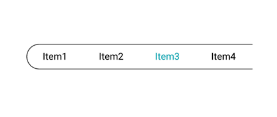

# Handling multiple segments in Xamarin.Android SfSegmentedControl

The segmented control handles the segmented items with the space distributed for the items on two ways.

## Visible segment counts

The segmented control displays the item for the view based on the count which is given for [`VisibleSegmentCount`](https://help.syncfusion.com/cr/xamarin-android/Syncfusion.Android.Buttons.SfSegmentedControl.html#Syncfusion_Android_Buttons_SfSegmentedControl_VisibleSegmentsCount). 



[C#]

segmentedControl.VisibleSegmentsCount = 4;
....
segmentedControl.ItemsSource = = new ObservableCollection<SfSegmentItem>
{
  new SfSegmentItem(){Text = "Item1"},          
  new SfSegmentItem(){Text = "Item2"},     
  new SfSegmentItem(){Text = "Item3"},  
  new SfSegmentItem(){Text = "Item4"},          
  new SfSegmentItem(){Text = "Item5"},     
  new SfSegmentItem(){Text = "Item6"},  
  new SfSegmentItem(){Text = "Item7"},          
};
   


## Scrolling

When the available space in the segmented control is not equally distributed, the items beyond the edges of the control can be viewed by scrolling the panel.

