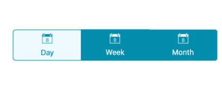
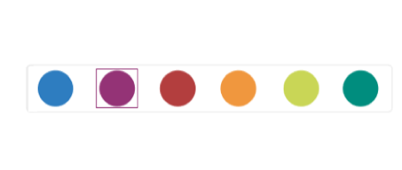

# Indicating the selected item

The segmented control indicates the selected item by differentiating it with the text color of the item or by using selection strip.

## Selection text color

The user can change the text color of the Selected item to desired color.The selected item text color can be customized by the [`SelectionTextColor`](https://help.syncfusion.com/cr/xamarin-android/Syncfusion.Android.Buttons.SfSegmentedControl.html#Syncfusion_Android_Buttons_SfSegmentedControl_SelectionTextColor) property.



[C#]

segmentedControl.SelectionTextColor = Color.ParseColor("#02A0AE");



## Selection Strip

A selection strip is used to indicate the selected item in the segmented control. The selection strip can be customized in many forms.

#### Position

The position of the selection indicator can be customized by the user in different ways.

##### Top

The selection strip can be displayed as a line with customizable color and thickness. It can be positioned at the top of an item.



[C#]

segmentedControl.SelectionIndicatorSettings = new SelectionIndicatorSettings()
{
    Position = Position.Top
};



##### Bottom

As like Top placement selection strip can be customized by its color and thickness which can be positioned at the bottom of an item.



[C#]

segmentedControl.SelectionIndicatorSettings = new SelectionIndicatorSettings()
{
    Position = Position.Bottom
};



##### Fill

The selection strip can be placed over a segment item to indicate it is selected. You can customize its color to highlight the item.



[C#]

segmentedControl.SelectionIndicatorSettings = new SelectionIndicatorSettings()
{
    Position = Position.Fill
};



##### Border

The selection strip can be set as a border to highlight the selected item.



[C#]

segmentedControl.SelectionIndicatorSettings = new SelectionIndicatorSettings()
{
    Position = Position.Border
};



#### Color

The background color of the selection strip can be customized using [`Color`](https://help.syncfusion.com/cr/xamarin-android/Syncfusion.Android.Buttons.SfSegmentItem.html#Syncfusion_Android_Buttons_SfSegmentItem_SelectionBackgroundColor) property which is inside SelectionIndicatorSettings class.



[C#]

segmentedControl.SelectionIndicatorSettings = new SelectionIndicatorSettings()
{
    Color = Color.ParseColor("#2C7BBC")
};



#### Thickness

The border thickness of the selection strip can be customized using [`Thickness`](https://help.syncfusion.com/cr/xamarin-android/Syncfusion.Android.Buttons.SfSegmentedControl.html#Syncfusion_Android_Buttons_SfSegmentedControl_SegmentBorderThickness) property which is inside SelectionIndicatorSettings class



[C#]

segmentedControl.SelectionIndicatorSettings = new SelectionIndicatorSettings()
{
    StrokeThickness = 10
};


