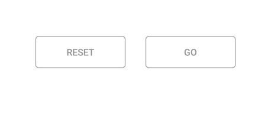

# Populating data source

The segmented control can be populated from a collection of strings, views, or a collection of objects in a built-in class.

## String collection

The segmented control provides the collection of strings as a data source.



[C#]

...

SfSegmentedControl segmentedControl = new SfSegmentedControl(this)
{
    SelectionTextColor = Color.ParseColor("#02A0AE"),
    LayoutParameters = new ViewGroup.LayoutParams(ViewGroup.LayoutParams.MatchParent, 300),
    BackColor = Color.Transparent,
    BorderColor = Color.ParseColor("#3F3F3F"),
    FontColor = Color.Black,
    SelectedIndex = 2,
    FontSize = 15,
    SegmentPadding = 25,
    SegmentBackgroundColor = Color.Transparent,
    VisibleSegmentsCount = 3,
    DisplayMode = SegmentDisplayMode.Text,
    ItemsSource = new List<String>
    {
        "Formals","Casuals","Trendy"
    },
    CornerRadius = 25,
    SelectionIndicatorSettings = new SelectionIndicatorSettings()
    {
        Color = Color.Transparent,
        Position = SelectionIndicatorPosition.Border
    }

};

...



## Segment items

The segmented control customize the text or icons, or use other built-in customization options available for the segments. Segment item collections can also be used.



[C#]

...
SfSegmentedControl segmentedControl = new SfSegmentedControl(this)
{
    SelectionTextColor = Color.White,
    LayoutParameters = new ViewGroup.LayoutParams(ViewGroup.LayoutParams.MatchParent, 300),
    BorderColor = Color.ParseColor("#007CEE"),
    FontColor = Color.Black,
    SelectedIndex = 2,
    FontSize = 15,
    SegmentBackgroundColor = Color.Transparent,
    VisibleSegmentsCount = 5,
    DisplayMode = SegmentDisplayMode.Text,
    ItemsSource = new ObservableCollection<SfSegmentItem>
    {
        new SfSegmentItem(){Text="XS"},
        new SfSegmentItem(){Text="S"},
        new SfSegmentItem(){Text="M"},
        new SfSegmentItem(){Text="L"},
        new SfSegmentItem(){Text="XL"},
    },

    CornerRadius = 25,
    SelectionIndicatorSettings = new SelectionIndicatorSettings()
    {
        Color = Color.ParseColor("#007CEE")
    }

};
...



 
   
## Custom views

Custom views or images can be added as segments in the Segmented control.



[C#]

...
Button resetButtonView = new Button(this) { Text = "Reset", TextAlignment = TextAlignment.Center };
resetButtonView.SetHeight(50);
resetButtonView.SetBackgroundColor(Color.White);
resetButtonView.SetTextColor(Color.Gray);

Button goButtonView = new Button(this) { Text = "Go", TextAlignment = TextAlignment.Center };
goButtonView.SetHeight(50);
goButtonView.SetTextColor(Color.Gray);
goButtonView.SetBackgroundColor(Color.White);

SfSegmentedControl segmentedControl = new SfSegmentedControl(this)
{
    SelectionTextColor = Color.White,
    LayoutParameters = new ViewGroup.LayoutParams(ViewGroup.LayoutParams.MatchParent, 300),
    BorderColor = Color.Transparent,
    SegmentHeight = 60,
    SegmentBorderColor = Color.Gray,
    SegmentPadding = 10,
    FontSize = 15,
    VisibleSegmentsCount = 2,
    SegmentBackgroundColor = Color.Transparent,
    ItemsSource = new ObservableCollection<View>
    {
        resetButtonView,
        goButtonView
    },

};

...


