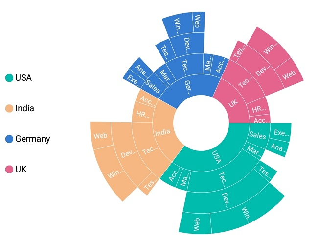
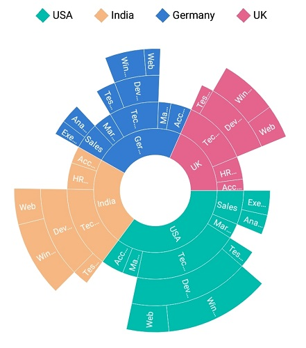
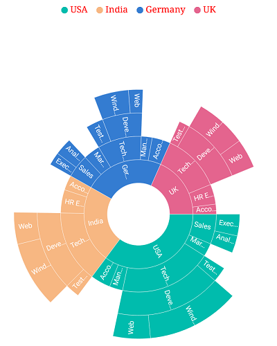
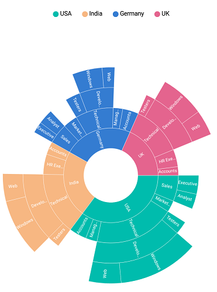

# Legend

Legends are used to represent the first level (i.e root level) of categories in the sunburst chart.

## Visibility

The visibility of legends can be controlled using the [`IsVisible`](https://help.syncfusion.com/cr/xamarin-android/Syncfusion.SfSunburstChart.Android.SunburstChartLegend.html#Syncfusion_SfSunburstChart_Android_SunburstChartLegend_IsVisible) property.

The following code shows how to control the visibility of legend.

 

 

  sunburstChart.Legend.IsVisible = true;



 

## Position

Legends can be docked at the top, right, left, or bottom position using the [`LegendPosition`](https://help.syncfusion.com/cr/xamarin-android/Syncfusion.SfSunburstChart.Android.SunburstChartLegend.html#Syncfusion_SfSunburstChart_Android_SunburstChartLegend_LegendPosition) property.

The following code shows customizing the legend position.

 

 

  sunburstChart.Legend.IsVisible = true;
  sunburstChart.Legend.LegendPosition = SunburstDockPosition.Left;



 

## Legend icon types

Legend icon shapes can be customized using the [`IconType`](https://help.syncfusion.com/cr/xamarin-android/Syncfusion.SfSunburstChart.Android.SunburstChartLegend.html#Syncfusion_SfSunburstChart_Android_SunburstChartLegend_IconType) property. The IconType property provides several predefined shapes. The default legend icon type is circle.

The following predefined shapes are available in the IconType property:

* Circle
* Cross
* Diamond
* Pentagon
* Rectangle
* Triangle.

 

 

  sunburstChart.Legend.IsVisible = true;
  sunburstChart.Legend.IconType = SunburstLegendIcon.Diamond;



 

## Icon size customization

The size of the legend icon can be customized using the [`IconHeight`](https://help.syncfusion.com/cr/xamarin-android/Syncfusion.SfSunburstChart.Android.SunburstChartLegend.html#Syncfusion_SfSunburstChart_Android_SunburstChartLegend_IconHeight) and [`IconWidth`](https://help.syncfusion.com/cr/xamarin-android/Syncfusion.SfSunburstChart.Android.SunburstChartLegend.html#Syncfusion_SfSunburstChart_Android_SunburstChartLegend_IconWidth) properties.

 

 

  sunburstChart.Legend.IsVisible = true;
  sunburstChart.Legend.IconType = SunburstLegendIcon.Diamond;
  sunburstChart.Legend.IconWidth = 15;
  sunburstChart.Legend.IconHeight = 15;            



 

## Label style

Legend label can be customized using the following properties available in [`LabelStyle`](https://help.syncfusion.com/cr/xamarin-android/Syncfusion.SfSunburstChart.Android.SunburstChartLegend.html#Syncfusion_SfSunburstChart_Android_SunburstChartLegend_LabelStyle):

* [`Margin`](https://help.syncfusion.com/cr/xamarin-android/Syncfusion.SfSunburstChart.Android.SunburstChartLegendLabelStyle.html#Syncfusion_SfSunburstChart_Android_SunburstChartLegendLabelStyle_Margin): Sets the specified margin for legend labels.
* [`Color`](https://help.syncfusion.com/cr/xamarin-android/Syncfusion.SfSunburstChart.Android.SunburstChartLegendLabelStyle.html#Syncfusion_SfSunburstChart_Android_SunburstChartLegendLabelStyle_Color): Customizes the text color of the label.
* [`TextSize`](https://help.syncfusion.com/cr/xamarin-android/Syncfusion.SfSunburstChart.Android.SunburstChartLegendLabelStyle.html#Syncfusion_SfSunburstChart_Android_SunburstChartLegendLabelStyle_TextSize): Customizes the label's text size.
* [`Typeface`](https://help.syncfusion.com/cr/xamarin-android/Syncfusion.SfSunburstChart.Android.SunburstChartLegendLabelStyle.html#Syncfusion_SfSunburstChart_Android_SunburstChartLegendLabelStyle_Typeface): Typeface of the labels can be customized.

 

 

  sunburstChart.Legend.IsVisible = true;
  sunburstChart.Legend.LabelStyle.Color = Color.Red;
  sunburstChart.Legend.LabelStyle.Margin = new Thickness(5);
  sunburstChart.Legend.LabelStyle.TextSize = 14;
  sunburstChart.Legend.LabelStyle.Typeface = Typeface.Serif;



 

## Item margin

Margin can be set to individual legend items using the [`ItemMargin`](https://help.syncfusion.com/cr/xamarin-android/Syncfusion.SfSunburstChart.Android.SunburstChartLegend.html#Syncfusion_SfSunburstChart_Android_SunburstChartLegend_ItemMargin) property.

 

 

  sunburstChart.Legend.IsVisible = true;
  sunburstChart.Legend.ItemMargin = new Thickness(3, 3, 3, 3);           



 

