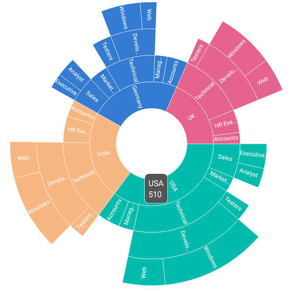
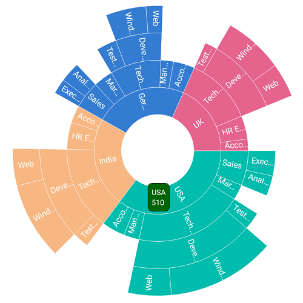
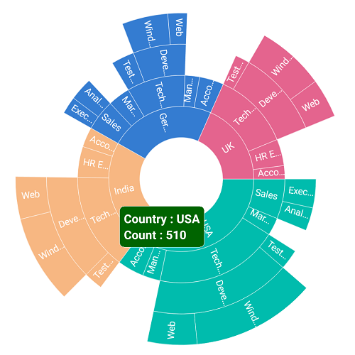

# Tooltip

Tooltip provides additional information about the segments in the sunburst chart. Tooltip is displayed by tapping the segment. By default, tooltip displays the corresponding segment’s category and value. To enable the tooltip, set the [`ShowTooltip`](https://help.syncfusion.com/cr/xamarin-android/Syncfusion.SfSunburstChart.Android.SunburstTooltipSettings.html#Syncfusion_SfSunburstChart_Android_SunburstTooltipSettings_ShowTooltip) property to true.

The following code shows enabling the tooltip.

 

 

  sunburstChart.TooltipSettings.ShowTooltip = true;



 

## Customization

The appearance of the tooltip can be customized using the following properties:

* [`BackgroundColor`](https://help.syncfusion.com/cr/xamarin-android/Syncfusion.SfSunburstChart.Android.SunburstTooltipSettings.html#Syncfusion_SfSunburstChart_Android_SunburstTooltipSettings_BackgroundColor) : Customizes the background color of the tooltip.
* [`BorderColor`](https://help.syncfusion.com/cr/xamarin-android/Syncfusion.SfSunburstChart.Android.SunburstTooltipSettings.html#Syncfusion_SfSunburstChart_Android_SunburstTooltipSettings_BorderColor) : Customizes the border color of the tooltip.
* [`BorderWidth`](https://help.syncfusion.com/cr/xamarin-android/Syncfusion.SfSunburstChart.Android.SunburstTooltipSettings.html#Syncfusion_SfSunburstChart_Android_SunburstTooltipSettings_BorderWidth) : Customizes the border width of the tooltip.
* [`Duration`](https://help.syncfusion.com/cr/xamarin-android/Syncfusion.SfSunburstChart.Android.SunburstTooltipSettings.html#Syncfusion_SfSunburstChart_Android_SunburstTooltipSettings_Duration) : Specifies the duration of the tooltip to be displayed.

The following properties are available under [`LabelStyle`](https://help.syncfusion.com/cr/xamarin-android/Syncfusion.SfSunburstChart.Android.SunburstTooltipSettings.html#Syncfusion_SfSunburstChart_Android_SunburstTooltipSettings_LabelStyle).

* [`Color`](https://help.syncfusion.com/cr/xamarin-android/Syncfusion.SfSunburstChart.Android.SunburstChartLabelStyle.html#Syncfusion_SfSunburstChart_Android_SunburstChartLabelStyle_Color) : Customizes the text color of the tooltip.
* [`TextSize`](https://help.syncfusion.com/cr/xamarin-android/Syncfusion.SfSunburstChart.Android.SunburstChartLabelStyle.html#Syncfusion_SfSunburstChart_Android_SunburstChartLabelStyle_TextSize) : Customizes the size of the tooltip text.
* [`Typeface`](https://help.syncfusion.com/cr/xamarin-android/Syncfusion.SfSunburstChart.Android.SunburstChartLabelStyle.html#Syncfusion_SfSunburstChart_Android_SunburstChartLabelStyle_Typeface) : Customizes the font style.

The following code shows all the above customizations.

 



  sunburstChart.TooltipSettings.ShowTooltip = true;
  sunburstChart.TooltipSettings.LabelStyle.TextSize = 10;
  sunburstChart.TooltipSettings.LabelStyle.Typeface = Typeface.SansSerif;
  sunburstChart.TooltipSettings.LabelStyle.Color = Color.White;
  sunburstChart.TooltipSettings.BackgroundColor = Color.DarkGreen;
  sunburstChart.TooltipSettings.BorderColor = Color.Black;
  sunburstChart.TooltipSettings.BorderWidth = 1;
  sunburstChart.TooltipSettings.Duration = 2000;        



 

## Custom template

The sunburst chart provides options to design your own template for tooltip by inheriting [`SunburstTooltipSettings`](https://help.syncfusion.com/cr/xamarin-android/Syncfusion.SfSunburstChart.Android.SunburstTooltipSettings.html) class.

 

 

  CustomTooltip customTooltip = new CustomTooltip(this);
  sunburstChart.TooltipSettings = customTooltip;
  sunburstChart.TooltipSettings.ShowTooltip = true;            
  sunburstChart.TooltipSettings.BackgroundColor = Color.DarkGreen;
          

  public class CustomTooltip : SunburstTooltipSettings
  {
     private Context tooltipContext;
     public CustomTooltip(Context context) : base()
     {
        tooltipContext = context;
     }

     public override View GetView(SunburstSegment segment)
     {
        TextView xLabel = new TextView(tooltipContext);
        xLabel.Text = "Country : " + segment.Category;
        xLabel.SetTextColor(Color.White);
        xLabel.Typeface = Typeface.DefaultBold;

        TextView yLabel = new TextView(tooltipContext);
        yLabel.Text = "Count : " + segment.Value;
        yLabel.SetTextColor(Color.White);
        yLabel.Typeface = Typeface.DefaultBold;

        LinearLayout layout = new LinearLayout(tooltipContext);           
        LinearLayout.LayoutParams linearLayoutParams = new LinearLayout.LayoutParams(LinearLayout.LayoutParams.MatchParent,
        LinearLayout.LayoutParams.MatchParent);

        layout.Orientation = Orientation.Vertical;
        layout.LayoutParameters = linearLayoutParams;

        layout.AddView(xLabel);
        layout.AddView(yLabel);

        return layout;
    }
  }



 

