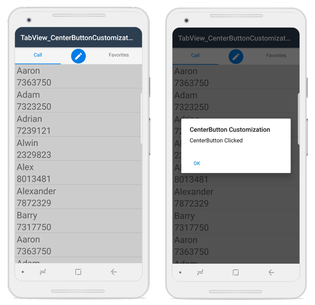

# CenterButtonSettings

This section explains on how to create and customize The Xamarin.Android SfTabView CenterButton. To enable CenterButton we need to set the `OverFlowMode` of Xamarin.Android SfTabView as `CenterButton`.





SfTabView tabView;
protected override void OnCreate(Bundle savedInstanceState)
{
    base.OnCreate(savedInstanceState);
    tabView = new SfTabView(this);
    tabView.OverflowMode = OverflowMode.CenterButton;
    SetContentView(tabView);
}





## Customize CenterButtonSettings

We can customize the CenterButton by using the properties of `CenterButtonSetting`. Following are the some properties that are used to customize the view of CenterButton `BackgroundColor`, `BorderColor`, `BorderThickness`, `Height`, `Title`, `TitleFontColor`, `TitleFontSize`, `TitleFontStyle`, `Width`.





protected override void OnCreate(Bundle savedInstanceState)
{
    var centerButton = tabView.CenterButtonSettings;
    centerButton.Height = 50;
    centerButton.Width = 100;
    centerButton.Title = "Center Button";
    centerButton.TitleFontSize = 15;
    centerButton.TitleFontColor = Color.DarkGreen;
    centerButton.TitleFontStyle = Typeface.DefaultBold;
}





## CenterButtonTapped Event

When we tap the `CenterButton` an event `CenterButtonTapped` will be raised. Using this event we can able to set alert message.





protected override void OnCreate(Bundle savedInstanceState)
{
    base.OnCreate(savedInstanceState);
    tabView.CenterButtonTapped += TabView_CenterButtonTapped;
}

private void TabView_CenterButtonTapped(object sender, System.EventArgs e)
{
    Android.App.AlertDialog.Builder alertDialog = new Android.App.AlertDialog.Builder(this);
    alertDialog.SetTitle("CenterButton Customization");
    alertDialog.SetMessage("CenterButton clicked");
    alertDialog.SetNeutralButton("Ok", (c, eve) => { });
    alertDialog.Show();
}





## Custom CenterButton

When built-in view is not needed, It can be overridden by adding custom views to the CenterButtonView. The CenterButton view can be customized by adding Image, Label, Button inside the CenterButtonView. Please refer the following code snippet to customize the CenterButton view.





SfTabView tabView;
ImageView image;
protected override void OnCreate(Bundle savedInstanceState)
{
    base.OnCreate(savedInstanceState);
    tabView = new SfTabView(this);
    image = new ImageView(this);
    image.SetImageResource(Resource.Drawable.Compose);
    image.Clickable = true;
    image.Click += Image_Click;
    tabView.CenterButtonView = image;
}

private void Image_Click(object sender, System.EventArgs e)
{
    Android.App.AlertDialog.Builder alertDialog = new Android.App.AlertDialog.Builder(this);
    alertDialog.SetTitle("CenterButton Customization");
    alertDialog.SetMessage("CenterButton view customized");
    alertDialog.SetNeutralButton("Ok", (c, eve) => { });
    alertDialog.Show();
}





Please Find the sample from this [link](http://www.syncfusion.com/downloads/support/directtrac/general/ze/TabView_CenterButtonCustomizatin1937817286.zip)