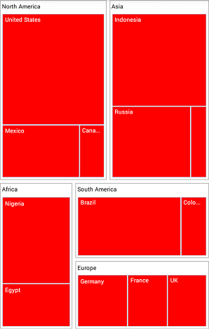
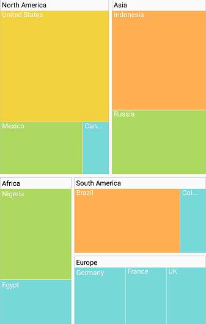
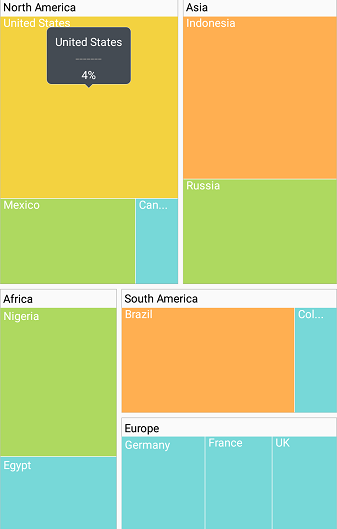
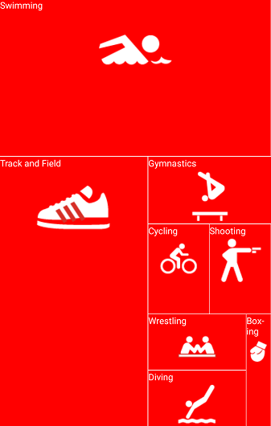

# Customization

The TreeMap control supports color customization to determine the exact combination of colors for the tree nodes displayed and provides tooltip support to display additional information of TreeMap data.

## Color

You can customize the colors of leaf nodes using the [`ColorMapping`](https://help.syncfusion.com/cr/xamarin-android/Com.Syncfusion.Treemap.ColorMapping.html) support.

The [`ColorMapping`](https://help.syncfusion.com/cr/xamarin-android/Com.Syncfusion.Treemap.ColorMapping.html) is categorized into the following three different types:

* UniColorMapping
* RangeColorMapping
* DesaturationColorMapping

### UniColorMapping

You can color all the leaf nodes with the same color by setting a value to the [`Color`](https://help.syncfusion.com/cr/xamarin-android/Com.Syncfusion.Treemap.UniColorMapping.html#Com_Syncfusion_Treemap_UniColorMapping_Color) property of [`UniColorMapping`](https://help.syncfusion.com/cr/xamarin-android/Com.Syncfusion.Treemap.UniColorMapping.html).

  

 

 UniColorMapping uniColorMapping = new UniColorMapping();
 uniColorMapping.Color = Color.Red;
 treeMap.LeafItemColorMapping = uniColorMapping;



  

### RangeColorMapping

You can group the leaf nodes based on the range of color values of data. You can set a unique color for every range. To achieve this, specify the [`To`](https://help.syncfusion.com/cr/xamarin-android/Com.Syncfusion.Treemap.Range.html#Com_Syncfusion_Treemap_Range_To) and [`From`](https://help.syncfusion.com/cr/xamarin-android/Com.Syncfusion.Treemap.Range.html#Com_Syncfusion_Treemap_Range_From) values as range bound and specify the [`Color`](https://help.syncfusion.com/cr/xamarin-android/Com.Syncfusion.Treemap.Range.html#Com_Syncfusion_Treemap_Range_Color) value to fill the leaf nodes of a particular range using the `RangeColorMapping` property of TreeMap. You must specify value to ColorValuePath since the ranges `From` and `To` depend on the under bound value of [`ColorValuePath`](https://help.syncfusion.com/cr/xamarin-android/Com.Syncfusion.Treemap.SfTreeMap.html#Com_Syncfusion_Treemap_SfTreeMap_ColorValuePath).

  



 RangeColorMapping rangeColorMapping = new RangeColorMapping();

            Range range1 = new Range();
            range1.From = 0;
            range1.To = 1;
            range1.Color = Color.ParseColor("#77D8D8");
            range1.LegendLabel = "1 % Growth";

            Range range2 = new Range();
            range2.From = 0;
            range2.To = 2;
            range2.Color = Color.ParseColor("#AED960");
            range2.LegendLabel = "2 % Growth";

            Range range3 = new Range();
            range3.From = 0;
            range3.To = 3;
            range3.Color = Color.ParseColor("#FFAF51");
            range3.LegendLabel = "3 % Growth";

            Range range4 = new Range();
            range4.From = 0;
            range4.To = 4;
            range4.Color = Color.ParseColor("#F3D240");
            range4.LegendLabel = "4 % Growth";

            rangeColorMapping.Ranges.Add(range1);
            rangeColorMapping.Ranges.Add(range2);
            rangeColorMapping.Ranges.Add(range3);
            rangeColorMapping.Ranges.Add(range4);

            treeMap.LeafItemColorMapping = rangeColorMapping;



  

### DesaturationColorMapping

You can differentiate all the leaf nodes using the [`DesaturationColorMapping`](https://help.syncfusion.com/cr/xamarin-android/Com.Syncfusion.Treemap.DesaturationColorMapping.html) property of TreeMap. Differentiation can be achieved even when the same color is applied for all the leaf nodes by varying the opacity of the leaf nodes based on the [`Color`](https://help.syncfusion.com/cr/xamarin-android/Com.Syncfusion.Treemap.DesaturationColorMapping.html#Com_Syncfusion_Treemap_DesaturationColorMapping_Color) value specified. You can also change the opacity range by setting the [`From`](https://help.syncfusion.com/cr/xamarin-android/Com.Syncfusion.Treemap.DesaturationColorMapping.html#Com_Syncfusion_Treemap_DesaturationColorMapping_From) and [`To`](https://help.syncfusion.com/cr/xamarin-android/Com.Syncfusion.Treemap.DesaturationColorMapping.html#Com_Syncfusion_Treemap_DesaturationColorMapping_To) properties of `DesaturationColorMapping`.

  



            DesaturationColorMapping desaturationColorMapping = new DesaturationColorMapping();
            desaturationColorMapping.Color = Color.ParseColor("#41B8C4");
            desaturationColorMapping.From = 1;
            desaturationColorMapping.To = 0.2;
            treeMap.LeafItemColorMapping = desaturationColorMapping;



  

### Palette color mapping

Leaf nodes were colored based on the colors mentioned in the `Colors` collection of the [`PaletteColorMapping`](https://help.syncfusion.com/cr/xamarin-android/Com.Syncfusion.Treemap.PaletteColorMapping.html). 

  



            PaletteColorMapping paletteMapping = new PaletteColorMapping();
            paletteMapping.Colors.Add(Color.ParseColor("#BD8EC2"));
            paletteMapping.Colors.Add(Color.ParseColor("#FFD34E"));
            paletteMapping.Colors.Add(Color.ParseColor("#55B949"));
            paletteMapping.Colors.Add(Color.ParseColor("#00B2DA"));
            paletteMapping.Colors.Add(Color.ParseColor("#744A94"));
            paletteMapping.Colors.Add(Color.ParseColor("#A1A616"));
            paletteMapping.Colors.Add(Color.ParseColor("#0753A1"));
            treeMap.LeafItemColorMapping = paletteMapping;



 

## Tooltip

You can enable the tooltip support for TreeMap by setting the [`ShowTooltip`](https://help.syncfusion.com/cr/xamarin-android/Com.Syncfusion.Treemap.SfTreeMap.html#Com_Syncfusion_Treemap_SfTreeMap_ShowTooltip) property to true. By default, it takes the property of bound object referenced in [`GroupPath`](https://help.syncfusion.com/cr/xamarin-android/Com.Syncfusion.Treemap.TreeMapFlatLevel.html#Com_Syncfusion_Treemap_TreeMapFlatLevel_GroupPath) and displays its content when the corresponding node is tapped.

  



          treeMap.ShowTooltip = true;



 

### Tooltip customization

Tooltip can be customized by inheriting [`TooltipSetting`](https://help.syncfusion.com/cr/xamarin-android/Com.Syncfusion.Treemap.SfTreeMap.html#Com_Syncfusion_Treemap_SfTreeMap_TooltipSettings). Tooltip defines our own customized view.

 

 

treeMap.ShowTooltip = true;
            CustomTooltipSetting tooltip = new CustomTooltipSetting(this);
            treeMap.TooltipSettings = tooltip;



  

Refer to the following code snippet for defining custom tooltip.

 

 

public class CustomTooltipSetting : TooltipSetting
    {
        Context context;
        public CustomTooltipSetting(Context con)
        {
            context = con;
        }

        public override View GetView(object data, Context context)
        {
            LinearLayout layout = new LinearLayout(context);
            LinearLayout.LayoutParams linearlayoutParams = new LinearLayout.LayoutParams(LinearLayout.LayoutParams.WrapContent,
                    LinearLayout.LayoutParams.WrapContent);
            layout.Orientation = Orientation.Vertical;
            layout.LayoutParameters = linearlayoutParams;
            layout.SetGravity(GravityFlags.CenterHorizontal);

            TextView topLabel = new TextView(context);
            topLabel.Text = ((JSONObject)data).GetString("Country");
            topLabel.TextSize = 12;
            topLabel.SetTextColor(Color.ParseColor("#FFFFFF"));
            topLabel.Gravity = GravityFlags.CenterHorizontal;

            TextView SplitLine = new TextView(context);
            SplitLine.Text = "-------";
            SplitLine.SetTextColor(Color.Gray);
            SplitLine.Gravity = GravityFlags.CenterHorizontal;

            TextView bottoLabel = new TextView(context);
            var growth = ((JSONObject)data).GetDouble("Growth");
            bottoLabel.Text = ((int)growth).ToString() + "%";
            bottoLabel.TextSize = 12;
            bottoLabel.SetTextColor(Color.ParseColor("#FFFFFF"));
            bottoLabel.Gravity = GravityFlags.CenterHorizontal;

            layout.AddView(topLabel);
            layout.AddView(SplitLine);
            layout.AddView(bottoLabel);

            return layout;
        }
    }



  

## Selection

The TreeMap control provides selection support, which allows you to select the tree map items. The selection can be enabled by setting the [`HighlightOnSelection`](https://help.syncfusion.com/cr/xamarin-android/Com.Syncfusion.Treemap.SfTreeMap.html#Com_Syncfusion_Treemap_SfTreeMap_HighlightOnSelection) property to true in TreeMap. You can specify the highlight color and border width using the [`HighlightStrokeColor`](https://help.syncfusion.com/cr/xamarin-android/Com.Syncfusion.Treemap.SfTreeMap.html#Com_Syncfusion_Treemap_SfTreeMap_HighlightStrokeColor) and [`HighlightStrokeWidth`](https://help.syncfusion.com/cr/xamarin-android/Com.Syncfusion.Treemap.SfTreeMap.html#Com_Syncfusion_Treemap_SfTreeMap_HighlightStrokeColor) properties, respectively.

  

 

 treeMap.HighlightOnSelection = true;
            treeMap.HighlightStrokeColor = Color.Red;
            treeMap.HighlightStrokeWidth = 8;



  

## Item customization

The TreeMap control provides support to customize the items, which allows any type of custom view to replace the item.

To achieve this, derive a class from [`TreeMapAdapter`](https://help.syncfusion.com/cr/xamarin-android/Com.Syncfusion.Treemap.TreeMapAdapter.html), override the GetTreeMapItemView method, and return the needed custom view as in the following code snippet.

 

 

 public class CustomAdapter: TreeMapAdapter
    {
        Context context;
        public CustomAdapter(Context con)
        {
            context = con;
        }
        public override View GetTreeMapItemView(TreeMapItem item)
        {
            LinearLayout layout = new LinearLayout(context);
            layout.SetBackgroundColor(Color.Red);
            LinearLayout.LayoutParams linearlayoutParams = new LinearLayout.LayoutParams(LinearLayout.LayoutParams.WrapContent,
                    LinearLayout.LayoutParams.WrapContent);
            layout.Orientation = Orientation.Vertical;
            layout.LayoutParameters = linearlayoutParams;
            layout.SetGravity(GravityFlags.CenterHorizontal);

            TextView topLabel = new TextView(context);
            topLabel.Text = item.Label;
            topLabel.TextSize = 12;
            topLabel.SetTextColor(Color.ParseColor("#FFFFFF"));
            topLabel.Gravity = GravityFlags.Left;            

            ImageView imageView = new ImageView(context);           
            if (item.Label == "Archery")
                imageView.SetImageResource(Resource.Drawable.Archery);
            else if(item.Label == "Boxing")
                imageView.SetImageResource(Resource.Drawable.Boxing);
            else if (item.Label == "Cycling")
                imageView.SetImageResource(Resource.Drawable.Cycling);
            else if (item.Label == "Diving")
                imageView.SetImageResource(Resource.Drawable.Diving);
            else if (item.Label == "Gymnastics")
                imageView.SetImageResource(Resource.Drawable.Gymnastics);
            else if (item.Label == "Shooting")
                imageView.SetImageResource(Resource.Drawable.Shooting);

            else if (item.Label == "Soccer")
                imageView.SetImageResource(Resource.Drawable.Soccer);
            else if (item.Label == "Swimming")
                imageView.SetImageResource(Resource.Drawable.Swimming);
            else if (item.Label == "Track and Field")
                imageView.SetImageResource(Resource.Drawable.TrackAndField);
            else if (item.Label == "Wrestling")
                imageView.SetImageResource(Resource.Drawable.Wrestling);

            layout.AddView(topLabel);
            layout.AddView(imageView);
           
            return layout;

        }
    }



  

Set the custom view to the TreeMap item as in the following code snippet.

 

 

SfTreeMap treeMap = new SfTreeMap(this);
            treeMap.ColorValuePath = "TotalMedals";
            treeMap.WeightValuePath = "TotalMedals";
            treeMap.LayoutType = Com.Syncfusion.Treemap.Enums.LayoutType.Squarified;          

            LeafItemSetting leafItemSetting = new LeafItemSetting();
            leafItemSetting.ShowLabels = false;
            leafItemSetting.Gap = 2;
            leafItemSetting.LabelPath = "GameName";
            treeMap.LeafItemSettings = leafItemSetting;

            treeMap.DataSource = GetDataSource();
            CustomAdapter customAdapter = new CustomAdapter(this);
            treeMap.Adapter = customAdapter;
            SetContentView(treeMap);



  

Refer to the following code snippet for the under bound data of TreeMap item customization.

 

 

JSONArray GetDataSource()
        {
            JSONArray array = new JSONArray();
            array.Put(getJsonObject("US", "Swimming", 16, 9, 6, 31, "Swimming.png"));
            array.Put(getJsonObject("US", "Track and Field", 9, 13, 7, 29, "TrackAndField.png"));
            array.Put(getJsonObject("US", "Gymnastics", 3, 1, 2, 6, "Gymnastics.png"));
            array.Put(getJsonObject("US", "Boxing", 1, 0, 1, 2, "Boxing.png"));

            array.Put(getJsonObject("US", "Cycling", 1, 2, 1, 4, "Cycling.png"));
            array.Put(getJsonObject("US", "Shooting", 3, 0, 1, 4, "Shooting.png"));
            array.Put(getJsonObject("US", "Wrestling", 2, 0, 2, 4, "Wrestling.png"));
            array.Put(getJsonObject("US", "Diving", 1, 1, 2, 4, "Diving.png"));
            return array;
        }

        JSONObject getJsonObject(string country, string gameName, double goldMedals, double silverMedals,
            double bronzeMedals, double totalMedals, string imageName)
        {
            JSONObject obj = new JSONObject();

            obj.Put("Country", country);
            obj.Put("GameName", gameName);
            obj.Put("GoldMedals", goldMedals);
            obj.Put("SilverMedals", silverMedals);
            obj.Put("BronzeMedals", bronzeMedals);
            obj.Put("TotalMedals", totalMedals);
            obj.Put("ImageName", imageName);
            return obj;

        }



  

