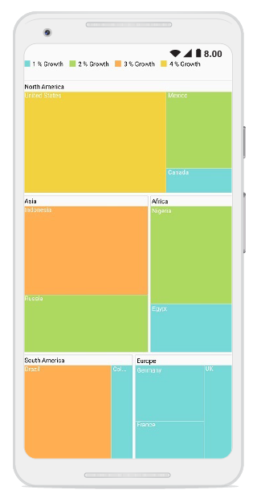

# Getting Started

This section explains the steps required to configure the TreeMap control and provides a walk-through on some of the customization features available in the TreeMap control.

## Adding SfTreeMap reference

After installing Essential Studio for Xamarin, you can find all the required assemblies in the installation folders.

{Syncfusion Installed location} \Essential Studio\17.2.0.28\lib

Add the following TreeMap assembly reference in the Xamarin.Android project: lib\android\Syncfusion.SfTreeMap.Android.dll

## Initializing TreeMap

Import the TreeMap namespace as shown in the following code sample.

  



using Com.Syncfusion.Treemap;



  

You can initialize the SfTreeMap control with the required optimal name by using the included namespace.

  



protected override void OnCreate(Bundle savedInstanceState)
        {
            base.OnCreate(savedInstanceState);
            SfTreeMap treeMap = new SfTreeMap(this);
            SetContentView(treeMap);
        }



  

## Populating TreeMap with data

Treemap items can be populated using the DataSource property by setting the defined view model data. To render leaf nods for the underlying data, levels and leaf item settings must be specified.

  



 SfTreeMap treeMap = new SfTreeMap(this);
            treeMap.ColorValuePath = "Growth";
            treeMap.WeightValuePath = "Population";
            treeMap.LayoutType = Com.Syncfusion.Treemap.Enums.LayoutType.Squarified;

  LeafItemSetting leafItemSetting = new LeafItemSetting();
            leafItemSetting.ShowLabels = true;
            leafItemSetting.Gap = 2;
            leafItemSetting.LabelPath = "Country";
            treeMap.LeafItemSettings = leafItemSetting;

  TreeMapFlatLevel flatLevel = new TreeMapFlatLevel();
            flatLevel.HeaderHeight = 20;
            flatLevel.GroupPath = "Continent";
            flatLevel.GroupGap = 5;
            flatLevel.ShowHeader = true;
            flatLevel.GroupStrokeColor = Color.Gray;
            flatLevel.GroupStrokeWidth = 1;
            flatLevel.HeaderStyle = new Style() { TextColor = Color.Black };
            treeMap.Levels.Add(flatLevel);
  treeMap.DataSource = GetDataSource();





The following code snippet explains the underlying view model data to render TreeMap.

 



JSONArray GetDataSource()
        {
            JSONArray array = new JSONArray();
            array.Put(getJsonObject("Asia", "Indonesia", 3, 237641326));
            array.Put(getJsonObject("Asia", "Russia", 2, 152518015));
            array.Put(getJsonObject("North America", "United States", 4, 315645000));
            array.Put(getJsonObject("North America", "Mexico", 2, 112336538));
            array.Put(getJsonObject("North America", "Canada", 1, 35056064));
            array.Put(getJsonObject("South America", "Colombia", 1, 47000000));
            array.Put(getJsonObject("South America", "Brazil", 3, 193946886));
            array.Put(getJsonObject("Africa", "Nigeria", 2, 170901000));
            array.Put(getJsonObject("Africa", "Egypt", 1, 83661000));
            array.Put(getJsonObject("Europe", "Germany", 1, 81993000));
            array.Put(getJsonObject("Europe", "France", 1, 65605000));
            array.Put(getJsonObject("Europe", "UK", 1, 63181775));

            return array;
        }

        JSONObject getJsonObject(string continent, string country, double growth, double population)
        {
            JSONObject obj = new JSONObject();

            obj.Put("Continent", continent);
            obj.Put("Country", country);
            obj.Put("Growth", growth);
            obj.Put("Population", population);          

            return obj;
        }



  

## Grouping TreeMap items using levels

You can group TreeMapItems using the following two types of levels:

* TreeMap flat level
* TreeMap hierarchical level

Add either flat level or hierarchical level to the [`Levels`](https://help.syncfusion.com/cr/xamarin-android/Com.Syncfusion.Treemap.SfTreeMap.html#Com_Syncfusion_Treemap_SfTreeMap_Levels) collection in TreeMap.
Each level will be formed based on the property specified in the [`GroupPath`](https://help.syncfusion.com/cr/xamarin-android/Com.Syncfusion.Treemap.TreeMapFlatLevel.html#Com_Syncfusion_Treemap_TreeMapFlatLevel_GroupPath), and each rectangle size will be calculated based on the [`WeightValuePath`](https://help.syncfusion.com/cr/xamarin-android/Com.Syncfusion.Treemap.SfTreeMap.html#Com_Syncfusion_Treemap_SfTreeMap_WeightValuePath) property.

## Customizing the appearance of TreeMap by range

You can differentiate the nodes based on their values and colors using [`RangeColorMapping`](https://help.syncfusion.com/cr/xamarin-android/Com.Syncfusion.Treemap.RangeColorMapping.html). You can define the color value range using the [`From`](https://help.syncfusion.com/cr/xamarin-android/Com.Syncfusion.Treemap.Range.html#Com_Syncfusion_Treemap_Range_From) and [`To`](https://help.syncfusion.com/cr/xamarin-android/Com.Syncfusion.Treemap.Range.html#Com_Syncfusion_Treemap_Range_To) properties in range. The values of the From and To properties depend on underlying data bound to the [`ColorValuePath`](https://help.syncfusion.com/cr/xamarin-android/Com.Syncfusion.Treemap.SfTreeMap.html#Com_Syncfusion_Treemap_SfTreeMap_ColorValuePath) property.

 



RangeColorMapping rangeColorMapping = new RangeColorMapping();

            Range range1 = new Range();
            range1.From = 0;
            range1.To = 1;
            range1.Color = Color.ParseColor("#77D8D8");
            range1.LegendLabel = "1 % Growth";

            Range range2 = new Range();
            range2.From = 0;
            range2.To = 2;
            range2.Color = Color.ParseColor("#AED960");
            range2.LegendLabel = "2 % Growth";

            Range range3 = new Range();
            range3.From = 0;
            range3.To = 3;
            range3.Color = Color.ParseColor("#FFAF51");
            range3.LegendLabel = "3 % Growth";

            Range range4 = new Range();
            range4.From = 0;
            range4.To = 4;
            range4.Color = Color.ParseColor("#F3D240");
            range4.LegendLabel = "4 % Growth";

            rangeColorMapping.Ranges.Add(range1);
            rangeColorMapping.Ranges.Add(range2);
            rangeColorMapping.Ranges.Add(range3);
            rangeColorMapping.Ranges.Add(range4);

            treeMap.LeafItemColorMapping = rangeColorMapping;



  

## LeafItemSetting

You can customize the leaf nodes of  TreeMap using [`LeafItemSettings`](https://help.syncfusion.com/cr/xamarin-android/Com.Syncfusion.Treemap.SfTreeMap.html#Com_Syncfusion_Treemap_SfTreeMap_LeafItemSettings).

  



LeafItemSetting leafItemSetting = new LeafItemSetting();
            leafItemSetting.ShowLabels = true;
            leafItemSetting.Gap = 2;
            leafItemSetting.LabelPath = "Country";
            treeMap.LeafItemSettings = leafItemSetting;



 

## Enabling legends

The color value of leaf nodes can be tracked using TreeMap legend. The legend support is applicable only for the TreeMap whose leaf nodes are colored using RangeColorMapping. Set the value of [`ShowLegend`](https://help.syncfusion.com/cr/xamarin-android/Com.Syncfusion.Treemap.LegendSetting.html#Com_Syncfusion_Treemap_LegendSetting_ShowLegend) property to “True” to make legends visible.

## Labels for legends

You can customize the labels of legend items using the [`LegendLabel`](https://help.syncfusion.com/cr/xamarin-android/Com.Syncfusion.Treemap.Range.html#Com_Syncfusion_Treemap_Range_LegendLabel) property in RangeColorMapping. 

 



   LegendSetting legendSettings = new LegendSetting();
            legendSettings.ShowLegend = true;
            legendSettings.LegendSize = new Size(700, 45);
            legendSettings.LabelStyle = new Style() { TextColor = Color.Black };
            treeMap.LegendSettings = legendSettings;





The following code sample is used to reproduce the output.

 



 SfTreeMap treeMap = new SfTreeMap(this);
            treeMap.ColorValuePath = "Growth";
            treeMap.WeightValuePath = "Population";
            treeMap.LayoutType = Com.Syncfusion.Treemap.Enums.LayoutType.Squarified;
            treeMap.ShowTooltip = true;

            LeafItemSetting leafItemSetting = new LeafItemSetting();
            leafItemSetting.ShowLabels = true;
            leafItemSetting.Gap = 2;
            leafItemSetting.LabelPath = "Country";
            treeMap.LeafItemSettings = leafItemSetting;

            TreeMapFlatLevel flatLevel = new TreeMapFlatLevel();
            flatLevel.HeaderHeight = 20;
            flatLevel.GroupPath = "Continent";
            flatLevel.GroupGap = 5;
            flatLevel.ShowHeader = true;
            flatLevel.GroupStrokeColor = Color.Gray;
            flatLevel.GroupStrokeWidth = 1;
            flatLevel.HeaderStyle = new Style() { TextColor = Color.Black };
            treeMap.Levels.Add(flatLevel);

            LegendSetting legendSettings = new LegendSetting();
            legendSettings.ShowLegend = true;
            legendSettings.LegendSize = new Size(700, 45);
            legendSettings.LabelStyle = new Style() { TextColor = Color.Black };
            treeMap.LegendSettings = legendSettings;

            RangeColorMapping rangeColorMapping = new RangeColorMapping();

            Range range1 = new Range();
            range1.From = 0;
            range1.To = 1;
            range1.Color = Color.ParseColor("#77D8D8");
            range1.LegendLabel = "1 % Growth";

            Range range2 = new Range();
            range2.From = 0;
            range2.To = 2;
            range2.Color = Color.ParseColor("#AED960");
            range2.LegendLabel = "2 % Growth";

            Range range3 = new Range();
            range3.From = 0;
            range3.To = 3;
            range3.Color = Color.ParseColor("#FFAF51");
            range3.LegendLabel = "3 % Growth";

            Range range4 = new Range();
            range4.From = 0;
            range4.To = 4;
            range4.Color = Color.ParseColor("#F3D240");
            range4.LegendLabel = "4 % Growth";

            rangeColorMapping.Ranges.Add(range1);
            rangeColorMapping.Ranges.Add(range2);
            rangeColorMapping.Ranges.Add(range3);
            rangeColorMapping.Ranges.Add(range4);

            treeMap.LeafItemColorMapping = rangeColorMapping;
            treeMap.DataSource = GetDataSource();

            SetContentView(treeMap);





You can find the complete getting-started sample in the following link: [Getting-started](https://github.com/SyncfusionExamples/TreeMap_GettingStarted_Android).

The following screenshot illustrates the output of SfTreeMap.

