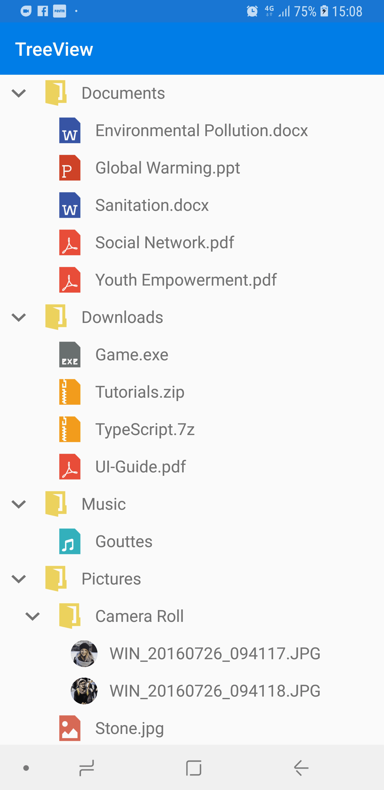

# SfTreeView

The Syncfusion TreeView for Xamarin.Android is a data-oriented control that displays data in a hierarchical structure with expanding and collapsing nodes. It is commonly used to illustrate a folder structure, or nested relationships in an application. 

## Key features
* Optimized view reusing strategy for enhanced performance.
* Bound and unbound mode - Support for binding hierarchical data or add unbound tree nodes.
* Selection - Support for selection with different selection modes.
* Templating - Provides complete UI customization through adapters. 

