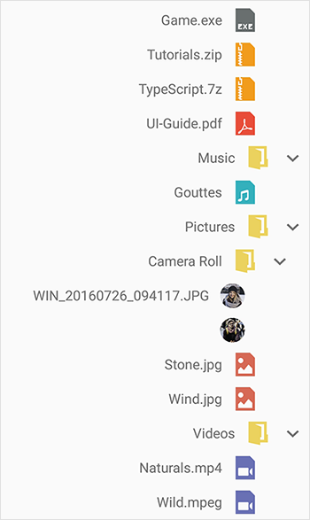

# Right to left(RTL)

TreeView supports the right-to-left by setting [LayoutDirection](https://developer.xamarin.com/api/type/Android.Views.LayoutDirection/) to `Rtl`.TreeView also supports right-to-left when device layout direction is changed.

N> Specific setup is required to enable right-to-left. For android settings you can refer [here](https://docs.microsoft.com/en-us/xamarin/android/app-fundamentals/localization#right-to-left-rtl-languages).




SfTreeView treeView = new SfTreeView();
treeView.LayoutDirection = LayoutDirection.Rtl;




N> If you need to customize [Adapter](https://help.syncfusion.com/cr/xamarin-android/Syncfusion.Android.TreeView.SfTreeView.html#Syncfusion_Android_TreeView_SfTreeView_Adapter) with your custom views, layout the views in based on [LayoutDirection](https://developer.xamarin.com/api/type/Android.Views.LayoutDirection/) to respond for right-to-left changes.



//customized view to support rtl
public class NodeImageView : LinearLayout
{
    private ContentLabel label1;
    private ImageViewExt imageIcon;
    SfTreeView view;

    public NodeImageView(Context context, SfTreeView treeView) : base(context)
    {
        view = treeView;
        this.Orientation = Orientation.Horizontal;
        label1 = new ContentLabel(context);
        label1.Gravity = GravityFlags.CenterVertical;
        if(view.LayoutDirection == Android.Views.LayoutDirection.Rtl)
            label1.TextDirection = TextDirection.Rtl;
        imageIcon = new ImageViewExt(context);
        this.AddView(imageIcon);
        this.AddView(label1);
    }

    protected override void OnMeasure(int widthMeasureSpec, int heightMeasureSpec)
    {
        var density = Resources.DisplayMetrics.Density;
        var measuredWidth = (int)(40 * density);
        var measuredHeight = (int)(45 * density);
        var labelWidth = Math.Abs(widthMeasureSpec - measuredWidth);
        this.label1.SetMinimumHeight(measuredHeight);
        this.label1.SetMinimumWidth(labelWidth);
        this.imageIcon.SetMinimumHeight(measuredHeight);
        this.imageIcon.SetMinimumWidth(measuredWidth);
        this.imageIcon.Measure(measuredWidth, measuredHeight);
        this.label1.Measure(labelWidth, measuredHeight);
        base.OnMeasure(widthMeasureSpec, heightMeasureSpec);
    }

    protected override void OnLayout(bool changed, int l, int t, int r, int b)
    {
        var density = Resources.DisplayMetrics.Density;
        var measuredWidth = (int)(40 * density);
        var measuredHeight = (int)(45 * density);
        if (view.LayoutDirection == Android.Views.LayoutDirection.Rtl)
        {
            this.imageIcon.Layout(Width- measuredWidth, 0, Width, measuredHeight);
            this.label1.Layout(0, 0, Width- measuredWidth, measuredHeight);
        }
        else
        {
            this.imageIcon.Layout(0, 0, measuredWidth, measuredHeight);
            this.label1.Layout(measuredWidth, 0, Width, measuredHeight);
        }
    }
}



You can download the entire [source code](https://github.com/SyncfusionExamples/treeview-xamarin-right-to-left) here.

